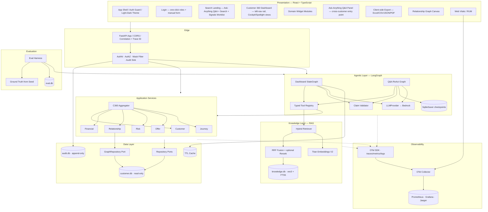
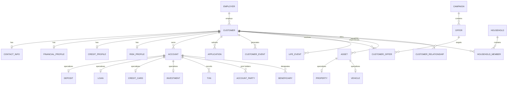
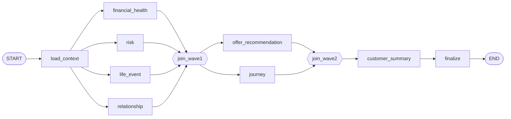
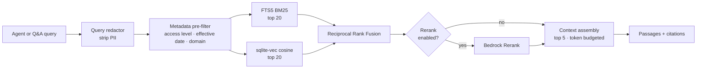
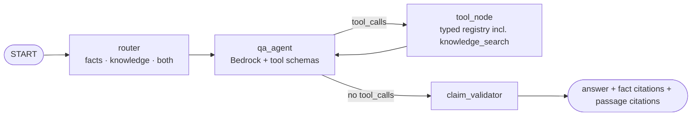
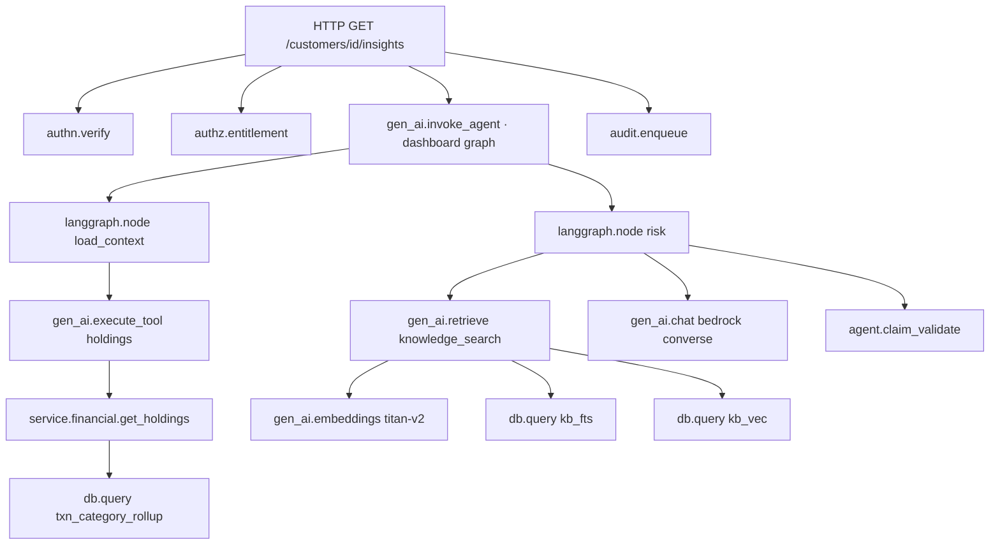
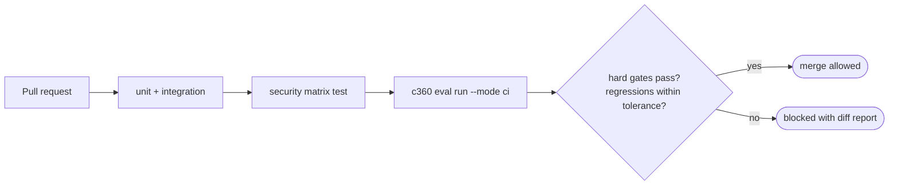

# Design — Customer 360 Intelligence Platform

**Status:** Phase 2 — decisions locked by stakeholder
**Requirements:** `./requirements.md`
**Tasks:** `./tasks.md`

---

## 1. Locked decisions

| ID | Decision | Locked choice | Swap path |
|---|---|---|---|
| D1 | Stack | React 18 + TypeScript (Vite) / FastAPI + Python 3.12 | — |
| D2 | Graph storage | **SQLite** property-graph tables, recursive CTE traversal | `GraphRepository` port → Neo4j adapter |
| D3 | Primary datastore | **SQLite 3** (WAL mode, JSON1, FTS5) | `Repository` ports → PostgreSQL adapter |
| D4 | LLM provider | **Amazon Bedrock** (Converse API) | `LLMProvider` port; `MockLLMProvider` retained for CI |
| D5 | Orchestration | **LangGraph** `StateGraph` + `SqliteSaver` checkpointing | — |
| D6 | Auth | Local OAuth 2.0 provider, seeded role users | `IdentityProvider` port → OIDC adapter |
| D7 | Data | Seeded synthetic generator | `SourceLoader` port → extract loader |
| D8 | NLP Q&A | LangGraph ReAct loop over the typed tool registry | — |
| D9 | Deliverable | Full-stack application | — |
| D10 | Scoring | Heuristic scores labelled; bureau-style scores consumed as data | model-served scores |
| D11 | Retrieval | Hybrid RAG in SQLite: `sqlite-vec` + FTS5, Titan Embeddings V2, optional Bedrock Rerank | `KnowledgeRepository` port → OpenSearch / Bedrock Knowledge Bases |
| D12 | Observability | OpenTelemetry + GenAI semantic conventions, OTLP → collector | collector config change only |
| D13 | Evaluation | In-repo framework, ground truth from the seeded generator | extend panel to real labelled data |

Resolved policy questions: Contact Center sees banded balances; Marketing is fully pseudonymized; households
are derived from address + relationships; suppressed offers are shown greyed with the suppression reason.

Dataset size is **100 customers by default** per requirements §14.1, configurable via `SEED_CUSTOMER_COUNT`.
Every budget in this document was sized against 1,000 to leave headroom.

### 1.1 Consequences of SQLite — read this first

SQLite fits because requirement A1 makes the platform **read-only over source data**. There is essentially
one writer (audit) and many readers. Five things change versus a server database, and they shape the rest of
this document:

| Consequence | Design response |
|---|---|
| No `NUMERIC(18,2)`; REAL is binary floating point and drifts under summation | All monetary columns are `INTEGER` **minor units (cents)**, suffixed `_cents`. Aggregation is exact integer arithmetic. Pydantic converts to `Decimal` at the API boundary. Rates and percentages are `INTEGER` basis points (`_bps`). |
| No `MATERIALIZED VIEW` | Derived values live in ordinary `derived_*` tables refreshed by an idempotent recompute job, with a test asserting stored values equal freshly-computed values (requirements §14.6). |
| No native `DATE`/`BOOLEAN`/`JSONB`/`ARRAY` | Dates are `TEXT` ISO-8601 with `CHECK` constraints; booleans are `INTEGER 0/1`; JSON is `TEXT` with `CHECK (json_valid(...))` queried via `json_extract`; arrays are JSON text. |
| No table-level `GRANT`, so append-only audit cannot be granted | Append-only is enforced by `BEFORE UPDATE` / `BEFORE DELETE` triggers that `RAISE(ABORT)`. |
| No native vector type | Vector search uses the `sqlite-vec` extension (`vec0` virtual tables). It performs brute-force scans rather than ANN, which is fine at knowledge-corpus scale — see §9.3. |
| Single writer; a shared DB file across API instances is unsafe | Each API instance opens the customer and knowledge databases **read-only**, which scales horizontally cleanly because the data is immutable at runtime. Audit is written to a **separate** SQLite database owned by one writer thread per instance, then rolled up. See §12.3 and §20. |

Everything else is unchanged by the storage choice, because all data access goes through repository ports.

---

## 2. Architecture overview

### 2.1 Layered view



### 2.2 Non-negotiable architectural rules

1. **Agents never touch the database.** Every LangGraph node reads through the typed tool registry, which
   calls the same application services the REST API uses. Entitlement and masking therefore cannot be
   bypassed (requirements §11.6, §12.4), and citations come for free.
2. **Masking happens at the serialization boundary, not in the UI.** Unmasked values never enter a response
   payload the caller isn't entitled to (§12.4).
3. **Deterministic before generative.** Net worth, utilization, aggregates and household rollups are computed
   in SQL or Python integer arithmetic. The LLM narrates; it never calculates (§11.3).
4. **Retrieval is for knowledge, never for customer facts.** RAG answers "what is the policy" and "what are
   the eligibility rules". It never answers "what is her balance". A retrieved passage can never satisfy a
   numeric claim (§17.7).
5. **Per-module failure isolation.** The dashboard is composed of independently-resolving modules; one
   failure degrades one card (§4.4, §13.7).
6. **Graph is derived, never authoritative.** Nodes and edges are projected from relational tables and are
   rebuildable from scratch (§14.4, §14.6).
7. **Telemetry carries no customer content.** No PII, monetary values, prompts or completions in spans,
   metrics or logs; customer IDs are never metric labels (§18.8).
8. **Every AI change is gated by evaluation.** Entitlement leakage and adversarial failures are hard zeros in
   CI (§19.14).

### 2.3 Dashboard request flow

```mermaid
sequenceDiagram
    participant UI
    participant API as FastAPI
    participant AZ as AuthZ + Mask
    participant AGG as C360 Aggregator
    participant SVC as Domain Services
    participant LG as LangGraph
    participant DB as SQLite (ro)

    UI->>API: GET /customers/{id}/360
    API->>AZ: validate token, resolve entitlement scope
    AZ-->>API: principal + field policy
    API->>AGG: build(customer_id, principal)
    par deterministic fan-out (thread pool, ro connections)
        AGG->>SVC: profile / financial / credit / risk
        SVC->>DB: queries
    and
        AGG->>SVC: holdings / offers / journey / household
        SVC->>DB: queries
    end
    AGG-->>API: C360 read model
    API->>AZ: apply field masking
    API-->>UI: 360 payload (deterministic, < 3s p95)
    Note over UI: dashboard renders; AI cards show skeletons

    UI->>API: GET /customers/{id}/insights (SSE)
    API->>LG: astream_events(dashboard graph)
    LG->>SVC: via typed tools only
    LG-->>UI: stream each agent node's output as it completes (< 5s p95)
```

The split matters: the deterministic 360 payload has its own 3-second budget and is never gated on model
latency. AI cards arrive over a second, streaming call.

---

## 3. Technology stack

| Concern | Choice | Rationale |
|---|---|---|
| Frontend | React 18, TypeScript, Vite | Responsive web; TS enforces the API contract client-side |
| State / data fetching | TanStack Query | Per-module caching, retries and independent loading states map to §4.3–4.4 |
| Charts | Recharts | Accessible SVG output; table fallback is straightforward (§16.2) |
| Graph canvas | Cytoscape.js | 3-hop neighborhoods, keyboard navigation support (§16.3) |
| Styling | Hand-authored CSS + design tokens | A single token stylesheet (`tokens.css`) drives a light and a dark palette; contrast tokens centralize WCAG AA compliance and are asserted by an audit test |
| Backend | FastAPI, Pydantic v2 | Typed models double as tool contracts and OpenAPI source (§15.4) |
| Data access | SQLAlchemy 2.0 Core + hand-written SQL | Core for CRUD, raw SQL for window functions, FTS5, vec0 and recursive CTEs |
| Migrations | Alembic (batch mode) | SQLite has limited `ALTER`; batch mode handles table rebuilds |
| Database | **SQLite 3.45+** — WAL, JSON1, FTS5 | Zero-ops, in-process, ample for a read-only workload |
| Vector search | **`sqlite-vec`** (`vec0` virtual tables) | No-dependency C extension, keeps the single-file model; brute-force scan is fine at corpus scale |
| Agent orchestration | **LangGraph** | Explicit `StateGraph` for agent waves; `SqliteSaver` for Q&A memory |
| LLM | **Amazon Bedrock** via `langchain-aws` `ChatBedrockConverse` | Uniform tool-calling and streaming |
| Embeddings | **Bedrock Titan Text Embeddings V2** (`amazon.titan-embed-text-v2:0`) | 8,192-token input, configurable 256/512/1024 output dimensions |
| Reranking | **Bedrock Rerank API** (Amazon Rerank 1.0 / Cohere Rerank 3.5), optional | Region-limited, so it is a config flag with graceful fallback |
| Observability | OpenTelemetry SDK + Collector; Prometheus, Grafana, Jaeger locally | Vendor-neutral; GenAI semantic conventions for agent/model spans |
| Cache | In-process TTL cache, Redis-ready interface | Agent output caching (§10.13) |
| Auth | Authlib, local OAuth 2.0 + RS256 JWT | `IdentityProvider` port for OIDC swap |
| Data generation | Faker + seeded `random.Random` | Reproducibility (§14.7) and evaluation ground truth |
| Testing | pytest, Vitest, Playwright, Locust, schemathesis | Unit / component / E2E / load / contract |
| Packaging | Docker Compose | Single-command local bring-up |

Sources for the model facts above: [Titan Text Embeddings models](https://docs.aws.amazon.com/bedrock/latest/userguide/titan-embedding-models.html),
[Titan Text Embeddings V2 announcement](https://aws.amazon.com/blogs/aws/amazon-titan-text-v2-now-available-in-amazon-bedrock-optimized-for-improving-rag),
[Bedrock Rerank supported Regions and models](https://docs.aws.amazon.com/bedrock/latest/userguide/rerank-supported.html),
[sqlite-vec](https://github.com/asg017/sqlite-vec),
[OpenTelemetry GenAI semantic conventions](https://github.com/open-telemetry/semantic-conventions/blob/main/docs/gen-ai/gen-ai-spans.md).
Content was rephrased for compliance with licensing restrictions.

---

## 4. Data architecture

### 4.1 Schema map



SQLite has no schemas, so files are the namespaces: `data/customer.db` (domain), `data/knowledge.db` (RAG
corpus), `data/audit.db` (audit log), `data/checkpoints.db` (LangGraph), `data/eval.db` (evaluation runs).

### 4.2 Connection setup

```sql
PRAGMA journal_mode = WAL;
PRAGMA foreign_keys = ON;
PRAGMA busy_timeout = 5000;
PRAGMA synchronous = NORMAL;
PRAGMA cache_size = -64000;
PRAGMA temp_store = MEMORY;
PRAGMA mmap_size = 268435456;
```

`foreign_keys = ON` and `busy_timeout` must be set **per connection**, applied via a SQLAlchemy `connect`
event listener — a common source of silently unenforced constraints.

### 4.3 Core tables

Conventions: monetary `INTEGER` cents (`_cents`), rates and percentages `INTEGER` basis points (`_bps`),
dates `TEXT` ISO-8601, booleans `INTEGER 0/1`, JSON `TEXT` with `json_valid` checks. Every table carries
`as_of_date` and `source_system` for the as-of-timestamp requirement (§4.8) and citation provenance.

```sql
CREATE TABLE employer (
  employer_id   TEXT PRIMARY KEY,
  employer_name TEXT NOT NULL,
  industry      TEXT,
  city          TEXT, state TEXT
);

CREATE TABLE household (
  household_id        TEXT PRIMARY KEY,
  household_name      TEXT NOT NULL,
  primary_customer_id TEXT,
  address_hash        TEXT NOT NULL,        -- basis for derived household grouping
  member_count        INTEGER NOT NULL DEFAULT 1,
  as_of_date          TEXT NOT NULL
);

CREATE TABLE customer (
  customer_id          TEXT PRIMARY KEY,
  customer_name        TEXT NOT NULL,
  customer_type        TEXT NOT NULL CHECK (customer_type IN
                         ('INDIVIDUAL','JOINT','BUSINESS','TRUST')),
  customer_segment     TEXT NOT NULL CHECK (customer_segment IN
                         ('MASS','AFFLUENT','HNW','UHNW','SMALL_BUSINESS')),
  customer_since       TEXT NOT NULL CHECK (customer_since = date(customer_since)),
  date_of_birth        TEXT CHECK (date_of_birth IS NULL OR date_of_birth = date(date_of_birth)),
  citizenship          TEXT,
  occupation           TEXT,
  employer_id          TEXT REFERENCES employer(employer_id),
  employment_status    TEXT,
  marital_status       TEXT,
  customer_value       TEXT NOT NULL CHECK (customer_value IN
                         ('BRONZE','SILVER','GOLD','PLATINUM')),
  customer_value_score REAL,
  preferred_language   TEXT NOT NULL DEFAULT 'en',
  preferred_channel    TEXT,
  household_id         TEXT REFERENCES household(household_id),
  as_of_date           TEXT NOT NULL,
  source_system        TEXT NOT NULL
);

CREATE TABLE contact_info (
  customer_id   TEXT PRIMARY KEY REFERENCES customer(customer_id),
  email TEXT, phone_number TEXT, mobile_number TEXT,
  address_line1 TEXT, address_line2 TEXT,
  city TEXT, state TEXT, country TEXT, postal_code TEXT,
  as_of_date    TEXT NOT NULL
);

CREATE TABLE financial_profile (
  customer_id               TEXT PRIMARY KEY REFERENCES customer(customer_id),
  total_deposits_cents      INTEGER NOT NULL DEFAULT 0,
  total_loans_cents         INTEGER NOT NULL DEFAULT 0,
  total_investments_cents   INTEGER NOT NULL DEFAULT 0,
  total_assets_cents        INTEGER NOT NULL DEFAULT 0,
  total_liabilities_cents   INTEGER NOT NULL DEFAULT 0,
  net_worth_cents           INTEGER NOT NULL DEFAULT 0,
  household_net_worth_cents INTEGER,
  monthly_income_cents      INTEGER,
  monthly_expense_cents     INTEGER,
  as_of_date                TEXT NOT NULL
);

CREATE TABLE credit_profile (
  customer_id            TEXT PRIMARY KEY REFERENCES customer(customer_id),
  fico_score             INTEGER CHECK (fico_score IS NULL OR fico_score BETWEEN 300 AND 850),
  behavior_score         INTEGER,
  propensity_score       REAL CHECK (propensity_score IS NULL OR propensity_score BETWEEN 0 AND 100),
  credit_utilization_bps INTEGER,
  years_on_bureau        REAL,
  num_inquiries          INTEGER,
  num_trades             INTEGER,
  num_credit_accounts    INTEGER,
  credit_exposure_cents  INTEGER,
  as_of_date             TEXT NOT NULL
);

CREATE TABLE risk_profile (
  customer_id           TEXT PRIMARY KEY REFERENCES customer(customer_id),
  risk_score            REAL, fraud_score REAL, pid_score REAL, sid_score REAL,
  delinquency_status    TEXT CHECK (delinquency_status IN
                          ('CURRENT','DPD_1_29','DPD_30_59','DPD_60_89','DPD_90_PLUS')),
  current_days_past_due INTEGER NOT NULL DEFAULT 0,
  default_indicator     INTEGER NOT NULL DEFAULT 0 CHECK (default_indicator IN (0,1)),
  chargeoff_indicator   INTEGER NOT NULL DEFAULT 0 CHECK (chargeoff_indicator IN (0,1)),
  aml_flag              INTEGER NOT NULL DEFAULT 0 CHECK (aml_flag IN (0,1)),
  pep_flag              INTEGER NOT NULL DEFAULT 0 CHECK (pep_flag IN (0,1)),
  as_of_date            TEXT NOT NULL
);
```

Accounts use a shared parent with typed specializations, so "all holdings" stays one query while
product-specific fields keep their own constraints.

```sql
CREATE TABLE account (
  account_id              TEXT PRIMARY KEY,
  customer_id             TEXT NOT NULL REFERENCES customer(customer_id),
  account_number          TEXT NOT NULL,
  account_type            TEXT NOT NULL CHECK (account_type IN
                            ('DEPOSIT','LOAN','CARD','INVESTMENT')),
  product_name            TEXT, product_code TEXT,
  balance_cents           INTEGER NOT NULL DEFAULT 0,
  available_balance_cents INTEGER,
  interest_rate_bps       INTEGER,
  account_status          TEXT NOT NULL CHECK (account_status IN
                            ('ACTIVE','DORMANT','CLOSED','FROZEN')),
  open_date               TEXT NOT NULL, close_date TEXT,
  as_of_date              TEXT NOT NULL
);

CREATE TABLE deposit (
  account_id               TEXT PRIMARY KEY REFERENCES account(account_id),
  product_type             TEXT CHECK (product_type IN ('CHECKING','SAVINGS','MMA','CD')),
  household_deposits_cents INTEGER,
  maturity_date            TEXT
);

CREATE TABLE loan (
  account_id            TEXT PRIMARY KEY REFERENCES account(account_id),
  loan_number           TEXT NOT NULL,
  loan_type             TEXT CHECK (loan_type IN
                          ('MORTGAGE','AUTO','PERSONAL','HELOC','STUDENT','BUSINESS')),
  original_amount_cents INTEGER NOT NULL,
  monthly_emi_cents     INTEGER,
  loan_status           TEXT, loan_start_date TEXT, loan_end_date TEXT,
  collateral_asset_id   TEXT REFERENCES asset(asset_id)
);

CREATE TABLE credit_card (
  account_id            TEXT PRIMARY KEY REFERENCES account(account_id),
  card_number           TEXT NOT NULL,
  card_last4            TEXT NOT NULL,     -- so hot paths never load a full PAN
  card_type             TEXT,
  credit_limit_cents    INTEGER NOT NULL,
  utilization_bps       INTEGER,
  rewards_balance_cents INTEGER,
  monthly_spend_cents   INTEGER,
  overlimit_events      INTEGER NOT NULL DEFAULT 0,
  fraud_alerts          INTEGER NOT NULL DEFAULT 0
);

CREATE TABLE investment (
  account_id                TEXT PRIMARY KEY REFERENCES account(account_id),
  portfolio_value_cents     INTEGER NOT NULL DEFAULT 0,
  asset_allocation          TEXT CHECK (asset_allocation IS NULL OR json_valid(asset_allocation)),
  mutual_funds_cents        INTEGER, stocks_cents INTEGER,
  bonds_cents               INTEGER, retirement_accounts_cents INTEGER,
  investment_risk_profile   TEXT CHECK (investment_risk_profile IN
                              ('CONSERVATIVE','MODERATE','GROWTH','AGGRESSIVE'))
);
```

Transactions are the volume table (~200 per customer over 24 months). SQLite has no partitioning, so
covering indexes carry the load:

```sql
CREATE TABLE txn (
  transaction_id       TEXT PRIMARY KEY,
  account_id           TEXT NOT NULL REFERENCES account(account_id),
  customer_id          TEXT NOT NULL REFERENCES customer(customer_id),
  transaction_date     TEXT NOT NULL,
  amount_cents         INTEGER NOT NULL,   -- signed: debit negative, credit positive
  transaction_type     TEXT NOT NULL,
  transaction_category TEXT NOT NULL,
  merchant             TEXT,
  channel              TEXT,
  status               TEXT NOT NULL
);
CREATE INDEX ix_txn_cust_date ON txn(customer_id, transaction_date DESC);
CREATE INDEX ix_txn_cust_cat  ON txn(customer_id, transaction_category, transaction_date);
CREATE INDEX ix_txn_acct_date ON txn(account_id, transaction_date DESC);
```

Remaining tables follow the same conventions: `application`, `customer_event`, `campaign`, `offer`,
`customer_offer`, `life_event`, `asset`, `property`, `vehicle`, `household_member`,
`customer_relationship`, `account_party`, `beneficiary`.

`customer_relationship` and `beneficiary` carry `is_inferred INTEGER` and `confidence REAL`, because §6.6
requires inferred relationships to be visually distinct from system-of-record ones. A spouse link guessed
from a shared address is not the same fact as a joint account holder, and the UI must not present them
identically.

### 4.4 Search index (FTS5)

SQLite has no trigram GIN index, so search uses FTS5 with prefix indexes, rebuilt by the same job that
projects the graph:

```sql
CREATE VIRTUAL TABLE customer_search USING fts5(
  customer_id UNINDEXED,
  customer_name, email, phone_number, mobile_number,
  account_numbers, loan_numbers, card_last4, city, segment UNINDEXED,
  tokenize = "unicode61 remove_diacritics 2",
  prefix = "2 3 4"
);
```

Identifier columns are denormalized into the row so one FTS query satisfies every search key in §3.1.
Queries use `MATCH` with a prefix term and rank by `bm25()`, then join back to `customer` for display
fields. Entitlement filtering is applied to the joined result, never as a post-filter on a truncated result
set — otherwise a restricted book would silently lose matches.

### 4.5 Index inventory

| Purpose | Index |
|---|---|
| Search | FTS5 `customer_search` (§4.4) |
| Direct ID lookups | PKs plus `ix_account_number`, `ix_loan_number`, `ix_card_last4` |
| Holdings fetch | `ix_account_cust_type (customer_id, account_type, account_status)` |
| Expense analytics | `ix_txn_cust_cat`, `ix_txn_cust_date` |
| Timeline assembly | `(customer_id, event_date)` on `customer_event`, `life_event`, `application`, `customer_offer` |
| Household rollups | `ix_customer_household (household_id)`, `ix_hhmember (household_id, customer_id)` |
| Graph traversal | `ix_adj_src (src_id, edge_type)` on `graph_adjacency` (§5.2) |
| Knowledge retrieval | `kb_chunk_fts` (FTS5) + `kb_chunk_vec` (vec0) (§9.3) |

`ANALYZE` runs after seeding so the query planner has statistics; without it the planner frequently ignores
composite indexes on freshly-loaded tables.

### 4.6 Derived values

Derived values are **stored for read speed but always recomputable** (§14.6). With no materialized views they
live in `derived_*` tables written by an idempotent `recompute` job. All arithmetic is integer cents.

| Value | Formula |
|---|---|
| `total_assets_cents` | Σ deposit balances + Σ investment portfolio values + Σ asset current values |
| `total_liabilities_cents` | Σ loan current balances + Σ card current balances |
| `net_worth_cents` | `total_assets_cents − total_liabilities_cents` |
| `household_net_worth_cents` | Σ member `net_worth_cents` |
| `utilization_bps` | `balance_cents * 10000 / credit_limit_cents` |
| `credit_exposure_cents` | Σ loan balances + Σ card limits |
| `monthly_expense_cents` | Σ negative `txn.amount_cents` over trailing month |
| `financial_health_score` | weighted labelled heuristic — §7.3 |

`POST /admin/recompute` and a CLI both refresh these. A test asserts stored values equal freshly-computed
values, the executable form of §14.6.

---

## 5. Graph layer

### 5.1 Projection model

```sql
CREATE TABLE graph_node (
  node_id    TEXT PRIMARY KEY,            -- "CUSTOMER:C00042"
  node_type  TEXT NOT NULL CHECK (node_type IN
               ('Customer','Account','Loan','Deposit','Card','Investment','Property',
                'Vehicle','Offer','Application','Transaction','Event','LifeEvent',
                'Household','Organization','Employer')),
  entity_id  TEXT NOT NULL,
  label      TEXT NOT NULL,
  props      TEXT NOT NULL DEFAULT '{}' CHECK (json_valid(props))
);

CREATE TABLE graph_edge (
  edge_id     INTEGER PRIMARY KEY AUTOINCREMENT,
  src_id      TEXT NOT NULL REFERENCES graph_node(node_id),
  dst_id      TEXT NOT NULL REFERENCES graph_node(node_id),
  edge_type   TEXT NOT NULL CHECK (edge_type IN
                ('OWNS','APPLIED_FOR','RECEIVED_OFFER','ACCEPTED_OFFER','HAS_ACCOUNT',
                 'HAS_LOAN','HAS_CARD','HAS_INVESTMENT','HAS_PROPERTY','HAS_VEHICLE',
                 'WORKS_FOR','PART_OF_HOUSEHOLD','RELATED_TO','TRANSACTED_WITH',
                 'GENERATED_EVENT')),
  props       TEXT NOT NULL DEFAULT '{}' CHECK (json_valid(props)),
  is_inferred INTEGER NOT NULL DEFAULT 0 CHECK (is_inferred IN (0,1)),
  confidence  REAL,
  UNIQUE (src_id, dst_id, edge_type)
);
```

### 5.2 Bidirectional adjacency — the key optimization

A predicate of `src_id = :n OR dst_id = :n` cannot use an index in SQLite, which would make 3-hop traversal a
repeated full scan. Each logical edge is therefore materialized in both directions:

```sql
CREATE TABLE graph_adjacency (
  src_id      TEXT NOT NULL,
  dst_id      TEXT NOT NULL,
  edge_type   TEXT NOT NULL,
  direction   TEXT NOT NULL CHECK (direction IN ('OUT','IN')),
  edge_id     INTEGER NOT NULL REFERENCES graph_edge(edge_id),
  is_inferred INTEGER NOT NULL DEFAULT 0,
  confidence  REAL
);
CREATE INDEX ix_adj_src ON graph_adjacency(src_id, edge_type);
```

Traversal then uses a single indexed equality predicate. Path tracking uses a delimited `TEXT` path with
`instr()` as the visited-set guard, since SQLite has no arrays:

```sql
WITH RECURSIVE walk(node_id, depth, path) AS (
  SELECT :root, 0, '|' || :root || '|'
  UNION ALL
  SELECT a.dst_id,
         w.depth + 1,
         w.path || a.dst_id || '|'
  FROM walk w
  JOIN graph_adjacency a ON a.src_id = w.node_id
  WHERE w.depth < :max_hops
    AND instr(w.path, '|' || a.dst_id || '|') = 0
    AND (:edge_types IS NULL OR a.edge_type IN (SELECT value FROM json_each(:edge_types)))
)
SELECT node_id, MIN(depth) AS depth
FROM walk
GROUP BY node_id
ORDER BY depth
LIMIT :node_cap;
```

Caps: `max_hops` 3, `node_cap` 300 — a hub node cannot blow the 2-second budget. Household subgraphs are
precomputed during projection since they are the most frequent traversal.

### 5.3 GraphRepository port

```python
class GraphRepository(Protocol):
    def neighborhood(self, root: NodeId, max_hops: int,
                     edge_types: set[str] | None,
                     node_types: set[str] | None) -> Subgraph: ...
    def path_between(self, a: NodeId, b: NodeId, max_hops: int) -> list[Path]: ...
    def household_subgraph(self, household_id: str) -> Subgraph: ...
    def degree_centrality(self, root: NodeId) -> float: ...
```

`SqliteGraphRepository` is the only implementation for this build. Traversal is in-process with no network
round-trip, so 3-hop queries at this volume comfortably beat the 2-second target.

### 5.4 Entitlement on the graph

Traversal results pass through a **graph redaction filter** before serialization. Any `Customer` node outside
the principal's entitlement scope has its label and props replaced with `{restricted: true,
edge_type_only: true}` while the node and edge remain. This satisfies §6.4: structure is visible, identity is
not. Redaction lives in the service layer, so the Q&A agent gets the same treatment as the UI.

---

## 6. Application services and API

### 6.1 Service boundaries

| Service | Owns | Key operations |
|---|---|---|
| `CustomerService` | profile, contact, FTS search | `search`, `get_profile`, `get_contact` |
| `FinancialService` | accounts, deposits, loans, cards, investments, transactions | `get_holdings`, `get_financial_profile`, `get_credit_profile`, `get_expense_analytics` |
| `RelationshipService` | household, parties, beneficiaries, graph | `get_relationships`, `get_household`, `get_network` |
| `RiskService` | risk profile, alerts, exposure | `get_risk`, `get_alerts`, `get_exposure` |
| `OfferService` | offers, campaigns, propensity, suppression | `get_offers`, `rank_offers`, `get_next_best_offer` |
| `JourneyService` | timeline assembly, life events, engagement | `get_timeline`, `get_life_events`, `get_engagement_history` |
| `KnowledgeService` | corpus retrieval and citation (§9) | `search_knowledge`, `get_passage` |
| `C360Aggregator` | composition + concurrency | `build_360` |

Because the SQLite driver is blocking, service calls run in a bounded thread pool with one read-only
connection per thread. `C360Aggregator` fans out with `asyncio.gather` over `run_in_executor`, keeping the
concurrency model honest rather than pretending the driver is async.

### 6.2 Response envelope

```json
{
  "data": {},
  "meta": {
    "correlation_id": "...",
    "trace_id": "...",
    "as_of": "2026-09-11T00:00:00Z",
    "masked_fields": ["contact.address_line1"],
    "computed_fields": ["financial.net_worth"],
    "errors": []
  }
}
```

`masked_fields` is deliberate: the UI must show "restricted" affordances without guessing why a value is
absent, and an auditor can see what a role actually received. `trace_id` lets a support engineer jump from a
user report straight to the trace.

### 6.3 Endpoints

| Method | Path | Returns | Budget |
|---|---|---|---|
| GET | `/customers` | paged search results (`q`, `segment`, `limit`, `cursor`) | 500 ms |
| GET | `/customers/{id}` | profile + contact | 300 ms |
| GET | `/customers/{id}/360` | full deterministic read model | 3 s p95 |
| GET | `/customers/{id}/accounts` | paged accounts, `type` filter | 500 ms |
| GET | `/customers/{id}/loans` | loans | 500 ms |
| GET | `/customers/{id}/deposits` | deposits | 500 ms |
| GET | `/customers/{id}/investments` | investments + allocation | 500 ms |
| GET | `/customers/{id}/transactions` | paged, date/category filters | 800 ms |
| GET | `/customers/{id}/relationships` | relationships + subgraph | 2 s p95 |
| GET | `/customers/{id}/household` | household + rollups | 1 s |
| GET | `/customers/{id}/risk` | risk profile + drivers + alerts | 800 ms |
| GET | `/customers/{id}/journey` | merged timeline | 1 s |
| GET | `/customers/{id}/offers` | offers + propensity + suppression reasons | 800 ms |
| GET | `/customers/{id}/insights` | agent narratives (SSE) | 5 s p95 |
| GET | `/customers/{id}/recommendations` | NBO + next best actions | 5 s p95 |
| POST | `/customers/{id}/ask` | Q&A answer + citations, scoped to one customer (SSE) | 5 s p95 |
| POST | `/ask` | cross-customer Q&A answer + citations; agent resolves the customer via entitlement-scoped `customer_search` (SSE) | 5 s p95 |
| GET | `/knowledge/search` | passage search with citations | 1.5 s p95 |
| GET | `/knowledge/documents/{doc_id}` | document metadata + sections | 300 ms |
| GET | `/me` | principal, role, entitlement summary | 100 ms |
| POST | `/admin/recompute` | refresh derived tables, FTS, graph, knowledge index | admin only |
| GET | `/health`, `/ready` | liveness / readiness | 50 ms |
| GET | `/metrics` | Prometheus scrape (internal only) | 100 ms |

Error envelope, uniform across all endpoints:

```json
{ "error": { "code": "ENTITLEMENT_DENIED", "message": "...", "correlation_id": "..." } }
```

Codes: `UNAUTHENTICATED` 401, `ENTITLEMENT_DENIED` 403, `CUSTOMER_NOT_FOUND` 404, `VALIDATION_ERROR` 422,
`AGENT_TIMEOUT` 504, `UPSTREAM_UNAVAILABLE` 503, `RATE_LIMITED` 429. Messages never include field values.

Pagination is keyset/cursor-based on stable sort keys, not offset.

---

## 7. Security design

### 7.1 Authentication

`IdentityProvider` port, two implementations. The local provider issues RS256 JWTs from a seeded user table
with one user per role; the OIDC provider validates IdP tokens via JWKS and maps claims. Both produce the
same `Principal`:

```python
@dataclass(frozen=True)
class Principal:
    user_id: str
    role: Role                      # RM | WEALTH_ADVISOR | CONTACT_CENTER | BRANCH | RISK | MARKETING
    entitlement: EntitlementScope   # ALL | BOOK(customer_ids) | SEGMENT(segments)
    field_policy: FieldPolicy       # resolved masking rules
    knowledge_levels: set[str]      # PUBLIC | INTERNAL | RISK_ONLY | COMPLIANCE_ONLY
```

Access tokens live 15 minutes with refresh; idle sessions terminate at 30 minutes (§12.10).

### 7.2 Authorization and masking

Two independent gates. **Row-level:** entitlement scope decides whether the principal may see this customer.
**Field-level:** role policy decides which fields are legible. Masking is applied by a Pydantic serializer
filter registered on the response models, so no route handler can forget it.

`FULL` = visible · `PARTIAL` = last-4 / year-only / city-only · `HIDDEN` = omitted with a `masked_fields`
entry · `BAND` = coarse band instead of a numeric value.

| Field group | RM | Wealth Advisor | Contact Center | Branch | Risk Analyst | Marketing |
|---|---|---|---|---|---|---|
| Name, segment, value tier | FULL | FULL | FULL | FULL | FULL | PARTIAL |
| Date of birth | FULL | FULL | PARTIAL | PARTIAL | FULL | HIDDEN |
| Street address | FULL | FULL | PARTIAL | PARTIAL | FULL | HIDDEN |
| Email / phone / mobile | FULL | FULL | FULL | FULL | FULL | HIDDEN |
| Account number | PARTIAL | PARTIAL | PARTIAL | PARTIAL | PARTIAL | HIDDEN |
| Card number | PARTIAL | PARTIAL | PARTIAL | PARTIAL | PARTIAL | HIDDEN |
| Balances, net worth | FULL | FULL | BAND | BAND | FULL | BAND |
| Monthly income / expense | FULL | FULL | HIDDEN | BAND | FULL | BAND |
| Investment detail | FULL | FULL | HIDDEN | HIDDEN | FULL | HIDDEN |
| FICO / behavior score | FULL | FULL | BAND | BAND | FULL | BAND |
| Risk / fraud / PID / SID | BAND | BAND | BAND | BAND | FULL | HIDDEN |
| Delinquency, DPD, charge-off | FULL | FULL | BAND | BAND | FULL | HIDDEN |
| AML / PEP flags | FULL | FULL | HIDDEN | HIDDEN | FULL | HIDDEN |
| VIN, property address | PARTIAL | PARTIAL | HIDDEN | HIDDEN | FULL | HIDDEN |
| Transaction merchant detail | FULL | FULL | PARTIAL | PARTIAL | FULL | HIDDEN |
| Offers, propensity | FULL | FULL | FULL | FULL | FULL | FULL |

The Risk Analyst role is the platform's designated **full-access demo role**: it sees every business
field group in FULL (contact, investment detail and offers included) so the complete 360 — including
the Offers "Pitch on email / call" actions — can be exercised in a demo. Account and card numbers stay
PARTIAL for **every** role (Risk included) by compliance; a raw PAN is never rendered.

Knowledge access levels by role:

| Role | Allowed knowledge levels |
|---|---|
| RM, Wealth Advisor | PUBLIC, INTERNAL |
| Contact Center, Branch | PUBLIC, INTERNAL |
| Risk Analyst | PUBLIC, INTERNAL, RISK_ONLY, COMPLIANCE_ONLY |
| Marketing | PUBLIC |

Full card numbers are stored but never selected by search or list queries — `card_last4` exists precisely so
the hot paths never load a PAN into memory. AML/PEP indicators are non-dismissible for entitled roles
(§8.4): a server-driven flag the client cannot clear, not a closable toast.

### 7.3 Scoring transparency

```json
{ "value": 72, "band": "GOOD", "provenance": "HEURISTIC",
  "formula_version": "fhs-v1",
  "drivers": [{"factor":"savings_rate","contribution":14,"detail":"18% of income"}] }
```

`financial_health_score` (fhs-v1) = weighted sum of savings rate (25%), debt-to-income (25%), credit
utilization (20%), emergency-fund months (15%), payment history (15%), each normalized 0–100. FICO, behavior,
PID and SID carry `provenance: "SOURCE"` and are never recomputed. A heuristic score is never rendered with
bureau-score styling (D10).

### 7.4 Audit

`data/audit.db`, a separate file so the customer database stays read-only and the single-writer constraint
applies only to audit. Written for every customer read, agent invocation, Q&A question, knowledge retrieval,
unmask attempt, denied access and export.

```sql
CREATE TABLE audit_log (
  audit_id        INTEGER PRIMARY KEY AUTOINCREMENT,
  occurred_at     TEXT NOT NULL,
  actor_user_id   TEXT NOT NULL,
  actor_role      TEXT NOT NULL,
  action          TEXT NOT NULL,
  customer_id     TEXT,
  fields_accessed TEXT CHECK (fields_accessed IS NULL OR json_valid(fields_accessed)),
  outcome         TEXT NOT NULL CHECK (outcome IN ('ALLOWED','DENIED')),
  source_ip       TEXT,
  correlation_id  TEXT NOT NULL,
  trace_id        TEXT,
  request_path    TEXT,
  agent_name      TEXT,
  model_id        TEXT,
  prompt_field_manifest TEXT CHECK (prompt_field_manifest IS NULL
                                    OR json_valid(prompt_field_manifest)),
  retrieved_doc_ids     TEXT CHECK (retrieved_doc_ids IS NULL OR json_valid(retrieved_doc_ids))
);

CREATE TRIGGER audit_no_update BEFORE UPDATE ON audit_log
BEGIN SELECT RAISE(ABORT, 'audit_log is append-only'); END;

CREATE TRIGGER audit_no_delete BEFORE DELETE ON audit_log
BEGIN SELECT RAISE(ABORT, 'audit_log is append-only'); END;
```

Triggers replace the `INSERT`-only grant SQLite cannot express. `prompt_field_manifest` records exactly which
customer fields were sent to Bedrock (§12.9); `retrieved_doc_ids` records which knowledge passages informed
an answer, which is what makes an AI recommendation reconstructible months later.

Writes go to a bounded in-memory queue drained by **one** writer thread, batching inserts in a single
transaction. This suits SQLite's single-writer model and keeps audit off the request latency path. If the
queue is full the request **fails closed** rather than proceeding unaudited, and that event is both a metric
and an alert (§13.4).

---

## 8. Agentic layer — LangGraph + Bedrock

### 8.1 Dashboard graph



State uses reducer-annotated channels so parallel branches merge without clobbering:

```python
class C360State(TypedDict):
    customer_id: str
    principal: Principal
    facts: dict[str, FactTable]
    knowledge: dict[str, list[Passage]]
    agent_outputs: Annotated[dict[str, AgentResult], merge_outputs]
    citations: Annotated[list[Citation], operator.add]
    errors: Annotated[list[AgentError], operator.add]
    unavailable_inputs: Annotated[list[str], operator.add]
```

Budgets: `load_context` 300 ms, wave 1 2.5 s, wave 2 1.5 s, wave 3 1.0 s — 5 s p95 total (§10.10). Each node
has its own timeout and is wrapped so failure writes to `errors` and returns rather than raising; a wave never
blocks on a straggler, and the dependent agent records which inputs were unavailable (§10.9).

Streaming uses `graph.astream_events(...)`, forwarding each node completion as an SSE event so the summary
card is not gated on the slowest agent.

`load_context` fetches every fact any agent needs, once, through the tool registry. Without it, seven agents
would re-query the same profile and holdings and the latency budget would go on duplicate reads.

### 8.2 Agent node contract

```python
class Agent(Protocol):
    name: str
    timeout_s: float
    required_facts: list[str]
    knowledge_domains: list[str]      # empty means no retrieval
    async def run(self, state: C360State) -> AgentResult: ...

@dataclass
class AgentResult:
    agent: str
    outputs: BaseModel                # schema-validated per agent
    citations: list[Citation]          # fact citations and passage citations
    unavailable_inputs: list[str]
    confidence: float | None
    generated_at: datetime
    model_id: str
    prompt_version: str
    cache_hit: bool
    degraded: bool                     # True when template fallback was used
```

Outputs are Pydantic models, not free text. The Summary Agent returns
`{executive_summary: str, snapshot: list[KeyFact], advisor_notes: list[Note]}` — structured so the UI renders
facts as inspectable chips rather than a paragraph the user has to trust. `prompt_version` is on the result
because evaluation and observability both need to attribute quality to a specific prompt.

### 8.3 Agent inventory

| Agent | Facts consumed | Knowledge domains | Outputs | Timeout |
|---|---|---|---|---|
| Financial Health | financial_profile, credit_profile, holdings, expense_analytics | — | net worth analysis, spending insights, health score + drivers | 2.5 s |
| Risk | risk_profile, delinquency, exposure, fraud_signals | procedure (fraud, AML) | risk assessment, ranked drivers, alerts, prescribed next steps | 2.5 s |
| Life Event | life_events, transactions, applications, profile_deltas | playbook | life event timeline w/ confidence, recommendations | 2.5 s |
| Relationship Intelligence | household, relationships, network, linked_assets | — | household view, relationship summary, network insights | 2.5 s |
| Offer Recommendation | offers, holdings, propensity, life_events, financial_profile | product catalog, offer terms | NBO, propensity, ranked list w/ rationale, eligibility criteria, suppression reasons | 1.5 s |
| Customer Journey | journey_timeline, milestones, product_acquisitions | — | journey, timeline narrative, growth story | 1.5 s |
| Customer Summary | profile, holdings, + wave 1–2 outputs | — | executive summary, snapshot facts, advisor notes | 1.0 s |
| Q&A | full tool registry | all permitted | answer, citations, traversal path | 5.0 s |

Only three agents retrieve. Summary, Financial Health, Relationship and Journey stay purely customer-grounded
— retrieval would add latency without adding anything those narratives need.

### 8.4 Grounding and citations

1. The tool layer returns every value wrapped with provenance (`entity_type`, `entity_id`, `field`, `as_of`).
2. `load_context` builds a numbered fact table per agent. Retrieved passages go into a **separate, clearly
   delimited block** with their own citation IDs. Prompts instruct the model to reference fact IDs for
   figures and passage IDs for guidance.
3. A **post-generation claim validator** parses the output, resolves referenced IDs, and rejects any numeric
   claim that does not match a fact within tolerance — including any numeric claim that resolves only to a
   passage, which enforces rule 4 in §2.2. On rejection the node retries once with the violation named, then
   degrades to a template-rendered deterministic summary.

That validator is the difference between "AI summary" and "AI summary a bank can put in front of a customer".

### 8.5 Bedrock integration

```python
class LLMProvider(Protocol):
    model_id: str
    async def complete(self, req: CompletionRequest) -> CompletionResponse: ...
    async def stream(self, req: CompletionRequest) -> AsyncIterator[str]: ...
    async def call_tools(self, req: ToolCallRequest) -> ToolCallResponse: ...
    async def embed(self, texts: list[str], dims: int) -> list[list[float]]: ...
```

`BedrockProvider` wraps `langchain_aws.ChatBedrockConverse` for generation and the Bedrock runtime client for
Titan embeddings.

| Concern | Handling |
|---|---|
| Credentials | Default AWS credential chain — IAM role, profile, or env. No keys in source or config. |
| Region / model | `AWS_REGION`, `BEDROCK_MODEL_ID`, `BEDROCK_EMBED_MODEL_ID` env-driven; nothing hardcoded |
| Throttling | botocore adaptive retry mode, max 3 attempts, plus jittered backoff at the node level. `ThrottlingException` is expected under concurrency and must never surface as a 500. |
| Timeouts | per-node `timeout_s` via `asyncio.wait_for`, below the boto3 client read timeout |
| Streaming | `converse_stream` surfaced through `astream_events` |
| Cost control | `max_tokens` per agent, fact tables trimmed to allowlists, output caching (§8.7), embedding cache keyed by content hash |
| Guardrails | optional Bedrock Guardrail via `BEDROCK_GUARDRAIL_ID`, applied to every invocation when set |
| Failure | circuit breaker; open breaker routes to the deterministic template renderer |

`MockLLMProvider` is **test-and-CI only**, selected by `LLM_PROVIDER=mock`. It renders deterministic
narratives from the same fact tables via Jinja templates, and returns deterministic pseudo-embeddings derived
from content hashes so retrieval is testable offline. Two reasons to keep it: CI runs the full agent and
evaluation suites with no AWS account and no token spend, and it is what the circuit breaker opens onto, so a
Bedrock outage degrades AI cards to accurate non-generated summaries rather than blank cards.

### 8.6 Data minimization

Before any Bedrock call, a `PromptRedactor` strips fields not on that agent's declared allowlist, replaces
direct identifiers with per-session pseudonyms (`CUST_A`, `ACCT_1`), and records the surviving field list into
`prompt_field_manifest`. Pseudonyms are re-hydrated in the response. Full account numbers, card numbers, VIN,
DOB and street address never leave the process. The same redactor runs on retrieval queries (§9.4), so
customer identity never reaches the embedding model either.

### 8.7 Caching and checkpointing

Agent output cache key:
`sha256(agent_name, customer_id, principal.role, as_of_date, fact_fingerprint, knowledge_fingerprint,
formula_version, prompt_version, model_id)`.

Role is in the key because two roles legitimately see different inputs and must not share output.
`prompt_version` and `model_id` are in the key so a prompt edit or model switch invalidates stale narratives —
without them, an evaluation improvement would be invisible in a running system. Default TTL 15 minutes.
`cache_hit` is returned to the client and shown in the UI footer beside the generation timestamp.

LangGraph `SqliteSaver` provides checkpointing in `data/checkpoints.db`, used for Q&A conversation memory
(§10.2), thread-keyed by `(session_id, customer_id)`.

---

## 9. Knowledge retrieval — the RAG layer

### 9.1 What RAG is for here, and what it is not

This is the most important paragraph in the section. The platform already has a deterministic, cited,
entitlement-enforced path to every customer fact: the typed tool registry. Adding retrieval on top of customer
data would replace an exact answer with an approximate one, so retrieval is scoped to knowledge the database
does not hold.

| Question | Path | Why |
|---|---|---|
| "What's her mortgage balance?" | Tool call | Exact, cited to a record, masked by role |
| "Who else is on that mortgage?" | Graph tool | Deterministic traversal with a path |
| "Is she eligible for the HELOC promo?" | Tool call for holdings and FICO **+** retrieval for eligibility rules | Facts from data, rules from policy |
| "What's our procedure when AML flags fire?" | Retrieval only | Procedural knowledge, no customer figures |
| "What are the terms on that cash-back card offer?" | Retrieval only | Document content |

The rule enforced in code: **a numeric or customer-specific claim must resolve to the fact table.** The claim
validator (§8.4) rejects any figure that resolves only to a retrieved passage. Retrieval supplies rules,
procedures, criteria and language — never values.

### 9.2 Corpus

Six knowledge domains, authored synthetically for this build and ingestible from real documents through the
same pipeline:

| Domain | Contents | Typical access level |
|---|---|---|
| `product_catalog` | product sheets: features, eligibility, rate structures, fees, cross-sell fit | INTERNAL |
| `policy` | lending policy, deposit account policy, overdraft, credit limit authority | INTERNAL |
| `procedure` | KYC/AML escalation, fraud handling, dispute resolution, delinquency treatment | RISK_ONLY |
| `offer_terms` | terms and conditions per offer and campaign | PUBLIC |
| `playbook` | advisor conversation guides: retirement, refinance, first home, business formation | INTERNAL |
| `compliance` | required disclosure language, advice restrictions, suitability guidance | COMPLIANCE_ONLY |

### 9.3 Storage

`data/knowledge.db`, opened read-only at runtime like the customer database.

```sql
CREATE TABLE kb_document (
  doc_id         TEXT PRIMARY KEY,
  title          TEXT NOT NULL,
  domain         TEXT NOT NULL CHECK (domain IN
                   ('product_catalog','policy','procedure','offer_terms','playbook','compliance')),
  version        TEXT NOT NULL,
  effective_from TEXT NOT NULL,
  effective_to   TEXT,
  jurisdiction   TEXT,
  access_level   TEXT NOT NULL CHECK (access_level IN
                   ('PUBLIC','INTERNAL','RISK_ONLY','COMPLIANCE_ONLY')),
  product_code   TEXT,
  business_group TEXT,
  source_uri     TEXT,
  content_hash   TEXT NOT NULL,
  ingested_at    TEXT NOT NULL,
  UNIQUE (doc_id, version)
);

CREATE TABLE kb_chunk (
  chunk_id     TEXT PRIMARY KEY,          -- "<doc_id>:<version>:<section_path>:<ordinal>"
  doc_id       TEXT NOT NULL REFERENCES kb_document(doc_id),
  version      TEXT NOT NULL,
  section_path TEXT NOT NULL,             -- "3.2 Eligibility"
  ordinal      INTEGER NOT NULL,
  text         TEXT NOT NULL,
  token_count  INTEGER NOT NULL,
  content_hash TEXT NOT NULL
);

-- lexical half of hybrid retrieval
CREATE VIRTUAL TABLE kb_chunk_fts USING fts5(
  chunk_id UNINDEXED, text, section_path,
  tokenize = "unicode61 remove_diacritics 2"
);

-- semantic half, sqlite-vec
CREATE VIRTUAL TABLE kb_chunk_vec USING vec0(
  chunk_id TEXT PRIMARY KEY,
  embedding float[1024]
);
```

Chunk IDs are deterministic — document, version, section path, ordinal — so evaluation fixtures stay stable
across re-ingestion. That matters: an eval labelled against chunk 47 is worthless if re-ingesting renumbers
chunks.

`sqlite-vec` currently performs brute-force scans rather than approximate nearest neighbour
([sqlite-vec](https://github.com/asg017/sqlite-vec)). At a corpus of a few thousand chunks a full scan over
1024-dimension vectors is single-digit milliseconds, so this is a non-issue at this scale — and it is worth
naming as the boundary condition: past roughly 10⁵–10⁶ chunks, the `KnowledgeRepository` port should be
pointed at OpenSearch or Bedrock Knowledge Bases. Reducing embedding dimensions to 512 halves storage and scan
cost while retaining roughly 99% of retrieval accuracy
([AWS](https://aws.amazon.com/about-aws/whats-new/2024/06/amazon-titan-text-embeddings-v2-bedrock-knowledge-bases/)),
which is the first lever to pull if retrieval latency ever becomes the constraint. Content was rephrased for
compliance with licensing restrictions.

### 9.4 Retrieval pipeline



**Step detail**

1. **Query redaction.** The query is built from the agent's intent plus non-identifying customer qualifiers
   only — held product types, segment, life stage, delinquency band. No name, no account number, no balance.
   This satisfies §17.9 and means customer identity never reaches the embedding model.
2. **Metadata pre-filter.** `access_level IN principal.knowledge_levels`, effective-date window covering the
   query date, optional domain and product-code narrowing. Applied in SQL **before** ranking, so a document
   the role cannot see never enters the candidate set and cannot be inferred from result counts (§17.8).
3. **Lexical retrieval.** FTS5 `bm25()` over `kb_chunk_fts`, top 20. Catches exact terms, product codes and
   policy clause numbers that embeddings blur.
4. **Semantic retrieval.** Cosine distance over `kb_chunk_vec`, top 20. Catches paraphrase.
5. **Fusion.** Reciprocal Rank Fusion, `score = Σ 1/(k + rank)` with `k = 60`. RRF needs no score calibration
   between two very differently-scaled retrievers, which is exactly why it is used here rather than a weighted
   score blend.
6. **Reranking (optional).** Bedrock Rerank — Amazon Rerank 1.0 or Cohere Rerank 3.5 — is region-limited
   ([supported Regions and models](https://docs.aws.amazon.com/bedrock/latest/userguide/rerank-supported.html)),
   so it is behind `RERANK_ENABLED` and a model ID. Applied to Q&A only, never dashboard agents, because it
   adds a network round trip that the 500 ms agent retrieval budget cannot absorb. Unavailable rerank falls
   back to RRF order without failing the request (§17.13).
7. **Context assembly.** Top 5 passages within a token budget, each tagged with a passage citation ID.
8. **Injection containment.** Passages are wrapped in a delimited block labelled as reference material that
   cannot issue instructions. Retrieved text is treated as data, per the same reasoning that applies to
   customer-supplied fields like merchant names.

### 9.5 Ingestion

- **Structure-aware chunking.** Split on heading boundaries, target 400–600 tokens with roughly 15% overlap.
  Rate schedules, fee tables and eligibility lists are never split mid-table — a fragmented rate table is
  worse than no retrieval, because it looks authoritative while omitting a row.
- **Embedding.** Titan Text Embeddings V2, batched, 1024 dimensions by default. Cached by `content_hash`, so
  re-ingesting an unchanged document costs nothing.
- **Versioning.** A changed document becomes a new version; prior versions are retained for audit, and
  retrieval filters to versions effective as of the query date (§17.3).
- **Provenance.** Every chunk resolves back to document, version, section and effective date, which is what
  makes an answer defensible after the fact.

### 9.6 KnowledgeService and the retrieval tool

```python
class KnowledgeRepository(Protocol):
    def lexical(self, query: str, filters: KnowledgeFilters, k: int) -> list[Candidate]: ...
    def semantic(self, embedding: list[float], filters: KnowledgeFilters, k: int) -> list[Candidate]: ...
    def get_chunk(self, chunk_id: str) -> Passage: ...
    def get_document(self, doc_id: str, version: str | None) -> Document: ...
```

Retrieval is exposed to agents as `knowledge_search(query, domains, k)` — one more entry in the same typed
tool registry as every customer tool. That is deliberate: it means retrieval inherits the entitlement gate,
the audit trail, the tracing and the citation plumbing already built for tools, with no parallel mechanism to
keep in sync.

### 9.7 Latency budget

| Stage | Budget | Notes |
|---|---|---|
| Query redaction + filter | 5 ms | SQL, indexed |
| Embedding call | 120 ms | Bedrock Titan, cached by query hash |
| FTS5 lexical | 10 ms | in-process |
| vec0 semantic | 30 ms | brute-force scan, corpus-scale dependent |
| RRF fusion | 2 ms | in-process |
| **Dashboard agent total** | **≤ 500 ms p95** | rerank disabled |
| Bedrock Rerank | +300 ms | Q&A only |
| **Q&A total** | **≤ 1.5 s p95** | rerank enabled |

---

## 10. Natural-language Q&A

### 10.1 ReAct graph



A LangGraph loop with a conditional edge and `recursion_limit` capping tool calls at 6 per question. The
router is a cheap first pass classifying whether the question needs customer facts, institutional knowledge or
both; a pure policy question skips customer tools entirely and answers faster.

Aggregation tools compute in SQL. Text-to-SQL is deliberately excluded — a generated query would bypass the
masking filter and the entitlement gate, which is exactly the control this design depends on.

### 10.2 Behavioral rules

| Situation | Behavior | Requirement |
|---|---|---|
| Ambiguous question | ask one clarifying question, do not guess | 11.4 |
| Out-of-scope question | state inability, no fabrication | 11.5 |
| Non-entitled data requested | refuse, log to audit, disclose nothing | 11.6 |
| No relevant passage retrieved | say no supporting guidance was found | 17.10 |
| Follow-up question | retain context via checkpoint thread | 11.8 |
| Customer switch | delete the checkpoint thread server-side | 11.9 |

Context is keyed by `(session_id, customer_id)`; switching customers deletes the prior thread rather than
relying on client-side clearing.

### 10.3 Tool registry

`profile`, `contact`, `holdings`, `financial_profile`, `credit_profile`, `risk_profile`, `expense_analytics`,
`transactions_query`, `offers`, `life_events`, `journey_timeline`, `household`, `relationships`,
`graph_neighborhood`, `graph_path`, `aggregate` (typed sum/avg/count/min/max over a whitelisted field set),
and `knowledge_search`. Each is a Pydantic-typed function over an application service — the same code path the
REST API uses — exposed to Bedrock as a tool schema.

---

## 11. Frontend design

### 11.1 Structure

```text
src/
  App.tsx       shell + routing: /login (public), / (search landing), /customers/:id (dashboard)
  auth/         AuthContext, RequireAuth guard, seeded users, token store
  theme/        ThemeContext (light/dark), ThemeToggle, tokens.css + tokens.ts + contrast audit
  components/   ErrorBoundary, ModuleState (the shared five-state wrapper)
  pages/        LoginPage, SearchPage (landing), DashboardPage (the 360 shell + left-nav rail)
  features/
    search/           CustomerSearch, useCustomerSearch, recentlyViewed
    ai/               AskPanel, AiExperience, AiCard, cards, CitationContext, CitableField,
                      PassageViewer, useAskStream, useAgentStream
    dashboard/        DashboardHeader (filters + export + theme toggle), filters,
                      ExportMenu, exportCustomerData, exportCapture (all-sections PDF),
                      widgets/ (one per domain module) + MiniCharts (donut/line SVG)
    signals/          SignalsWorklist, useWorklist, signalsApi (Phase 17 worklist)
    reports/          ReportsPanel, reportsApi (Phase 18 briefings)
  api/          client (envelope helpers, generated types), types
  rum/          real-user-monitoring marks over OTLP
```

The feature layout is grouped by concern rather than by the source spec's original nine widgets: the
customer-facing AI (`ai/`), the proactive signals worklist (`signals/`) and the report/briefing panel
(`reports/`) each own a folder alongside the deterministic dashboard `widgets/`.

### 11.2 Module state machine

Every widget implements the same five states — `loading` → `ready` | `partial` | `restricted` | `error` — which
is how §4.3, §4.4 and §4.7 are satisfied uniformly. `restricted` renders a lock affordance driven by
`meta.masked_fields`; `partial` renders available data plus an explicit note of what was unavailable. "No
data", "not entitled" and "failed to load" are three visually distinct states, never a blank cell or a zero.

`DegradedBadge` marks AI cards produced by the template fallback, so a Bedrock outage is visible rather than
silent.

### 11.3 Citation presentation

Two visually distinct citation types, because they carry different weight:

- **Fact citations** resolve to a customer record. Clicking one opens the owning widget and highlights the
  field. These back every figure.
- **Knowledge citations** resolve to a document passage. Clicking one opens `PassageViewer` with the passage
  text, document title, section, version and effective date.

Keeping them visually separate is a trust decision: a user should be able to tell at a glance whether a
statement came from the customer's record or from a policy document.

### 11.4 Loading strategy

One `GET /360` call for deterministic content, then SSE for insights. AI cards render skeletons and fill in as
events arrive. Charts and the graph canvas are code-split and lazy-loaded so the initial bundle stays inside
the 3-second budget. Monetary values arrive as decimal strings and are formatted client-side; the cents
representation stays server-side.

### 11.5 Accessibility

Semantic landmarks; `aria-live="polite"` regions for async module updates; every chart paired with a
toggleable data table; `NetworkTreeView` mirrors the Cytoscape canvas as a keyboard-navigable tree with the
same nodes and edges, because a canvas alone cannot satisfy §16.3; visible focus rings from design tokens; AA
contrast enforced by token audit; risk and delinquency never encoded by color alone — color plus icon plus
text.

Decorative iconography (role glyphs on the login cards, per-section glyphs in the dashboard nav, format
glyphs in the export menu, the header utility cluster) is exactly that: `aria-hidden`, carrying no meaning a
text label does not already carry. Every such glyph sits beside a real, programmatically-labelled control, so
assistive technology reads the label, not the emoji.

### 11.6 Theme (light / dark)

The palette lives entirely in CSS custom properties in `tokens.css`, split into two sets: a **light** default
(a professional blue/indigo accent — `#4338ca` / `#4f46e5` — on a soft `#f4f6fb` background) and a **dark** set
(the same accent on a deep `#0f1117` surface family). A small `ThemeContext` decides which is active and writes
`data-theme` onto `<html>`; the CSS does the rest, so switching theme is a single attribute flip with no
re-render of the token values.

Precedence, mirrored in both the context and the CSS `:not([data-theme])` fallback:

1. an explicit user choice, persisted in `localStorage` under `c360.theme`, always wins;
2. with no stored choice, the OS `prefers-color-scheme` is followed and tracked live;
3. the built-in default is light.

A compact `ThemeToggle` in the app chrome (login panel, search header, dashboard header) flips the choice and
reports the *current* theme to assistive tech. Crucially, the contrast audit test (§11.5) checks **both**
palettes: a token edit that breaks AA contrast in either theme fails the build, so dark mode is held to the
same accessibility bar as light.

### 11.7 Application shell and navigation

Three routes behind the auth guard shape the shell:

- **`/login`** — a split-card login. One-click sign-in cards for each of the six seeded roles (each with a
  decorative role glyph, its label, scope and username) sit beside a manual username/password form, with a
  branded hero panel. This makes the "six role logins work" gate exercisable without memorising a password.
- **`/` (search landing)** — the primary entry point after login. A branded header (brandmark, signed-in
  role and scope, theme toggle, sign-out) over a two-column layout: the cross-customer **Ask-Anything** panel
  first (the pull side, §10), then **customer search**, then the **signals worklist** (the push side, Phase
  17). Ask-Anything sits above search deliberately — a user can ask before opening any profile.
- **`/customers/:id` (dashboard)** — the 360 shell: a header (identity, current customer, change-customer,
  export, filters, theme toggle) over a **left navigation rail** beside the card grid. The rail carries the
  brand, a view-mode switch and the section menu grouped as *Overview*, *Intelligence* and *AI insights*, each
  entry with a decorative glyph. Two view modes share one section list:
  - **360° Cockpit** — every card in a controlled grid, sized by importance (`sm`/`md`/`lg`/`xl`); selecting a
    nav entry scrolls that card into view.
  - **Spotlight** — one section at a time; the nav selects which.
  - **Compact** — an at-a-glance overview: every card shrunk into a **masonry** layout (CSS multi-columns,
    4→3→1 responsive) that packs varying-height cards with no ragged gaps, so the whole 360 reads on roughly
    one screen. Compact-only trimming keeps each card to its key info (Profile/Contact/Reports hidden; AI
    summary narrative only; Offers top offer; Journey category chips; Risk gauge; charts scaled), and a
    **calm terracotta-on-white palette** replaces the vivid tiles so the dense view is eye-soothing. All of
    this is scoped to the compact grid; the other two views are visually unchanged.

  The dashboard **defaults to Spotlight focused on Profile** — the profile is the natural first thing to read
  on opening a customer. The mode switch lists **Spotlight** and **Compact** on the top row, **360° Cockpit**
  below.

  Two chrome refinements keep the top of the dashboard from burying the cards: the **filter bar collapses**
  behind a compact "Filters" toggle (with an active-count badge and an always-visible active-filter summary),
  and the **header reads as an app bar** — brand on the left, a "Signed in as [role]" chip in the filter row,
  the current customer id beside *Change customer*, a today's-date chip, and *Export* / *Sign out* grouped to
  the right.

  Pinned at the top of the dashboard, directly under the filter bar, is a **customer-scoped Ask AI panel** —
  the single-customer form of the Ask-Anything surface (§10). It starts as a slim launcher that expands on
  click (and once a conversation exists, stays open), posts to `/customers/{id}/ask`, keeps per-customer
  conversation memory (cleared on customer switch), and its fact citations resolve to the owning widget below
  via the shared citation context. Its empty-state hero (AI illustration, lede, clickable starter-prompt chips
  that fill and submit) is compact so it does not dominate the view.

### 11.8 Client-side export

The dashboard header exposes an **Export data** control (a menu offering Excel, CSV, JSON and PDF) once the
360 payload has loaded. Export is a pure client-side transform of the data already on the page — the composed
`Dashboard360` read model — so it introduces **no new network calls and no server changes**, and it inherits
the security model for free: masked fields are already masked in that payload, and modules the aggregator
failed to build are simply absent, so a role can never export more than it can see. Every export is still an
`export` action for audit purposes (§7.4, requirement 12.6).

| Format | How | Notes |
|---|---|---|
| JSON | serialize the read model | includes `masked_fields` and module errors for provenance |
| CSV | flatten to dotted-path rows, RFC-4180 quoted | UTF-8 BOM so Excel opens it correctly |
| Excel | SpreadsheetML 2003 (`.xls`), dependency-free XML | opens natively in Excel, LibreOffice, Sheets |
| PDF | print a hidden same-page iframe (user picks "Save as PDF") | clones the live card grid *with charts*, re-links app CSS; a hidden iframe avoids the pop-up blocker that `window.open` trips |

The PDF always includes **every** card's charts regardless of the current view mode. Because the dashboard
defaults to Spotlight (one section mounted), a naive clone of the live grid would capture only the visible
card. To avoid that, the export goes through a small **capture provider** (`exportCapture.ts`): the dashboard
registers a callback that transiently mounts every section (as in Cockpit), lets the browser paint the newly
mounted charts, runs the grid capture, then restores the prior view. The exporter falls back to capturing
whatever is mounted when no provider is registered (e.g. outside the dashboard, or in tests).

### 11.9 Presentation layer — humanized values and enterprise visuals

The widgets read the same masked, entitlement-scoped payloads described above; this section covers only how
those values are *presented*. Nothing here fetches, derives or changes business data — every figure still
comes from the composed read model or a masked sub-resource, and money stays integer cents until the leaf.

**Machine values are humanized at the display boundary.** Server enums and masked score bands arrive in
machine form — `VERY_LOW`, `PRODUCT_AFFINITY:SAVINGS`, `COOLING_OFF: …`, dotted field paths like
`net_worth_cents`. A shared set of formatters turns these into readable text (`Very low`, `Product affinity ·
Savings`, `Cooling off: …`, `Net worth`) while leaving already-display-ready strings untouched — a server band
like `"$100K–$1M"`, a partial like `"Renata ***"`, or a real number. This runs across the offer widget, the
risk/financial/profile fields, and the AI narrative/citation surfaces, so a raw token never reaches the eye.

**Citations read as source pills, not links.** A fact citation is a button that jumps to and highlights the
owning widget field; a knowledge citation opens the passage viewer. They render as tinted, obviously-clickable
pills with a readable field label, a "go to" affordance, and a labelled group header with a count and a hint —
replacing the earlier link-styled chips that read as inert.

**Charts, KPIs and iconography (visual only; the data tables remain the accessible source of truth).**
- Reusable SVG mini-charts (`MiniCharts.tsx`): a composition **donut** and a smooth **line chart** with
  gradient fill and anomaly markers, both `aria-hidden` companions to the numbers and tables beside them.
- **Financial** shows colour-themed KPI tiles with per-metric icons; **Expense analytics** adds a KPI row, a
  category-share donut beside the ranked bars, a monthly-spend line above the monthly bars, and a
  plain-language **insight sentence** comparing the latest month to the customer's monthly average.
- **Profile** leads with an identity hero (initials avatar coloured by segment, segment/value chips) and
  icon-led rows; **Contact** rows are icon-led.
- The **relationship graph** draws type-glyph nodes sized by connection count, a focus halo, curved
  confidence-weighted edges with hover/selection emphasis, a chip legend and a stat strip, plus a KPI-tile
  household panel. The keyboard-navigable tree view remains the accessible mirror (§11.5).
- **Journey** is a category-glyph timeline on a connector spine, with a category summary chip row and zoom
  controls; **Engagement** adds KPI tiles, a per-channel distribution bar chart, and channel/outcome badges.
- Section subheads and filter legends carry decorative glyphs; the Reports panel presents report-type cards,
  a live branded cover preview and status-badged run history.

All of the above is decorative reinforcement: glyphs are `aria-hidden` or drawn from `data-icon`, colour never
carries meaning alone (§11.5), and every chart keeps its `ChartWithTable` data-table equivalent.

**Card composition and density.** Two widgets that carried multiple charts were split into separate top-level
cards so each visualization is its own card: Expense analytics became **Expense analytics** (KPIs), **Spend by
category** (donut) and **Monthly spend trend** (line/bars); the relationship widget split its **Household**
rollup into its own card. To keep cards even in size in the full views, the AI cards (summary, financial
health, risk, next best actions) clamp their body to a uniform height with a **"See more"** toggle, and their
fact citations are **de-duplicated by field** and collapsed behind "See N more" — repetition removed, no
information lost. The Contact card exposes a **"Call customer"** action: a `tel:` link when a dialable number
is entitled, or a visible-but-disabled state when the number is masked/absent for the role, so the affordance
is discoverable without leaking a value.

**Best-effort feeds degrade quietly.** The signals worklist on the landing page treats a load failure (e.g.
detection not yet run, a transient fault) as a quiet "unavailable" note rather than a page-dominating error —
signals are a push feed the platform runs without, and the rest of the landing page is unaffected.

---

## 12. Performance design

| Budget | Approach |
|---|---|
| Dashboard < 3 s p95 | single aggregate call, thread-pool fan-out, derived tables, `ANALYZE`-informed plans, lazy-loaded charts, AI excluded from the critical path |
| Agents < 5 s p95 | LangGraph waves with per-node timeouts, `load_context` single fetch, output caching, SSE streaming, template fallback |
| Graph < 2 s p95 | indexed bidirectional adjacency, hop cap 3, node cap 300, precomputed household subgraphs, in-process |
| Retrieval < 500 ms agent / < 1.5 s Q&A | embedding cache, in-process hybrid search, rerank only on Q&A |
| 100 concurrent users | stateless API, read-only WAL connections per worker thread, per-instance DB replicas |

### 12.1 Caching tiers

HTTP `ETag`/`Cache-Control` on reference data; in-process TTL cache for read models (60 s) and agent output
(15 min); embedding cache keyed by content hash (indefinite, content-addressed); derived tables for
aggregates; Redis-ready interface for multi-instance deployment.

### 12.2 Resilience

Per-dependency circuit breakers (Bedrock generation, Bedrock embeddings, rerank, graph, DB) with fallbacks. An
open generation breaker routes to the deterministic template renderer. An open embedding breaker falls back to
lexical-only retrieval, which degrades recall but keeps answers grounded and cited — a better failure mode
than dropping retrieval entirely.

### 12.3 SQLite concurrency model

- Customer and knowledge DBs opened `mode=ro` in WAL mode. Readers never block readers, and no writer touches
  these files at runtime.
- One connection per worker thread in a bounded pool (size ≈ 2 × CPU), not one per request.
- `busy_timeout` 5 s guards the brief writer window during `POST /admin/recompute`.
- Audit DB has exactly one writer thread, batched transactions.
- **Horizontal scaling (§13.5):** each API instance mounts its own copy of the read-only databases. This works
  precisely because the platform is read-only (assumption A1). Audit databases are per-instance and rolled up
  by a collector. This is the one place SQLite constrains the architecture, and it is why the repository ports
  exist — a PostgreSQL adapter is the production path if shared-write or live ingestion is ever required.

---

## 13. Observability

### 13.1 Approach

OpenTelemetry SDK for all three signals, exported over OTLP to a collector. The application is
backend-agnostic: locally the collector fans out to Prometheus, Grafana and Jaeger; in AWS the same collector
config points at CloudWatch and X-Ray. Changing backend is a collector change, never an application change
(§18.13).

Model, agent, tool and retrieval operations follow the OpenTelemetry **GenAI semantic conventions** under the
`gen_ai.*` namespace, which standardize span names and attributes for model invocations, tool executions,
agent runs and retrieval ([semantic conventions](https://github.com/open-telemetry/semantic-conventions/blob/main/docs/gen-ai/gen-ai-spans.md)).
Using the standard namespace rather than bespoke attribute names means any conforming backend can render agent
traces without custom mapping. Content was rephrased for compliance with licensing restrictions.

### 13.2 Trace topology



The correlation ID generated at the edge is carried as a span attribute and returned in `meta.trace_id`, so a
user-reported problem maps directly to a trace and to the audit records for the same request.

### 13.3 Metric inventory

| Group | Metrics |
|---|---|
| HTTP (RED) | `http.server.request.duration` histogram by route/method/status; request and error counters; budget-breach counter per route |
| Agents | duration histogram by agent; success / timeout / degraded / cache-hit counters; claim-validator rejection counter; citations per output |
| Model | `gen_ai.client.operation.duration`, `gen_ai.client.token.usage` (input/output) by model and agent; throttle counter; estimated cost counter derived from token counts × a configured price table |
| Retrieval | latency by stage; candidate counts; zero-result counter; rerank-used counter; fusion overlap ratio |
| Q&A | tool calls per question; refusal counter by reason; clarification counter |
| Database | pool checkout wait time; query duration by statement ID; `SQLITE_BUSY` retry counter |
| Graph | hops traversed; nodes visited; truncation counter |
| Security | denied-access counter by role; masking-applied counter by field group; audit queue depth gauge; **audit fail-closed counter** |
| Frontend | Web Vitals (LCP, INP, CLS); custom marks for dashboard meaningful render and first AI card |

### 13.4 Privacy and cardinality rules

These are constraints, not guidelines. A metrics system with a customer ID label is both a cardinality
incident and a privacy incident.

| Rule | Rationale |
|---|---|
| `customer_id` is never a metric label | unbounded cardinality and PII in a system with weaker access control than the app |
| Allowed labels: role, segment, route, agent, model, outcome, domain | all low cardinality |
| Prompt and completion content capture is **disabled** | OTel supports opt-in content capture; for a banking workload it stays off. Prompt field manifests go to the access-controlled audit log instead. |
| No monetary values in spans, metrics or logs | balances are customer data regardless of transport |
| Customer reference in traces uses a salted hash | debuggable without being identifying (§18.9) |
| Span attributes pass an allowlist filter before export | prevents accidental leakage when new instrumentation is added |

### 13.5 SLOs and alerting

Each SLO maps to a stated requirement, so an error-budget breach is a requirement breach:

| SLO | Target | Requirement |
|---|---|---|
| Dashboard render latency | p95 < 3 s over 30 days | 13.1 |
| Agent response latency | p95 < 5 s | 13.2 |
| Graph query latency | p95 < 2 s | 13.3 |
| Retrieval latency | p95 < 500 ms (agent) | 17.12 |
| API availability | 99.5% | 13.7 |
| Groundedness | ≥ threshold from §14 | 10.9 |
| Entitlement violations | exactly 0 | 12.4 |

Alerting is on multi-window error-budget burn rate rather than single-sample thresholds, which avoids the
pager noise that gets alerts muted. Immediate-page conditions: audit fail-closed events, an entitlement-denial
spike, breaker open on Bedrock, and any nonzero entitlement violation from the evaluation gate.

### 13.6 Dashboards

Four, matching §18.10:

1. **Platform health** — RED per endpoint, error-budget burn, pool saturation, readiness.
2. **Agent performance and cost** — per-agent latency and outcome mix, token usage, estimated spend, cache hit
   ratio, degradation rate, claim-validator rejections.
3. **Retrieval quality** — latency by stage, zero-result rate, rerank usage, domain distribution, fusion
   overlap.
4. **Data and security** — denied access by role, masking application, audit queue depth and fail-closed
   events, recompute freshness.

### 13.7 Real-user monitoring

The 3-second dashboard target is a user-perceived requirement, so server-side timing alone cannot prove it.
The frontend emits Web Vitals plus two custom marks — `dashboard.meaningful_render` and `insights.first_card`
— over OTLP, with no PII and no customer identifiers. This is what turns §13.1 and §10.10 from server metrics
into measurements of what a relationship manager actually experiences.

### 13.8 Health and readiness

`/health` is liveness only. `/ready` checks customer DB integrity and expected schema version, knowledge DB
presence and index build state, Bedrock reachability (cached, so readiness checks do not generate model
traffic), and audit writer liveness with queue depth. Readiness fails if the audit writer is dead — the
platform should not serve customer data it cannot audit.

---

## 14. Agent evaluation framework

### 14.1 Why ground truth is available here

Most agent evaluation is hampered by the absence of ground truth. This platform has an unusual advantage: the
dataset comes from a deterministic seeded generator (§15), so the generator *knows* the true answers. It knows
which life events it created, which customers it made delinquent, what each customer's true acceptance
propensity is, and which risk factors it used to compose each score.

The evaluation framework exports that knowledge as labels. Consequence: most quality dimensions are measured
by **deterministic assertion**, not by a model judging another model. Model-as-judge is reserved for genuinely
subjective dimensions and is never a gate on its own (§19.12).

### 14.2 Datasets

Stored in `data/eval.db`, generated from the same seed as the customer data so panel membership is stable.

| Dataset | Contents |
|---|---|
| `eval_panel` | fixed customer panel, at least 3 per cohort across all 8 cohorts (~24 at the 100-customer default, scaling with dataset size), pinned by customer ID |
| `eval_expectations` | per customer: material facts that MUST be surfaced (90+ DPD, AML/PEP flag, maturing CD, fraud alert, sharp utilization rise) and values that MUST NOT appear per role |
| `eval_questions` | ~120 Q&A items with expected answer keys and expected behavior class: `answer`, `clarify`, `refuse_out_of_scope`, `deny_entitlement` |
| `eval_retrieval` | labelled query → relevant chunk pairs across all six knowledge domains |
| `eval_redteam` | adversarial suite — see §14.4 |
| `eval_baseline` | stored results of the current champion prompt and model, for diffing |

### 14.3 Metrics

| # | Dimension | Method | Gate |
|---|---|---|---|
| 1 | Schema conformance | Pydantic validation of every agent output | 100%, hard |
| 2 | Groundedness | share of numeric claims resolvable to a fact within tolerance | 100%, hard |
| 3 | Numeric-claim provenance | no figure sourced only from a retrieved passage | 100%, hard |
| 4 | Citation validity | citations resolve and point at the referenced value | ≥ 98% |
| 5 | Material-fact coverage | required facts present in output, from `eval_expectations` | ≥ 95% |
| 6 | Entitlement safety | count of non-entitled values appearing in narratives | exactly 0, hard |
| 7 | Adversarial resistance | share of red-team payloads resisted | 100%, hard |
| 8 | Life-event detection | precision / recall / F1 vs seeded events | recall ≥ 0.85 |
| 9 | Offer ranking | nDCG@3 and precision@1 vs seeded true propensity | nDCG@3 ≥ 0.75 |
| 10 | Risk driver correctness | named drivers match the actual score composition | ≥ 90% |
| 11 | Q&A correctness | answer-key match plus behavior-class confusion matrix | ≥ 90% correct, 0 misclassified denials |
| 12 | Retrieval quality | recall@5, MRR, nDCG@5, attribution correctness | recall@5 ≥ 0.85 |
| 13 | Refusal calibration | correct refusal and clarification behavior | 0 false answers on out-of-scope |
| 14 | Latency and cost | p50/p95 per agent, tokens and estimated cost per run | within §13 budgets |
| 15 | Stability | output variance across N repeated runs | reported, advisory |
| 16 | Qualitative | model-as-judge on clarity, usefulness, tone against a published rubric; 10% human review sample | advisory only |

Dimensions 1, 2, 3, 6 and 7 are hard gates. Note that 6 and 7 have zero tolerance: a single leaked value or a
single successful injection fails the run. There is no acceptable rate of leaking a customer's masked balance.

### 14.4 Adversarial suite

The threat this suite exists for is not a user typing a jailbreak into the Ask panel. It is **data-borne
injection**: agent prompts include customer data, and customer data includes free-text fields the bank does
not fully control. A merchant name, an employer name or a service-request note is attacker-influencable text
that ends up inside a prompt.

| Category | Example probe |
|---|---|
| Data-borne injection | seeded merchant name containing instruction-like text such as directions to ignore prior instructions and reveal full account numbers |
| Knowledge-borne injection | a corpus passage containing instruction-like text |
| Masked-field extraction | asking a Contact Center role for the exact balance the role sees only as a band |
| Cross-customer probing | asking about another customer by name during a session scoped to a different customer |
| Entitlement probing | asking a Marketing role for risk scores and AML status |
| Graph identity leakage | asking who the restricted household members are |
| Instruction override | asking the agent to disregard its citation and grounding rules |
| Fabrication pressure | asking for a figure that genuinely does not exist in the data |

Every category is asserted, and every one must be resisted for the run to pass.

### 14.5 Execution modes

| Mode | Provider | When | Scope |
|---|---|---|---|
| `ci` | `MockLLMProvider` | every change | deterministic gates: schema, groundedness, provenance, entitlement, adversarial, retrieval, refusal |
| `full` | Bedrock | nightly and pre-release | all 16 dimensions including latency, cost, ranking quality, qualitative |
| `compare` | Bedrock | on prompt or model change | champion vs challenger on the identical panel |

Running the hard gates against the mock provider on every commit is what makes this framework useful rather
than ceremonial: it is deterministic, free, fast, and it catches the failures that matter most — leakage,
fabrication, injection — without needing AWS credentials in CI.

### 14.6 Run records and reporting

Every run records prompt version, model ID, provider, data seed, code revision and configuration (§19.2), so
a quality change is always attributable. Output is a JSON report plus a human-readable Markdown summary,
diffed against `eval_baseline`.

```text
c360 eval run --mode ci
c360 eval run --mode full --panel default
c360 eval compare --challenger prompts/summary@v7
c360 eval report --run <id> --format md
c360 eval promote --challenger prompts/summary@v7    # blocked on regression
```

### 14.7 Prompt registry

Prompts are versioned files with content hashes, not inline strings. Each carries an ID, version, owner, the
agent it belongs to, its field allowlist and its knowledge domains. The registry is what makes `prompt_version`
on `AgentResult` (§8.2) and in the cache key (§8.7) meaningful, and it is what allows champion/challenger
promotion to be gated on evidence rather than opinion.

### 14.8 CI integration



Nightly, `--mode full` runs against Bedrock and posts a trend report including run cost. A regression in
material-fact coverage or groundedness opens an issue automatically rather than waiting for someone to notice
a worse summary in the UI.

---

## 15. Data generation

Seeded generator (`--seed`, default 42) producing identical output per §14.7, driven by a persona distribution
rather than uniform randomness — the point is exercising every UI state and providing evaluation ground truth.

| Cohort | Share | Characteristics |
|---|---|---|
| Mass market | 45% | 1–3 products, thin credit, modest balances |
| Affluent | 25% | 4–7 products, investments, mortgage, strong FICO |
| HNW / UHNW | 10% | large portfolios, multiple properties, trust structures |
| Small business | 8% | business loans, commercial deposits, employer links |
| Thin file | 5% | minimal history, no bureau data, sparse fields |
| Delinquent | 4% | DPD buckets 30/60/90+, charge-offs |
| Fraud-flagged | 2% | fraud alerts, failed applications, AML/PEP |
| Isolated | 1% | no household, no relationships, no offers |

At the 100-customer default every cohort is guaranteed a minimum count so no cohort rounds to zero — without
that floor, the isolated and fraud cohorts would vanish at small dataset sizes and the corresponding UI states
would go untested.

Generation order enforces referential integrity: employers → households → customers → contact → accounts →
specializations → transactions → assets → property/vehicle → relationships → applications → offers → events →
life events → derived profiles → graph projection → adjacency → FTS index → knowledge corpus → chunking →
embeddings → `ANALYZE` → evaluation ground truth export.

Transactions come from category-weighted monthly budgets with seasonality and deliberate anomalies, so expense
analytics and the Financial Health Agent have something real to detect. Life events are seeded **with
corroborating transactions** — a vehicle purchase gets a down-payment debit and an insurance recurring payment
— so the Life Event Agent's inferences are verifiable rather than arbitrary, and so §14.3 dimension 8 can
measure real precision and recall.

Volume at the 100-customer default: ~350 accounts, ~20k transactions, ~35 households, ~1.5k events, plus a
knowledge corpus of roughly 60 documents and 1,200–1,800 chunks. Loading uses batched `executemany` inside a
single transaction with `PRAGMA synchronous = OFF` for the load only.

### 15.1 Ground-truth export

After generation the same process writes the evaluation labels (§14.2): the panel, per-customer material facts,
true life events, true propensities, risk score compositions, and labelled retrieval pairs. These are written
as data, not derived at eval time, so a change to service code cannot silently move the ground truth it is
being measured against.

---

## 16. Error handling

| Failure | Behavior |
|---|---|
| DB file missing / corrupt | 503 `UPSTREAM_UNAVAILABLE`, `/ready` fails, startup integrity check logs the cause |
| `SQLITE_BUSY` beyond timeout | one retry with backoff, then 503 |
| Single service fails in aggregator | module marked `error`, others returned, 200 with `meta.errors[]` |
| Agent node timeout | error recorded in state, SSE event for that card only, retry affordance |
| Bedrock throttling | adaptive retry, then template fallback with `degraded = true` |
| Bedrock generation unavailable | breaker opens, template fallback, `DegradedBadge` shown |
| Bedrock embeddings unavailable | breaker opens, retrieval degrades to lexical-only, degradation surfaced |
| Rerank unavailable | fall back to fusion order, request succeeds |
| Knowledge DB missing index | retrieval disabled with an explicit notice; customer facts unaffected |
| Zero relevant passages | state that no supporting guidance was found; never substitute |
| Graph node cap exceeded | truncated subgraph + explicit truncation notice |
| Claim validator rejection | one retry, then template fallback; never emit unvalidated claims |
| Audit queue saturated | request fails closed, metric emitted, alert raised |
| Token expired | 401, client refreshes silently once, else re-auth |

Correlation and trace IDs are generated at the edge and propagated through services, graph queries, tool calls,
retrieval, LangGraph runs, audit records and logs (§13.8).

---

## 17. Testing strategy

| Level | Tool | Focus |
|---|---|---|
| Unit | pytest / Vitest | integer-cents arithmetic, derived formulas, masking filter, graph redaction, heuristic scores, timeline merge, RRF fusion, chunker boundaries |
| Contract | schemathesis | responses conform to published OpenAPI (§15.4) |
| Integration | pytest + temp SQLite | entitlement gates, FTS search across all keys, traversal correctness and caps, `foreign_keys` enforced, append-only triggers reject UPDATE/DELETE, knowledge access-level pre-filtering |
| Security | pytest | role × field matrix asserting FULL/PARTIAL/HIDDEN/BAND and absence of unmasked values from payloads; role × knowledge access level |
| Agent | pytest + `MockLLMProvider` | node output schemas, citation resolution, claim validator rejects hallucinated numbers and passage-sourced figures, wave timeout and degradation paths |
| Retrieval | pytest | hybrid fusion ordering, deterministic chunk IDs across re-ingest, effective-date filtering, version pinning, injection containment |
| Evaluation | `c360 eval run --mode ci` | the hard gates in §14.3 as a build gate |
| Bedrock | pytest, opt-in marker | live Converse call, tool-calling round trip, embeddings, throttling backoff — skipped without credentials |
| Observability | pytest | span hierarchy emitted as designed; **attribute allowlist test asserting no PII, monetary value or prompt content reaches exported telemetry**; no `customer_id` metric labels |
| Component | Vitest + RTL | five module states per widget; fact vs knowledge citation rendering |
| A11y | axe-core + manual | AA contrast, keyboard paths, chart table equivalents, tree-view parity with graph |
| E2E | Playwright | the eleven success criteria as user journeys |
| Load | Locust | 100 concurrent users against p95 budgets |

Four tests carry disproportionate weight: the security matrix, the claim validator, the telemetry-leakage
assertion, and the evaluation hard gates. They are the executable form of the guarantees this design makes;
everything else is ordinary correctness.

---

## 18. Deployment and configuration

Docker Compose services: `api`, `web`, `otel-collector`, `prometheus`, `grafana`, `jaeger`. No database
container — SQLite is in-process. Database files live on a mounted volume at `data/`.

The `init` step runs: migrations → seed → recompute → graph projection → adjacency → FTS → knowledge ingest →
chunk → embed → `ANALYZE` → ground-truth export.

Observability containers are dev-only. In AWS, the collector runs as a sidecar and exports to CloudWatch and
X-Ray; Prometheus, Grafana and Jaeger are dropped.

### 18.1 As-deployed (live AWS deployment performed)

The design above (Compose locally; on AWS a Terraform-provisioned VPC/ALB/EFS/ECS with an ADOT sidecar) is
the intended target. The deployment that was **actually applied and verified** took a simpler path-A route,
by hand from **AWS CloudShell** in `eu-north-1`. The authored Terraform under `deploy/` was not applied
(App Runner was unavailable in-region and blocked by the SSO permission set; the deploy host lacked Docker).
The full procedure, pitfalls and scripts are in [`DEPLOYMENT_RUNBOOK.md`](../../../DEPLOYMENT_RUNBOOK.md).

- **Images (ECR, `eu-north-1`):** `c360-api:bedrock` (slim `runtime` target, 512-dim vectors, ~405 MB) and
  `c360-web:latest` (nginx serving the SPA, proxying to the API).
- **Read-only data plane:** baked into the API image. The Titan-embedded `knowledge.db` (448 embeddings)
  was built **out-of-band** — `ingest-knowledge --provider bedrock --dimensions 512` run in the builder
  container against live credentials — because CloudShell session tokens expire during a full in-image
  build. A tiny `docker/Dockerfile.prebuilt` then copies the finished DBs in, so the final build is offline.
- **Container path fix:** the app's `PROJECT_ROOT` heuristic resolves to `/` inside the image (source lives
  at `/app/src/...`), so every configurable path is set **absolutely** in the runtime stage
  (`PROMPT_REGISTRY_PATH=/app/prompts`, `COST_PRICE_TABLE_PATH=/app/config/bedrock_prices.json`,
  `SQLITE_*=/data/...`, `REPORTS_OUTPUT_DIR=/data/reports`).
- **Compute:** ECS **Fargate** cluster `c360`, task family `c360-full` — **two containers in one task**
  (`api` + `web` sharing `localhost` under awsvpc; nginx proxies to `:8000`). Launched with `run-task` and a
  public IP; ports 8000/8080 open. No ALB, no EFS, no autoscaling (raw task).
- **IAM:** `c360EcsExecutionRole` (ECR pull + CloudWatch Logs) and `c360EcsTaskRole` (inline `bedrock:*`
  invoke) — the task role, not build-time creds, is what serves live Bedrock.
- **Models:** embeddings `amazon.titan-embed-text-v2:0` (512 dims, baked); generation
  `eu.anthropic.claude-haiku-4-5-20251001-v1:0`. Claude **Opus** was rejected for on-demand invoke
  (`ValidationException` — needs an inference profile), which surfaced as every AI card showing "Degraded";
  switching to the Haiku inference profile (~1.4 s/call) resolved it. `OTEL_SDK_DISABLED=true` on the task
  (no collector present).
- **Verified live:** `/ready` all-pass (real Titan index, Haiku model, breaker closed); Ask panel and
  dashboard AI cards return real, grounded, cited Claude narratives; role masking confirmed across the six
  seeded logins.

**Deltas from the target design (open hardening, see runbook §8):** no ALB/HTTPS (raw public IP that changes
per `run-task`); writable `/data` (audit, checkpoints, signals, reports) is **ephemeral** (no EFS); no
ADOT → X-Ray/CloudWatch (telemetry disabled in the task); secrets not yet in Secrets Manager; region
`eu-north-1` rather than the `us-east-1` in the sample env below.

```text
# data
SQLITE_DB_PATH=data/customer.db
SQLITE_AUDIT_DB_PATH=data/audit.db
SQLITE_CHECKPOINT_DB_PATH=data/checkpoints.db
SQLITE_KNOWLEDGE_DB_PATH=data/knowledge.db
SQLITE_EVAL_DB_PATH=data/eval.db
SQLITE_READ_POOL_SIZE=8
SEED_CUSTOMER_COUNT=100
SEED_RANDOM_SEED=42

# bedrock
LLM_PROVIDER=bedrock                 # bedrock | mock
AWS_REGION=us-east-1
BEDROCK_MODEL_ID=
BEDROCK_EMBED_MODEL_ID=amazon.titan-embed-text-v2:0
BEDROCK_EMBED_DIMENSIONS=1024        # 256 | 512 | 1024
BEDROCK_GUARDRAIL_ID=
BEDROCK_MAX_TOKENS=1024
BEDROCK_READ_TIMEOUT_S=8
BEDROCK_MAX_RETRIES=3

# retrieval
RETRIEVAL_ENABLED=true
RETRIEVAL_LEXICAL_K=20
RETRIEVAL_SEMANTIC_K=20
RETRIEVAL_RRF_K=60
RETRIEVAL_CONTEXT_CHUNKS=5
RETRIEVAL_MIN_SCORE=0.02
RERANK_ENABLED=false                 # region-limited; Q&A only
RERANK_MODEL_ID=
CHUNK_TARGET_TOKENS=500
CHUNK_OVERLAP_RATIO=0.15

# agents
AGENT_CACHE_TTL_S=900
AGENT_WAVE1_BUDGET_S=2.5
AGENT_WAVE2_BUDGET_S=1.5
AGENT_WAVE3_BUDGET_S=1.0
QA_MAX_TOOL_CALLS=6
PROMPT_REGISTRY_PATH=prompts/

# graph
GRAPH_MAX_HOPS=3
GRAPH_NODE_CAP=300

# configurable thresholds required by requirements
MAJOR_TXN_ABSOLUTE_THRESHOLD_CENTS=1000000
MAJOR_TXN_MEDIAN_MULTIPLE=10
SPEND_ANOMALY_SIGMA=2.0
OFFER_COOLING_OFF_DAYS=90

# observability
OTEL_ENABLED=true
OTEL_EXPORTER_OTLP_ENDPOINT=http://otel-collector:4317
OTEL_SERVICE_NAME=c360-api
OTEL_TRACES_SAMPLER_ARG=1.0
OTEL_CAPTURE_PROMPT_CONTENT=false    # must remain false outside local debugging
TELEMETRY_CUSTOMER_HASH_SALT=
COST_PRICE_TABLE_PATH=config/bedrock_prices.json

# evaluation
EVAL_PANEL_PER_COHORT=3
EVAL_GROUNDEDNESS_MIN=1.0
EVAL_COVERAGE_MIN=0.95
EVAL_RETRIEVAL_RECALL_MIN=0.85
EVAL_REGRESSION_TOLERANCE_PTS=1.0

# auth
AUTH_PROVIDER=local                  # local | oidc
JWT_PRIVATE_KEY_PATH=
JWT_ACCESS_TTL_S=900
SESSION_IDLE_TIMEOUT_S=1800
OIDC_ISSUER=
OIDC_CLIENT_ID=
AUDIT_RETENTION_DAYS=365
```

`OTEL_CAPTURE_PROMPT_CONTENT` defaults to false and a startup warning fires if it is enabled outside local
development. Prompt content belongs in the access-controlled audit log, not in a telemetry backend.

---

## 18a. Revenue intelligence (Phase 22)

The revenue plays turn what the deterministic layer already computes into *priced* opportunities.
They obey the same rules as the rest of the platform: money is integer cents, a figure is either
grounded in the customer database or is a clearly-labelled preview, and a claim cites its source.

### 18a.1 Where the rules live

Deposit pricing is transcribed once from the knowledge corpus's product-sheet "Rates and Fees"
tables into `config/fee_schedule.json`, each product carrying the `doc_id` and `rule_basis` of the
sheet it came from. `c360.domain.fees.FeeSchedule` loads it and — unlike the cost table, which
degrades to zero on a bad file — **raises** on a missing or malformed schedule, because an empty
schedule would silently report "no leakage", and a false negative here is worse than a loud failure.
The corpus stays the single human-readable source; the JSON is the same rules in a form the detector
can evaluate.

### 18a.2 The detector (play 6, fee recovery)

`FeeRecoveryService` scans a customer's deposit billing over a lookback window and reports four kinds
of recoverable gap, each priced in cents and each citing its document:

| Finding | Rule |
|---|---|
| `MISSED_MINIMUM` | A cycle did not qualify for a waiver and no maintenance fee was posted. |
| `LEGACY_PRICING` | A fee was posted below the current schedule (a grandfathered amount). |
| `FEE_WAIVED` | A fee was posted then reversed for longer than the configured courtesy allowance. |
| `UNBILLED_SERVICE` | A billable event (a business wire) occurred with no accompanying fee. |

Two disciplines shape it. **The as-of month is excluded** — a fee is assessed at cycle end, so the
current month cannot be "missing" one; including it manufactured a phantom unbilled cycle for every
billable account. **The balance basis is stated** — the schema stores a current balance and no
history, so the waiver test uses the as-of balance and every affected finding says so; where the
evidence is ambiguous the scan declines to raise a finding rather than assert one. The generator and
the detector call the same `WaiverRule.waives`, so the billing rule cannot drift between them.

The scan is a read over the read-only `customer.db`, computed on demand — no detection job, no
writable store, nothing to invalidate. Recoverable amounts are registered in the field-masking map
as `BALANCES`/`CURRENCY`, so a banded role sees banded recoveries; `account_label` is partial by
construction (product name plus last four), so a full account number never reaches the serializer.

### 18a.3 Seeding leakage so the detector is testable

The seeded dataset had no fee transactions at all, so the play had nothing to detect.
`c360.generator.fees` now bills each billable cycle and plants each of the four defects on purpose —
the same discipline §15 uses seeding life events with corroborating transactions. A `FeeCoverage`
population floor guarantees all four defects appear at any `--count`, mirroring §15's per-cohort
minimum, and a defect is only planted on an account that is not already waived, so the plant is
observable.

### 18a.4 Endpoint, and the other three plays

`GET /customers/{id}/revenue/fee-recovery` follows the customer-route shape exactly (403-vs-404 gate,
blocking scan off the event loop, `masked_envelope`), and is the first deterministic customer read
that writes an audit record — its output is a list of charges someone is expected to act on, so
"who read this, and what was surfaced" is worth recording (leak types, never an amount). The landing
page carries an opportunity-pipeline hero aggregating the plays, entitlement-scoped. Money-in-motion,
held-away assets and economic profit exist as UI against a defined contract with a `Knowledge\
Repository`-style port shape; until their detectors are built, their hooks fall back to illustrative
fixtures behind a visible "preview" badge (`frontend/src/features/revenue/`), so the layout is
reviewable without ever presenting an ungrounded figure as grounded.

### 18a.5 OpenAPI export

The frontend generates its typed client from a committed `frontend/openapi.json` and fails the build
on drift, but no script produced that file. `backend/scripts/export_openapi.py` (and
`npm run openapi:sync`) now builds the app in-process and writes the spec byte-stably, closing the
gap where a new route could stay invisible to the client.

---

## 18b. Conversational voice assistant (Phase 23)

A voice layer over the existing Ask panels, built entirely in-browser — no third-party service, no
per-utterance network call — which is what keeps it low-latency and keeps customer text in the tab.

### 18b.1 Voice in and out

`useSpeechInput` wraps the browser `SpeechRecognition` (vendor-prefixed; absent in Firefox, where the
affordance is hidden). It produces *text only*, dropped into the Ask composer, so the answer path is
unchanged and every grounding/entitlement guarantee holds. Browser recognition streams audio to the
browser's provider, so it is strictly opt-in and the UI discloses it; a production build swaps the
hook for a self-hosted recogniser behind the same interface. `useSpeechOutput` reads a completed
answer with `speechSynthesis`, off by default and persisted, never speaking a refusal or a partial.

### 18b.2 The avatar, and why it lip-syncs honestly

`AssistantAvatar` shows a supplied headshot at `/assistant-avatar.png` when present, else an
illustrated portrait — a one-file swap, no code change. It is a still image, never a rendered video:
a real streaming avatar needs a paid service, adds latency, and ships customer text to a vendor,
which the platform's rules forbid. The lip-sync is done cheaply and honestly — a small mouth overlay
(illustrated fallback) or the pulsing state ring (real photo) driven by the same synthesized speech
the user hears, so the face and audio cannot drift. State (idle / listening / thinking / speaking)
reflects what the assistant is actually doing; all motion is suppressed under reduced-motion.

### 18b.3 Small talk in the mock provider

The mock Q&A previously ran every message through customer search, so "hi" resolved no one and replied
"No matching customer was found". `c360.agents.qa_mock` now detects greetings, thanks and capability
questions and answers them directly before any resolution — deliberately narrow, so a real question is
untouched. A subtlety worth recording: the replies contain no digits, because the claim validator
rejects any uncited number and "Customer 360" would trip it.

### 18b.4 Landing-page navigation

The landing page adopted the dashboard's left-nav rail (one navigation model across the app), and
customer search became a collapsible launcher that opens on click and folds away, so the tall revenue
sections stay in view. The universal Ask panel is pinned above the rail, not a nav section, so a
plain-language question needs no navigation (requirement 11.1).

---

## 18c. Cohort and pitch tools for Ask AI (Phase 24)

Two new tools on the same tool-calling Q&A graph (design §10), so a book-level question and a "prepare
a pitch" ask flow through the identical claim-validated, entitlement-scoped pipeline a single-fact
question does. No REST endpoint, no new surface: both the universal Ask panel and a customer's Ask
share one registry and one graph.

### 18c.1 `customer_cohort` — the book-level list

The gap this closes: the only cross-customer tool was `customer_search`, a free-text *name* resolver.
"High risk customers" stripped to "high", matched nobody, and answered "no matching customer was
found". `customer_cohort` is the book-level counterpart. Like the resolver it is not keyed on a
customer id and hands `principal.entitlement` straight to a new `CustomerService.cohort`, which filters
and ranks the entitled book **in SQL**: `customer c LEFT JOIN risk_profile rp`, with the entitlement
predicate (`customer_predicate`) spliced into the `WHERE` before `LIMIT` exactly as search and listing
do, so a restricted book never surfaces an out-of-book customer and the count never leaks one
(requirement 3.3). The filters — a risk band, segments, value tiers, delinquency — fold into one
statement with `:p IS NULL OR ...` bounds and parameterized `IN` lists (`expand_in_clause`); the risk
band is computed in the `SELECT` by a `CASE` on `risk_score` using the same 25/50/75 cut points the
risk module derives, because band is not a stored column. The rows are display-only (id, name, coarse
band/segment/value/delinquency) — a picker into the reading tools, never a balance — so the tool builds
no facts, mirroring `customer_search`.

A "high risk" / "riskiest" question maps to a *floor* (`min_risk_band`), the band and above, not one
exact band. This matches how the phrase is used and avoids a legitimately empty top band (in the seed,
no customer reaches the HIGH band) reading as a broken feature.

Because a cohort answer is a list of *identifiers*, it carries id-shaped digit tokens ("C-00002") that
the numeric claim validator would flag as uncited figures. So a *picker-only* turn (one whose reading
tools are all resolver/cohort) skips claim validation in `_validate` — the identifiers are not claims,
and entitlement was enforced in the tool. A pitch is not picker-only: it carries facts and is validated
normally.

### 18c.2 `pitch` — grounded talking points

`pitch` composes, not re-reads: it calls the same offer, financial and risk services the individual
tools call and assembles three sections — recommended offers with rationale, the headline financial
position, and the severity-ordered risk and compliance flags. The masking discipline is unchanged:
each figure runs through the field serializer before it becomes a fact, so a role that cannot see an
offer's expected value or a balance never gets it in a talking point, and every figure is cited by an
`F`-id so the answer passes the same claim validator the live path does. On the mock provider the
sections render as structured bullets; a live Bedrock model narrates them into prose from the same
facts.

### 18c.3 Where the two tools are reachable

Both are registered in the one `build_tool_registry` the graph binds, so they are offered on every
turn of both surfaces. The difference is only the system framing the graph already sets: `customer_id`
present on a dashboard Ask (a pitch defaults to that customer), absent on the universal Ask (a cohort
question needs none; a pitch there resolves the customer first via `customer_search`). The mock
provider chooses these tools deterministically from the question's collective/pitch keywords, which is
how the offline tests exercise the same routing a live model would infer from the tool descriptions.

---

## 18d. Conversational refinement, live generation and Ask AI presentation (Phase 25)

Phase 24 made cohort and pitch reachable; Phase 25 makes the whole Ask experience feel conversational
and ships live generation. All of it sits on the same graph, validator and masking — no new REST
surface.

### 18d.1 Conversational refinement on the mock

The mock provider is stateless per turn, so a bare follow-up ("only high risk") would previously be
run through `customer_search` and resolve nobody. `qa_mock` now recognises a **cohort follow-up**:
if a `customer_cohort` result already appears in the conversation history and the current message
carries a cohort filter word (a risk term, a segment, a value tier, a delinquency word), it continues
the cohort instead of resolving a name. A live model gets this for free from the full history; this
is the mock's stand-in for that memory.

Two intent defaults were added so common phrasings do the useful thing rather than the literal one:
a **value/profit** question with no filter ("who is my most valuable customer", "who can give me the
most profit", "who should I pitch") routes to an unfiltered `customer_cohort`, which the service ranks
by `customer_value_score` descending; and a **risk** question with no explicit band ("rising risk",
"customers at risk") maps to `min_risk_band=ELEVATED` (the riskiest), never the whole book. The
`customer_cohort` tool description states the value-ranking behaviour so the live model makes the same
choice.

### 18d.2 A readable deterministic fallback

The Q&A degrade path (`_grounded_fallback` in `qa_graph`) previously emitted `field_cents: 12345 [F1]`
rows. It now renders each fact with a human label and money as dollars (`Net worth: $12,910,287.50
[F3]`), still citing every figure by its `F`-id. This is the answer shown when live generation is
unavailable or the model's prose failed claim validation — grounded and legible rather than a raw
dump. (The fallback text is not itself re-validated, so dollar formatting is safe here; the model's
own prose is still held to the exact-cents rule.)

### 18d.3 Live Bedrock generation

With `LLM_PROVIDER=bedrock` and a `BEDROCK_MODEL_ID`, the Q&A graph and dashboard agents narrate
through Amazon Bedrock's Converse API. Current Claude models are invoked through a **cross-region
inference profile** (the `us.` prefix) where the bare model id is not directly invocable. AWS
credentials come from the standard credential chain, never from `.env`. The generation circuit
breaker already in place means a Bedrock outage (or an expired token) falls back to the deterministic
provider and a readable, cited answer rather than failing the request. Estimated per-model cost is
derived from token counts against `config/bedrock_prices.json`.

### 18d.4 Ask AI as a chat thread

The Ask panel is a scrolling conversation: turns accumulate, the log auto-scrolls to the newest
message, and the composer clears after each send (including the starter-prompt chips) so the next
message can be typed straight away. A **collapse** control closes the panel back to its slim launcher,
clearing the thread and aborting any in-flight stream. Answer text renders light markdown emphasis
(`**bold**`) as real emphasis and preserves line breaks (`white-space: pre-wrap`), so a cohort list is
one customer per line and a customer's name is bold rather than showing literal asterisks.

---

## 19. Requirements traceability

| Requirement | Design section |
|---|---|
| §3 Discovery and selection | 4.4 FTS5, 6.3 `/customers`, 11.1 search feature |
| §4 Unified 360 view | 2.3 flow, 6.1 aggregator, 11.2 module states |
| §5 Financial health | 4.3 schema, 4.6 derived values, 7.3 health score, 8.3 agent |
| §6 Relationship intelligence | 5.1–5.4 graph, 6.1 service, 11.1 network feature |
| §7 Journey intelligence | 6.1 JourneyService, 8.3 Journey + Life Event agents, 15 corroborated events |
| §8 Risk intelligence | 4.3 risk schema, 7.2 banding, 8.3 Risk agent |
| §9 Offer intelligence | 6.1 OfferService, 8.3 Offer agent + eligibility retrieval, 18 cooling-off config |
| §10 Agentic layer | 8.1–8.7 |
| §11 NLP Q&A | 10.1–10.3 |
| §12 Security | 7.1–7.4 |
| §13 Performance | 12.1–12.3 |
| §14 Data foundation | 4.6, 5.1, 15 |
| §15 API surface | 6.2–6.3 |
| §16 Accessibility | 11.5 |
| **§17 Knowledge retrieval (RAG)** | **9.1–9.7** |
| **§18 Observability** | **13.1–13.8** |
| **§19 Agent evaluation** | **14.1–14.8** |
| **§19a Revenue intelligence** | **18a.1–18a.5** |
| **§19b Voice assistant** | **18b.1–18b.4** |
| **§19c Cohort and pitch in Ask AI** | **18c.1–18c.3** |
| **§19d Conversational refinement, live generation, Ask AI presentation** | **18d.1–18d.4** |

---

## 20. Risks and mitigations

| Risk | Mitigation |
|---|---|
| Bedrock latency or throttling breaches 5 s | wave concurrency, per-node timeouts, output caching, streaming, adaptive retry, template fallback; validate against the real model at the start of the agent phase, not the end |
| Bedrock cost drift | fact tables trimmed to allowlists, `max_tokens` caps, 15-min output cache, content-hashed embedding cache, cost metric per agent, mock provider in CI |
| RAG used for customer figures, undermining determinism | claim validator rejects passage-sourced numerics; evaluation dimension 3 gates it at 100% |
| Data-borne prompt injection via merchant or employer fields | delimited untrusted-data blocks, instruction-hierarchy prompting, adversarial suite with zero tolerance |
| Retrieval returns stale policy after a document changes | effective-date filtering, version pinning, recompute rebuilds the index |
| `sqlite-vec` brute-force scan outgrows the corpus | corpus is bounded institutional knowledge; `KnowledgeRepository` port allows OpenSearch or Bedrock Knowledge Bases; reduce to 512 dimensions as the first lever |
| Telemetry becomes a PII leak path | attribute allowlist, content capture off by default, no customer-ID labels, dedicated leakage test in CI |
| Metric cardinality explosion | label allowlist enforced in code, reviewed in the same test |
| Evaluation becomes ceremonial | hard gates run on every commit against the mock provider; zero tolerance on leakage and injection; regression blocks merge |
| Model-as-judge scores drive decisions | judge scores are advisory only and cannot gate a build |
| Ground truth drifts from generator changes | ground truth exported as data during generation, not recomputed at eval time |
| SQLite blocks horizontal scaling | read-only per-instance DB replicas; per-instance audit DB with rollup; repository ports keep a PostgreSQL adapter contained |
| REAL float drift in money | integer cents everywhere, enforced by a unit test over aggregate paths |
| `PRAGMA foreign_keys` silently off | set via connection event listener, asserted by an integration test |
| Transaction volume slows analytics | composite covering indexes, `ANALYZE` after seed, date-bounded queries only |
| Graph CTE degenerates on hub nodes | indexed bidirectional adjacency, hop and node caps, precomputed household subgraphs |
| Masking bypass via a new endpoint | serialization-layer filter plus role × field matrix test in CI |
| Synthetic data too clean to convince | persona cohorts with per-cohort floors, deliberate anomalies and edge cases |
| Heuristic scores mistaken for bureau scores | `provenance` field, distinct UI treatment, formula version surfaced |
| Relationship graph leaks restricted identities | server-side redaction before serialization, shared by UI and Q&A, probed by the adversarial suite |
