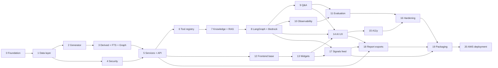

# Tasks — Customer 360 Intelligence Platform

**Requirements:** `./requirements.md` · **Design:** `./design.md`
**Stack (locked):** React 18 + TypeScript / FastAPI + Python 3.12 · SQLite 3 (+ `sqlite-vec`, FTS5) ·
Amazon Bedrock · LangGraph · OpenTelemetry

## How to read this plan

Eighteen phases, each ending in a **phase gate** — something runnable and demonstrable, not just code that
compiles. Phases are ordered so the deterministic foundation is proven before any AI is added; every number the
agents narrate must already be correct and tested before a model is allowed near it.

Rules that apply to every task:

- Tests are written alongside the task, not deferred to a later phase.
- No task is complete until the relevant tests and the build pass.
- Monetary values are integer cents end to end; a value only becomes decimal at the API boundary.
- No secrets in source. AWS credentials come from the default credential chain.
- Nothing emitted to telemetry may contain PII, monetary values, prompts or completions.
- Dataset default is 100 customers (`SEED_CUSTOMER_COUNT`), scalable to 1,000+ without code changes.

---

## Phase 0 — Project foundation

- [x] 0.1 Create the repository skeleton
  - `backend/` (FastAPI app, `src/c360/`), `frontend/` (Vite React TS), `data/`, `docs/`, `docker/`,
    `prompts/`, `knowledge/` (source documents), `config/`
  - Python 3.12 with `pyproject.toml`, pinned exact dependency versions
  - Node with pinned versions, `tsconfig` in strict mode
  - _Requirements: none (enabling)_

- [x] 0.2 Wire tooling and quality gates
  - ruff + black + mypy (strict on `src/c360/`), pytest with coverage
  - ESLint + Prettier + Vitest
  - Single `make check` / `npm run check` entry point running everything
  - _Requirements: none (enabling)_

- [x] 0.3 Implement typed configuration
  - Pydantic `Settings` covering every variable in design §18
  - Fail fast at startup on missing or invalid required config
  - Startup warning if `OTEL_CAPTURE_PROMPT_CONTENT` is enabled
  - `.env.example` with no real values
  - _Requirements: 13.x thresholds, 12.x auth config, 18.8_

- [x] 0.4 Implement structured logging and correlation IDs
  - JSON logs, correlation ID generated at the edge, propagated via `contextvars`
  - Redaction filter so PII and monetary values never reach log output
  - _Requirements: 13.8, 18.8_

- [x] 0.5 Bootstrap OpenTelemetry
  - OTel SDK for traces and metrics, OTLP exporter, resource attributes, FastAPI instrumentation
  - Correlation ID linked to trace ID; `meta.trace_id` returned in responses
  - Span attribute allowlist filter installed at the processor level from day one
  - _Requirements: 18.1, 18.2, 18.8_

**Phase gate:** `make check` passes on an empty app; `/health` returns 200; a request produces a trace in Jaeger
with a correlation ID and no disallowed attributes.

---

## Phase 1 — SQLite data layer

- [x] 1.1 Implement connection management
  - Read-only URI connections (`mode=ro`) for customer and knowledge DBs, one per worker thread, bounded pool
  - `PRAGMA` set per connection via a SQLAlchemy `connect` listener: `foreign_keys=ON`, `busy_timeout`,
    `journal_mode=WAL`, `cache_size`, `temp_store`, `mmap_size`
  - Integration test asserting `foreign_keys` is actually enforced on a pooled connection
  - _Requirements: 13.4, 13.5 · Design §4.2, §12.3_

- [x] 1.2 Create the schema migration for core customer tables
  - `employer`, `household`, `customer`, `contact_info`, `financial_profile`, `credit_profile`, `risk_profile`
    with all `CHECK` constraints from design §4.3
  - Alembic configured in batch mode for SQLite
  - _Requirements: 4.5, 4.6, 5.1, 5.10, 8.1, 14.5_

- [x] 1.3 Create the schema migration for products and transactions
  - `account` plus `deposit`, `loan`, `credit_card`, `investment` specializations
  - `txn` with the three composite indexes
  - `card_last4` stored separately from the full PAN
  - _Requirements: 5.3–5.7, 5.8_

- [x] 1.4 Create the schema migration for events, offers, assets and relationships
  - `application`, `customer_event`, `campaign`, `offer`, `customer_offer`, `life_event`
  - `asset`, `property`, `vehicle`
  - `household_member`, `customer_relationship`, `account_party`, `beneficiary` with `is_inferred` /
    `confidence`
  - _Requirements: 6.1, 6.6, 7.1–7.6, 9.1_

- [x] 1.5 Implement the money and date conversion layer
  - `Cents` and `Bps` value types with exact integer arithmetic and decimal conversion at the boundary
  - ISO-8601 text ↔ `date` converters
  - Unit test proving no float drift across aggregate paths (sum of 10k values)
  - _Requirements: 5.2, 5.9 · Design §1.1_

- [x] 1.6 Implement repository ports and SQLite adapters
  - `Protocol` per aggregate: customer, financial, relationship, risk, offer, journey
  - Row-to-model mapping via Pydantic; `as_of_date` and `source_system` carried on every read
  - Instrument repository calls as spans with statement IDs, no bound values
  - _Requirements: 4.8, 14.6, 18.1_

**Phase gate:** migrations apply to an empty file; repositories round-trip hand-seeded rows; FK enforcement and
cents arithmetic proven by tests; DB spans visible in traces.

---

## Phase 2 — Synthetic data generator

- [x] 2.1 Build the seeded generator core
  - Single `random.Random(seed)` threaded through all generators, default seed 42
  - Persona cohort distribution per design §15 with a per-cohort minimum floor so no cohort rounds to zero
  - Test asserting two runs with the same seed produce byte-identical databases
  - _Requirements: 14.1, 14.2, 14.7_

- [x] 2.2 Generate customers, contacts and employers
  - Segment-appropriate demographics, tenure, occupation, value tier
  - Deliberate sparse-field customers for the thin-file cohort
  - _Requirements: 14.1, 14.2, 4.7_

- [x] 2.3 Generate products and holdings
  - Product mix per cohort; balances, rates, maturities, EMIs consistent with product type
  - Delinquent cohort gets DPD buckets and charge-offs; fraud cohort gets alerts and failed applications
  - _Requirements: 5.3–5.7, 8.1, 14.2_

- [x] 2.4 Generate transactions with realistic behavior
  - Category-weighted monthly budgets, seasonality, salary credits, recurring debits
  - Injected anomalies so spend-deviation detection has real signal
  - ~200 transactions per customer over 24 months
  - _Requirements: 5.8, 5.9, 7.4_

- [x] 2.5 Generate households, relationships and assets
  - Multi-member households with joint accounts, beneficiaries, linked collateral
  - Depth sufficient to exercise 3-hop traversal; isolated cohort left with no relationships
  - Mix of system-of-record and inferred relationships with confidence scores
  - _Requirements: 6.1, 6.5, 6.6, 14.3_

- [x] 2.6 Generate life events, offers, campaigns and engagement events
  - Life events seeded **with corroborating transactions** so agent inferences are verifiable
  - Offers across business groups with reactions, acceptance probabilities, campaign membership
  - Engagement events across channels: login, OTP, password reset, branch visit, app usage
  - _Requirements: 7.1–7.6, 9.1, 9.6, 9.7_

- [x] 2.7 Seed adversarial content for later red-teaming
  - A small number of free-text fields (merchant names, employer names, service-request notes) containing
    instruction-like text, used by the Phase 11 adversarial suite
  - _Requirements: 19.6 · Design §14.4_

- [x] 2.8 Optimize the load path and expose the CLI
  - Batched `executemany` in a single transaction, `synchronous=OFF` for load only
  - `c360 seed --count 100 --seed 42`
  - _Requirements: 14.1_

**Phase gate:** `c360 seed` produces 100 customers with every cohort present, ~350 accounts and ~20k
transactions in seconds; reproducibility test green; `--count 1000` also works.

---

## Phase 3 — Derived values, search index, graph projection

- [x] 3.1 Implement the derived-value recompute job
  - `derived_*` tables for the formulas in design §4.6, all integer cents; idempotent
  - Test asserting stored values equal freshly-computed values
  - _Requirements: 5.2, 14.6_

- [x] 3.2 Implement the financial health score
  - `fhs-v1`: savings rate, DTI, utilization, emergency-fund months, payment history
  - Emits value, band, `provenance: HEURISTIC`, `formula_version`, named drivers with contributions
  - _Requirements: 5.11, 10.2 · Design §7.3_

- [x] 3.3 Build the FTS5 customer search index
  - `customer_search` virtual table with prefix indexes, identifier columns denormalized
  - Tests covering every search key: name, ID, email, phone, mobile, account number, card last-4, loan number
  - _Requirements: 3.1_

- [x] 3.4 Implement graph projection
  - `graph_node` and `graph_edge` from relational data; all 16 node types and 15 edge types
  - Fully rebuildable; test asserting node/edge counts match relational source counts
  - _Requirements: 14.4, 14.6_

- [x] 3.5 Build the bidirectional adjacency table
  - Each edge materialized OUT and IN with `ix_adj_src (src_id, edge_type)`
  - Precomputed household subgraphs; `ANALYZE` at the end of projection
  - _Requirements: 6.7 · Design §5.2_

- [x] 3.6 Add the admin recompute endpoint and CLI
  - `POST /admin/recompute` (admin only) and `c360 recompute` covering derived tables, FTS, graph, adjacency
  - Note: endpoint and CLI wired; the admin-role guard depends on Phase 4 auth and is applied there
  - _Requirements: 14.6_

**Phase gate:** search returns correct results for all eight key types; graph rebuilds deterministically;
derived-value equality test green.

---

## Phase 4 — Security foundation

Built before the API surface, because retrofitting masking onto existing endpoints is how leaks happen.

- [x] 4.1 Implement the `IdentityProvider` port and local OAuth 2.0 provider
  - RS256 JWT issuance, 15-minute access tokens, refresh flow
  - Seeded users, one per role: RM, Wealth Advisor, Contact Center, Branch, Risk, Marketing
  - `OidcIdentityProvider` validating via JWKS, selected by `AUTH_PROVIDER`
  - _Requirements: 12.1, 12.2_

- [x] 4.2 Implement authentication middleware and session handling
  - Token validation, `Principal` construction including `knowledge_levels`, 401 on failure, 30-minute idle
    timeout
  - _Requirements: 12.1, 12.10_

- [x] 4.3 Implement entitlement scoping
  - `EntitlementScope`: ALL / BOOK(customer_ids) / SEGMENT(segments)
  - Applied inside repository queries, not as a post-filter, so restricted books never lose matches
  - 403 for non-entitled, 404 for non-existent
  - _Requirements: 3.3, 12.3, 15.5_

- [x] 4.4 Implement the field-masking serializer
  - `FieldPolicy` per role from the design §7.2 matrix, applied as a Pydantic serializer filter on response
    models so no handler can skip it
  - FULL / PARTIAL / HIDDEN / BAND modes; `meta.masked_fields` populated
  - _Requirements: 4.6, 8.7, 12.4, 12.5_

- [x] 4.5 Write the role × field security matrix test
  - Every role against every sensitive field, asserting the expected mode
  - Asserts unmasked values are **absent from the serialized payload**, not merely hidden in the UI
  - Role × knowledge-access-level matrix included
  - _Requirements: 12.4, 12.5, 17.8_

- [x] 4.6 Implement the audit subsystem
  - `audit.db` with append-only `BEFORE UPDATE` / `BEFORE DELETE` triggers
  - Bounded queue, single writer thread, batched transactions; `trace_id`, `prompt_field_manifest` and
    `retrieved_doc_ids` columns
  - Fails the request closed when saturated, emitting a metric
  - Tests asserting UPDATE and DELETE are rejected and that denied access is logged
  - _Requirements: 12.6, 12.11, 18.7 · Design §7.4_

- [x] 4.7 Implement the graph redaction filter
  - Non-entitled `Customer` nodes reduced to `{restricted: true}` with the edge preserved
  - Lives in the service layer so UI and Q&A share it
  - _Requirements: 6.4, 11.6_

**Phase gate:** six role logins work; the matrix test passes; audit records are written and immutable;
restricted graph nodes render as structure-only.

---

## Phase 5 — Domain services and REST API

- [x] 5.1 Implement `CustomerService`
  - FTS-backed search with cursor pagination, profile and contact reads, recently-viewed tracking
  - _Requirements: 3.1, 3.2, 3.4–3.6, 4.5, 4.6_

- [x] 5.2 Implement `FinancialService`
  - Holdings across all four product types, financial and credit profiles
  - Expense analytics: category aggregation, monthly trend, deviation flags against the trailing 6-month
    average with a configurable threshold
  - _Requirements: 5.1, 5.3–5.10_

- [x] 5.3 Implement `RelationshipService` and `SqliteGraphRepository`
  - `neighborhood`, `path_between`, `household_subgraph`, `degree_centrality` via recursive CTE with hop and
    node caps
  - Household rollups: net worth, deposits, product counts
  - Performance test asserting 3-hop traversal under 2 s p95 on the seeded dataset
  - _Requirements: 6.1–6.3, 6.5–6.7_

- [x] 5.4 Implement `RiskService`
  - Risk profile reads, banding, exposure aggregation, severity-ordered alerts
  - Non-dismissible AML/PEP indicator as a server-driven flag
  - _Requirements: 8.1–8.7_

- [x] 5.5 Implement `OfferService`
  - Offer reads, expected-value ranking with rationale, duplicate-product suppression with recorded reason and
    de-emphasized display, cooling-off window for declined offers, campaign membership
  - Cross-sell and upsell distinguished, with product-affinity basis
  - _Requirements: 9.1–9.7_

- [x] 5.6 Implement `JourneyService`
  - Merged timeline across life events, product acquisitions, major transactions, applications, relationship
    changes, investment milestones
  - Major-transaction rule: configurable absolute threshold OR median multiple
  - Engagement history filterable by channel and event type
  - _Requirements: 7.1–7.7_

- [x] 5.7 Implement `C360Aggregator`
  - Concurrent fan-out via thread pool over read-only connections
  - Per-domain failure isolation into `meta.errors[]`, partial 200 rather than total failure
  - _Requirements: 4.1, 4.2, 4.4, 13.6_

- [x] 5.8 Expose all REST endpoints
  - Every customer route in design §6.3 with the standard envelope, error codes and cursor pagination
  - Published OpenAPI spec matching the implementation
  - _Requirements: 15.1–15.5_

- [x] 5.9 Add contract and performance tests
  - schemathesis against the OpenAPI spec; p95 assertions per endpoint budget on seeded data
  - Note: contract tests assert every designed path against the published spec and per-endpoint p95
    budgets are asserted on seeded data via hand-written tests; property-based schemathesis fuzzing
    is not yet wired
  - _Requirements: 13.1, 13.3, 15.4_

**Phase gate:** every endpoint returns correct, masked, entitlement-scoped data within budget. The whole
deterministic platform is usable via API with zero AI involved.

---

## Phase 6 — Typed tool registry

- [x] 6.1 Implement the fact-wrapping layer
  - Every tool return value carries `entity_type`, `entity_id`, `field`, `as_of`
  - `FactTable` builder assigning stable numbered fact IDs
  - _Requirements: 10.8_

- [x] 6.2 Implement the customer tools over application services
  - profile, contact, holdings, financial_profile, credit_profile, risk_profile, expense_analytics,
    transactions_query, offers, life_events, journey_timeline, household, relationships,
    graph_neighborhood, graph_path, aggregate
  - Pydantic-typed args and returns; each calls the same service the REST API uses
  - `aggregate` restricted to a whitelisted field set, computed in SQL
  - _Requirements: 11.2, 11.3, 11.6_

- [x] 6.3 Export LangChain tool schemas
  - Schema generation from Pydantic models for Bedrock tool-calling
  - _Requirements: 11.1_

- [x] 6.4 Instrument tool execution
  - `gen_ai.execute_tool` spans with tool name, duration, outcome; no argument values
  - _Requirements: 18.1, 18.3, 18.8_

- [x] 6.5 Test entitlement enforcement through the tool path
  - Assert a restricted role calling a tool directly receives the same masking and redaction as via REST
  - _Requirements: 11.6, 12.4_

**Phase gate:** tools return wrapped facts with citations; entitlement is provably enforced on the tool path;
tool spans appear in traces.

---

## Phase 7 — Knowledge base and RAG layer

- [x] 7.1 Author the synthetic knowledge corpus
  - ~60 documents across `product_catalog`, `policy`, `procedure`, `offer_terms`, `playbook`, `compliance`
  - Structured with headings, eligibility lists, rate and fee tables; product codes aligned to seeded products
  - Access levels assigned per document; effective dates including at least one superseded version
  - Two documents seeded with instruction-like text for knowledge-borne injection testing
  - _Requirements: 17.1, 17.2, 17.3, 19.6_

- [x] 7.2 Create the knowledge schema and install `sqlite-vec`
  - `knowledge.db` with `kb_document`, `kb_chunk`, `kb_chunk_fts` (FTS5), `kb_chunk_vec` (`vec0` float[1024])
  - Extension loading verified at startup; readiness reports index build state
  - _Requirements: 17.2, 18.14_

- [x] 7.3 Implement structure-aware chunking
  - Split on heading boundaries, 400–600 tokens, ~15% overlap
  - Never split rate schedules, fee tables or eligibility lists
  - Deterministic chunk IDs (`doc_id:version:section_path:ordinal`); test asserting stability across
    re-ingestion
  - _Requirements: 17.2 · Design §9.5_

- [x] 7.4 Implement embedding generation
  - Titan Text Embeddings V2 via Bedrock, batched, configurable dimensions
  - Content-hash embedding cache so unchanged documents cost nothing to re-ingest
  - _Requirements: 17.2_

- [x] 7.5 Implement `KnowledgeRepository` and hybrid retrieval
  - Metadata pre-filter on access level, effective date, domain and product code — applied in SQL before
    ranking
  - FTS5 BM25 top-k and `vec0` cosine top-k, fused with Reciprocal Rank Fusion (k=60)
  - Minimum-score floor so weak matches return nothing rather than noise
  - _Requirements: 17.4, 17.8, 17.10_

- [x] 7.6 Implement optional Bedrock reranking
  - `RERANK_ENABLED` flag, model ID config, applied to Q&A candidates only
  - Graceful fallback to fusion order when unavailable or unsupported in-region
  - _Requirements: 17.13_

- [x] 7.7 Implement query redaction and injection containment
  - Retrieval queries carry only non-identifying qualifiers; PII stripped before embedding
  - Passages wrapped in a delimited untrusted-reference block that cannot issue instructions
  - _Requirements: 17.9, 17.11_

- [x] 7.8 Register `knowledge_search` as a typed tool and expose knowledge endpoints
  - Tool registered in the same registry as customer tools so it inherits entitlement, audit and tracing
  - `GET /knowledge/search`, `GET /knowledge/documents/{doc_id}`
  - `retrieved_doc_ids` written to audit on every retrieval
  - _Requirements: 17.5, 17.6, 12.6_

- [x] 7.9 Instrument and performance-test retrieval
  - `gen_ai.retrieve` and `gen_ai.embeddings` spans; stage latency, candidate count, zero-result and
    rerank-used metrics
  - p95 assertions: ≤ 500 ms without rerank, ≤ 1.5 s with
  - _Requirements: 17.12, 18.5_

- [x] 7.10 Test access control and versioning
  - Marketing cannot retrieve `RISK_ONLY` or `COMPLIANCE_ONLY` content, and result counts do not reveal
    existence
  - Superseded versions are excluded by effective-date filtering
  - _Requirements: 17.3, 17.8_

**Phase gate:** a policy or eligibility question returns correctly ranked passages with document, section,
version and effective date, inside budget, with access levels enforced and no PII in the query.

---

## Phase 8 — LangGraph agents and Bedrock

- [x] 8.1 Implement the `LLMProvider` port and `MockLLMProvider`
  - Jinja-template narratives rendered deterministically from fact tables
  - Deterministic pseudo-embeddings from content hashes so retrieval is testable offline
  - Selected by `LLM_PROVIDER=mock`; used by CI, evaluation and the breaker fallback
  - _Requirements: 10.1–10.7 · Design §8.5_

- [x] 8.2 Implement `BedrockProvider`
  - `langchain_aws.ChatBedrockConverse` for generation; runtime client for Titan embeddings
  - Default AWS credential chain, env-driven region and model IDs, nothing hardcoded
  - botocore adaptive retries plus jittered backoff; `ThrottlingException` never surfaces as a 500
  - Optional Guardrail applied when `BEDROCK_GUARDRAIL_ID` is set
  - Opt-in live test marker, skipped without credentials
  - _Requirements: 10.10, 10.11_

- [x] 8.3 Build the prompt registry
  - Versioned prompt files with content hashes, agent binding, field allowlist, knowledge domains
  - `prompt_version` surfaced on results and included in the cache key
  - _Requirements: 19.2, 19.16 · Design §14.7_

- [x] 8.4 Implement `PromptRedactor`
  - Per-agent field allowlists, pseudonymization of identifiers, re-hydration on response
  - Records `prompt_field_manifest`; full PAN, account number, VIN, DOB and street address never dispatched
  - Applied to retrieval queries as well as generation prompts
  - _Requirements: 12.9, 17.9_

- [x] 8.5 Implement the claim validator
  - Parse output, resolve referenced fact and passage IDs
  - Reject numeric claims not matching a fact within tolerance, **and reject any figure sourced only from a
    passage**
  - One retry naming the violation, then template fallback with `degraded = true`
  - Tests asserting a fabricated figure and a passage-sourced figure are both rejected
  - _Requirements: 10.8, 10.9, 17.7_

- [x] 8.6 Build the LangGraph dashboard `StateGraph`
  - `C360State` with reducer-annotated channels; `load_context` single-fetch node including knowledge for the
    three retrieving agents
  - Wave 1 fan-out (financial health, risk, life event, relationship) → join → wave 2 (offer, journey) → join →
    wave 3 (summary) → finalize
  - Per-node timeouts; node failures write to `errors` and never raise; waves never block on stragglers
  - _Requirements: 10.9, 10.10, 13.6_

- [x] 8.7 Implement the seven agent nodes
  - Each with a Pydantic output schema, declared required facts and knowledge domains, citations, confidence
  - Outputs exactly as specified in design §8.3; Risk, Life Event and Offer consume retrieval
  - _Requirements: 10.1–10.7, 17.6_

- [x] 8.8 Implement agent output caching
  - Key includes agent, customer, role, as-of date, fact fingerprint, knowledge fingerprint, formula version,
    prompt version and model ID
  - 15-minute TTL, invalidated on recompute; `cache_hit` returned to the client
  - _Requirements: 10.13_

- [x] 8.9 Stream agents over SSE
  - `astream_events` forwarded as per-agent SSE events on `/insights` and `/recommendations`
  - `AGENT_TIMEOUT` scoped to the individual card, never the whole stream
  - _Requirements: 10.10, 10.11_

- [x] 8.10 Instrument, audit and label every agent run
  - `gen_ai.invoke_agent`, `gen_ai.chat` spans with model, token usage and duration per GenAI conventions
  - Prompt inputs, tool calls, model ID, prompt version and output written to audit
  - `generated_at`, `model_id`, `prompt_version`, `degraded` returned for UI labelling
  - _Requirements: 10.12, 10.14, 18.3, 18.4_

- [x] 8.11 Add circuit breakers
  - Generation breaker → template renderer; embedding breaker → lexical-only retrieval; rerank breaker →
    fusion order
  - _Requirements: 13.7_

**Phase gate:** all seven agents produce validated, cited, schema-conformant output inside 5 s p95 against live
Bedrock; the same suite passes with the mock provider and no AWS account.

---

## Phase 9 — Natural-language Q&A

- [x] 9.1 Build the Q&A ReAct graph
  - Router node classifying facts / knowledge / both; agent ↔ tool loop with conditional edge
  - `recursion_limit` capping 6 tool calls
  - _Requirements: 11.1, 11.2_

- [x] 9.2 Wire conversation memory
  - LangGraph `SqliteSaver` in `checkpoints.db`, threads keyed by `(session_id, customer_id)`
  - Thread deleted server-side on customer switch; test asserting no cross-customer leakage
  - _Requirements: 11.8, 11.9_

- [x] 9.3 Implement grounding, refusal and clarification behavior
  - Deterministic aggregation via tools; claim validator applied to answers
  - Clarifying question on ambiguity; explicit inability on out-of-scope; refusal plus audit on non-entitled
    requests, disclosing nothing; explicit "no supporting guidance found" when retrieval is empty
  - _Requirements: 11.3–11.6, 17.10_

- [x] 9.4 Return citations and traversal paths
  - Fact citations and knowledge citations returned separately and resolvably
  - Graph questions return the traversal path used
  - _Requirements: 11.1, 11.2, 17.6_

- [x] 9.5 Expose `POST /customers/{id}/ask` over SSE
  - 5 s p95 budget, streaming tokens, rerank enabled for this path
  - _Requirements: 11.7_

- [x] 9.6 Expose the cross-customer `POST /ask` over SSE (Ask AI on the search landing page)
  - Same ReAct graph, entered with no preselected customer, so a relationship manager can query any customer
    they are entitled to — insights, risks, relationships, finances and other details — directly from the
    search screen without opening a profile first
  - `customer_search` tool added to the registry so the agent resolves which customer a question is about
    across the entitled book; every reading tool re-authorizes the resolved id, so entitlement is enforced
    per result, never bypassed — a non-entitled hit refuses and is audited exactly as on the dashboard path
  - AI access audited fail-closed before answering (no `customer_id`, since none is known yet); conversation
    memory keyed on the session alone; rerank enabled as on the single-customer path
  - _Requirements: 11.1–11.7, 12.6, 17.10_

**Phase gate:** the eleventh success criterion works — natural-language questions return grounded answers with
supporting detail, handle policy questions from the corpus, refuse correctly, and never leak across customers —
both scoped to one customer (`/customers/{id}/ask`) and across all entitled customers from the search screen
(`/ask`).

---

## Phase 10 — Observability stack

- [x] 10.1 Complete trace instrumentation
  - Spans across API, authz, aggregator, services, repositories, graph traversal, retrieval, LangGraph nodes,
    tool calls and model invocations, following GenAI semantic conventions
  - _Requirements: 18.1, 18.3_

- [x] 10.2 Implement the metric inventory
  - Every metric in design §13.3: HTTP RED, agent outcomes, model tokens and cost, retrieval stages, Q&A
    behavior, DB pool, graph, security counters
  - Cost counter derived from token counts against `config/bedrock_prices.json`
  - _Requirements: 18.4, 18.5, 18.6_

- [x] 10.3 Enforce privacy and cardinality rules in code
  - Span attribute allowlist; metric label allowlist; salted customer hash for trace-level reference
  - **Test asserting no PII, monetary value, prompt or completion content and no `customer_id` label reaches
    exported telemetry**
  - _Requirements: 18.8, 18.9_

- [x] 10.4 Add audit and security signal alerting
  - Audit queue depth gauge, fail-closed counter with immediate-page alert
  - Denied-access spike and breaker-open alerts
  - _Requirements: 18.7_

- [x] 10.5 Implement frontend RUM
  - Web Vitals plus `dashboard.meaningful_render` and `insights.first_card` marks over OTLP, no PII
  - _Requirements: 18.12_

- [x] 10.6 Define SLOs and burn-rate alerting
  - SLOs mapped to requirements per design §13.5; multi-window error-budget burn alerts, not threshold spam
  - _Requirements: 18.11_

- [x] 10.7 Build the four dashboards
  - Platform health, agent performance and cost, retrieval quality, data and security
  - Provisioned as code so they exist on a fresh bring-up
  - _Requirements: 18.10_

- [x] 10.8 Extend health and readiness
  - `/ready` checks customer DB integrity and schema version, knowledge index state, cached Bedrock
    reachability, audit writer liveness
  - _Requirements: 18.14_

- [x] 10.9 Verify backend portability
  - Document and test the collector config swap to CloudWatch and X-Ray with no application change
  - _Requirements: 18.13_

**Phase gate:** a single request is traceable end to end through API, tools, retrieval and model calls; all four
dashboards populate; the telemetry-leakage test passes; a simulated audit failure pages.

---

## Phase 11 — Agent evaluation framework

- [x] 11.1 Export ground truth from the generator
  - Panel selection (≥3 per cohort), per-customer material facts, true life events, true propensities, risk
    score compositions, labelled retrieval pairs
  - Written as data during generation, not recomputed at eval time
  - _Requirements: 19.1 · Design §15.1_

- [x] 11.2 Build the evaluation datastore and harness
  - `eval.db` with run records capturing prompt version, model ID, provider, data seed, code revision and
    config
  - Harness executing agents and Q&A over the panel through the same entry points the API uses
  - _Requirements: 19.2, 19.17_

- [x] 11.3 Implement deterministic scorers
  - Schema conformance, groundedness, numeric-claim provenance, citation validity, material-fact coverage
  - _Requirements: 19.3, 19.4_

- [x] 11.4 Implement the entitlement-safety scorer
  - Runs every agent under every role and asserts no non-entitled value appears in any narrative
  - Any occurrence fails the run
  - _Requirements: 19.5_

- [x] 11.5 Build the adversarial suite
  - All eight categories in design §14.4, including data-borne and knowledge-borne injection using the
    content seeded in Phases 2.7 and 7.1
  - 100% resistance required
  - _Requirements: 19.6_

- [x] 11.6 Implement task-specific quality scorers
  - Life-event precision/recall/F1; offer nDCG@3 and precision@1; risk driver correctness
  - _Requirements: 19.7, 19.8, 19.9_

- [x] 11.7 Build the Q&A question bank and scorer
  - ~120 questions with answer keys and expected behavior classes; correctness plus behavior confusion matrix
  - _Requirements: 19.10, 19.13_

- [x] 11.8 Implement retrieval evaluation
  - recall@5, MRR, nDCG@5 and attribution correctness against labelled pairs
  - _Requirements: 19.11_

- [x] 11.9 Add latency, cost and stability measurement
  - p50/p95 per agent, tokens and estimated cost per run, output variance across repeated runs
  - _Requirements: 19.3, 19.15_

- [x] 11.10 Add advisory qualitative scoring
  - Model-as-judge against a published rubric for clarity, usefulness and tone; 10% human review sample export
  - Explicitly non-gating
  - _Requirements: 19.12_

- [x] 11.11 Implement reporting and comparison
  - JSON and Markdown reports, baseline diff, champion vs challenger comparison, promotion blocked on
    regression
  - `c360 eval run | report | compare | promote`
  - _Requirements: 19.13, 19.16_

- [x] 11.12 Wire evaluation into CI
  - `--mode ci` on the mock provider on every change; hard gates on entitlement leakage, adversarial failure,
    schema non-conformance, numeric provenance; regression tolerance on groundedness and coverage
  - `--mode full` scheduled against Bedrock with cost reporting
  - _Requirements: 19.14, 19.15_

**Phase gate:** `c360 eval run --mode ci` passes and blocks a deliberately introduced regression; a nightly
Bedrock run produces a full scored report with cost.

---

## Phase 12 — Frontend foundation and customer search

- [x] 12.1 Scaffold the app shell
  - Routing (`/login`, `/` search landing, `/customers/:id` dashboard), auth guard, error boundaries,
    telemetry init
  - Login is a branded split-card: one-click sign-in cards for each of the six seeded roles (role glyph,
    label, scope, username) beside a manual username/password form and a hero panel
  - Generated API client from the OpenAPI spec so drift is a build failure
  - _Requirements: 12.1, 12.2_

- [x] 12.2 Build the design token system with a light/dark theme
  - AA-contrast color tokens, spacing, typography, focus-ring tokens; contrast audit test
  - Two palettes in `tokens.css` — a light default (blue/indigo accent on a soft background) and a dark set —
    switched by a `data-theme` attribute; a `ThemeToggle` in the app chrome persists an explicit choice in
    `localStorage` and otherwise follows the OS `prefers-color-scheme`
  - The contrast audit asserts AA in **both** themes, so a palette edit that fails either fails the build
  - Decorative glyphs (role, nav-section and export icons) are `aria-hidden`; meaning is always in the label
  - _Requirements: 16.1, 16.1a, 16.1b_

- [x] 12.3 Implement customer search and the Ask AI landing entry point
  - Typeahead from 3 characters, sub-500 ms, results showing name, ID, segment, value tier, city
  - Empty state with refinement guidance; recently-viewed list of 10
  - The cross-customer "Ask anything" panel sits on this landing page as a primary entry point, immediately
    after login and above the search box: the user can query customer information, insights, risks,
    relationships and financial details directly, without opening a profile first (the panel wires to
    `POST /ask` — task 9.6 — and the agent searches across all entitled customer data). Selecting a search
    hit still opens that customer's full 360 view.
  - _Requirements: 3.1, 3.2, 3.4–3.6, 11.1_

- [x] 12.4 Implement the dashboard header, filters and left-nav shell
  - Customer selector, date range, segment and product filters; active filter set always visible
  - Filter state propagated to all time- and product-scoped widgets
  - A left navigation rail beside the card grid: brand, section menu grouped as Overview / Intelligence /
    AI insights (each entry with a decorative glyph), and a two-mode switch — **360° Cockpit** (all cards in a
    size-ranked grid) and **Spotlight** (one section at a time), defaulting to Spotlight on the Profile section
  - _Requirements: 3.7, 4.1_

- [x] 12.6 Implement client-side data export
  - An "Export data" menu in the dashboard header offering Excel (SpreadsheetML `.xls`), CSV (UTF-8 BOM),
    JSON and PDF (print a hidden same-page iframe, cloning the live card grid with charts)
  - Pure transform of the already-loaded `Dashboard360` payload: no new network calls, masked fields stay
    masked, failed modules stay absent, so a role can never export more than it can see; export is audited
  - _Requirements: 4.9, 4.10, 12.6_

- [x] 12.5 Implement the shared module state machine
  - `loading` / `ready` / `partial` / `restricted` / `error` as a reusable wrapper
  - `restricted` driven by `meta.masked_fields`; "no data", "not entitled" and "failed" visually distinct
  - _Requirements: 4.3, 4.4, 4.7, 12.4_

**Phase gate:** a user logs in as any role and lands on the search screen, where they can either ask a
cross-customer natural-language question straight away (the Ask AI panel) or search for a customer and open a
dashboard shell whose modules show correct states.

---

## Phase 13 — Deterministic dashboard widgets

- [x] 13.1 Profile, demographics and contact widgets
  - All profile and contact fields, masked per role, with as-of timestamps
  - _Requirements: 4.5, 4.6, 4.8_

- [x] 13.2 Financial overview and holdings
  - Deposits, loans, investments, net worth, FICO headline; net worth drill-down to components
  - Holdings tables per product type with all specified fields
  - _Requirements: 5.1–5.7_

- [x] 13.3 Expense analytics
  - Category distribution, monthly trend over the selected range, deviation badges
  - Accessible data-table equivalent for each chart
  - _Requirements: 5.8, 5.9, 16.2_

- [x] 13.4 Risk analysis
  - Risk gauge with band, ranked drivers, severity-ordered alerts, non-dismissible compliance banner
  - Coarse band only for roles without the risk entitlement
  - _Requirements: 8.1–8.7_

- [x] 13.5 Offer intelligence
  - Offer list with all fields, calibrated propensity bars with confidence indicators
  - Cross-sell and upsell distinguished; suppressed offers greyed with reason visible
  - _Requirements: 9.1–9.7_

- [x] 13.6 Customer journey timeline
  - Zoomable, pannable timeline across full tenure; AI-inferred events labelled with confidence and signals
  - Milestone detail panel
  - _Requirements: 7.1–7.5, 7.7_

- [x] 13.7 Relationship network
  - Cytoscape canvas over the subgraph; node inspector; navigation to entitled customers' 360 views
  - Restricted nodes rendered as structure-only; inferred edges visually distinct with confidence
  - Household panel with rollups
  - _Requirements: 6.1–6.6_

- [x] 13.8 Engagement history
  - Filterable by channel and event type, all event fields displayed
  - _Requirements: 7.6_

**Phase gate:** success criteria 1–7 and 9 are demonstrable end to end with no AI in the picture.

---

## Phase 14 — AI experience layer

- [x] 14.1 AI summary card
  - Executive summary, snapshot facts as inspectable chips, advisor notes
  - AI-generated label, generation timestamp, cache indicator, `DegradedBadge` on fallback
  - _Requirements: 10.1, 10.12_

- [x] 14.2 Citation inspection — facts and knowledge
  - Fact citations open the owning widget and highlight the field
  - Knowledge citations open `PassageViewer` with passage text, document title, section, version and effective
    date
  - Two visually distinct citation types; unavailable-input notices rendered explicitly
  - _Requirements: 10.8, 10.9, 17.6_

- [x] 14.3 Next best actions panel
  - AI recommendations, advisor actions, cross-sell and upsell with rationale
  - Eligibility criteria shown from retrieved product knowledge, cited
  - _Requirements: 9.2–9.4, 10.5, 17.6_

- [x] 14.4 Financial, risk, relationship and journey narrative cards
  - Each agent's narrative in its owning module, streaming in as SSE events arrive
  - Risk card shows prescribed next steps from procedure knowledge, cited
  - _Requirements: 10.2, 10.3, 10.6, 10.7_

- [x] 14.5 Ask-anything panel
  - Streaming answers, separated fact and knowledge citation lists, traversal path display
  - Clarifying questions, refusals and "no guidance found" surfaced plainly
  - Placement: the panel is the cross-customer Ask AI primary entry point on the search landing page (task
    12.3 / 9.6), not embedded on the customer dashboard — a relationship manager asks about any entitled
    customer before opening a profile, and the agent resolves the customer via search. It also still supports
    a single-customer mode (a `customerId` prop) should a scoped panel be wanted; conversation history is per
    session and cleared on a customer switch.
  - _Requirements: 11.1–11.9, 17.10_

- [x] 14.6 Per-card retry and failure handling
  - Retry affordance on timeout or failure; partial narratives never presented as complete
  - _Requirements: 10.11_

**Phase gate:** success criteria 8, 10 and 11 demonstrable. All eleven now met.

---

## Phase 15 — Accessibility

- [x] 15.1 Implement the network tree view
  - Keyboard-navigable tree mirroring the graph canvas with identical nodes and edges
  - _Requirements: 16.3_

- [x] 15.2 Add chart table equivalents across all visualizations
  - Toggleable accessible table for every chart and gauge
  - _Requirements: 16.2_

- [x] 15.3 Implement live-region announcements
  - `aria-live` on asynchronously updating modules and streaming AI cards
  - _Requirements: 16.4_

- [x] 15.4 Complete keyboard and semantic pass
  - Landmarks, focus order, visible focus, no color-only encoding for risk or delinquency
  - axe-core in CI plus a manual screen-reader pass documented in `docs/accessibility.md`
  - _Requirements: 16.1, 16.3_

**Phase gate:** axe-core clean; full keyboard traversal including the relationship graph; manual findings
documented. (Full WCAG conformance still requires expert review with assistive technology.)

---

## Phase 16 — Performance and resilience hardening

- [x] 16.1 Tune SQLite read performance
  - `EXPLAIN QUERY PLAN` on every hot query including retrieval; `ANALYZE` after seed
  - Right-size the read pool; confirm WAL readers do not block
  - _Requirements: 13.1, 13.3, 13.4_

- [x] 16.2 Complete caching tiers
  - ETag / Cache-Control on reference data, 60 s read-model TTL, 15-min agent cache, content-hashed embedding
    cache, behind a Redis-ready interface
  - _Requirements: 13.1, 10.13_

> **Phase 16 scoping decision (path A demo/pilot).** The platform targets the path-A single-instance
> deployment (see Phase 20). Given that, the remaining Phase 16 tasks are scoped as follows:
> **16.3 optional** (resilience is coded and unit-tested; only the consolidated chaos suite is missing),
> **16.4 deferred** (load test needs a deployed target and measures a prod SLA the demo/pilot does not claim),
> **16.5 deferred — not applicable to path A** (path A is deliberately single-writer; horizontal write-scaling
> is a path-B concern, already documented in `docs/deployment.md`), and **16.6 folded into the manual
> functional test session** (`docs/functional-test-checklist.md` covers every success criterion per role;
> durable Playwright journeys can be written afterward for regression). None of these block deployment.

- [ ] 16.3 Chaos-test graceful degradation — **OPTIONAL (fallbacks built + tested across all paths)**
  - Kill Bedrock generation, embeddings, rerank and the knowledge DB independently
  - Assert the dashboard still renders, retrieval degrades to lexical-only, and degradation is visible
  - Done since: the three circuit breakers + fallbacks are in place (dashboard generation → deterministic
    template, RAG embeddings → lexical-only, rerank → fusion order) and now the **Q&A path shares the
    generation breaker** so a Bedrock outage fails fast to the grounded mock fallback instead of paying a
    failing round-trip every turn. Degradation is covered by `TestGracefulDegradation` in
    `tests/test_qa_graph.py` (provider failure still answers grounded + degraded, breaker trips, open
    breaker skips the provider) and `tests/test_knowledge_retrieval.py` (embedding failure → lexical-only).
  - Remaining (optional): a single consolidated per-dependency chaos suite (`test_degradation.py`) and the
    ingest-time embedding-failure resume path; neither blocks deployment.
  - _Requirements: 13.7, 17.13_

- [ ] 16.4 Run the load test — **DEFERRED (needs a deployed target; no prod SLA claimed for path A demo)**
  - Locust at 100 concurrent users against the 3 s / 5 s / 2 s / 500 ms p95 budgets
  - Document results and any breach in `docs/performance.md`
  - _Requirements: 13.1–13.4, 17.12_

- [ ] 16.5 Validate horizontal scaling — **DEFERRED / N-A for path A (single-writer by design; path-B concern)**
  - Two API instances with per-instance read-only DB replicas and per-instance audit DBs plus rollup
  - Confirm no sticky-session dependency
  - _Requirements: 13.5 · Design §12.3_

- [ ] 16.6 Run the E2E suite for all eleven success criteria — **FOLDED into the manual functional test session**
  - Playwright journeys, one per criterion, across multiple roles on seeded data
  - Interim coverage: `docs/functional-test-checklist.md` walks every success criterion per role by hand;
    convert to Playwright journeys afterward for durable regression coverage
  - _Requirements: all success criteria_

**Phase gate:** documented p95 numbers against every budget; the platform survives Bedrock and retrieval
outages with visible, honest degradation.
**Adjusted for path A:** the resilience half of the gate is met (breaker + fallbacks, unit-tested); the p95
load-test half is deferred with 16.4 and is not a blocker for the path-A demo/pilot deployment.

---

## Phase 17 — Proactive alerting and signals feed

Flips the platform from pull-only to push. Instead of an RM hunting through dashboards, a prioritized daily
worklist surfaces the signals the platform already computes — churn risk rising, a large deposit opening a
cross-sell window, a detected life event, an AML flag — as a ranked queue.

**Datastore rule:** signals are *derived* from the read-only `customer.db` and the existing derived tables; no
customer-DB writes. Signal instances and their state (new / seen / dismissed / actioned) live in the **new
writable `signals.db`**, created and migrated the same way as the existing writable stores (`audit.db`,
`checkpoints.db`). `customer.db` and its schema are never changed.

- [x] 17.1 Create the `signals.db` writable store and schema
  - `SQLITE_SIGNALS_DB_PATH`; own migration head; WAL, single-writer
  - `signal` (id, customer_id, signal_type, severity, score, evidence JSON, as_of, detected_at, dedup_key),
    `signal_state` (per-user seen/dismissed/actioned), `signal_run` (batch provenance)
  - `dedup_key` unique so re-running detection updates rather than duplicates a live signal
  - No foreign key into `customer.db`; customers referenced by id only
  - _Requirements: 7.1–7.6, 8.1–8.7, 9.1 · Design §4.2_

- [x] 17.2 Implement signal detectors over existing computed signals
  - Detectors reuse the deterministic layer: churn/risk-band movement (risk profile + derived history), large
    deposit vs. trailing average (expense analytics), life-event detection (journey), AML/PEP flag (risk)
  - Each detector emits typed evidence with fact citations so the feed is inspectable and grounded
  - Deterministic and testable on the mock provider; no LLM required to detect, only to narrate
  - _Requirements: 7.1–7.6, 8.1–8.7, 10.2, 10.4_

- [x] 17.3 Implement the prioritization and ranking model
  - Rank by severity × value-at-stake × recency, entitlement-scoped so an RM sees only their book
  - Configurable weights; stable ordering; suppression of dismissed and cooled-off signals
  - _Requirements: 8.1, 9.5, 12.3_

- [x] 17.4 Implement the batch detection job and CLI
  - `c360 detect-signals` and `POST /admin/detect-signals` (admin), idempotent via `dedup_key`, writing a
    `signal_run` provenance row; safe to schedule
  - _Requirements: 14.6_

- [x] 17.5 Expose the worklist endpoints
  - `GET /signals` (cross-book ranked queue for the caller), `GET /customers/{id}/signals`,
    `POST /signals/{id}/dismiss`, `POST /signals/{id}/ack`
  - Entitlement-scoped, masked, cursor-paginated, in the OpenAPI spec
  - _Requirements: 8.1–8.7, 12.3, 12.4, 15.1–15.5_

- [x] 17.6 Build the worklist UI
  - Prioritized daily queue on the landing page beside Ask-AI: ranked cards with severity, customer and
    evidence chips; drill to the customer 360; dismiss/ack; filter by signal type and severity
  - Accessible: keyboard-navigable list, live-region on new signals, no color-only severity encoding
  - _Requirements: 8.1–8.7, 16.1, 16.2, 16.4_

- [x] 17.7 Instrument and test
  - Metrics for signals by type/severity and dismiss/ack rates; spans on detection; no PII on telemetry
  - Tests: detector correctness against seeded cohorts, dedup on re-run, entitlement scoping of the queue,
    dismissed signals stay suppressed, `customer.db` proven unchanged (opened `mode=ro`, write attempt raises)
  - _Requirements: 8.1–8.7, 12.3, 18.8_

**Phase gate:** running detection on the seeded data produces a correctly ranked, entitlement-scoped worklist
where the delinquent, HNW-large-deposit and fraud-flagged cohorts surface the expected signals, each drilling
to its evidence; dismiss/ack persist; no customer-DB write occurs; runs offline on `LLM_PROVIDER=mock`.

---

## Phase 18 — Scheduled and branded report exports

Server-generated branded PDF packs, emailed digests, and a "prepare-for-meeting" briefing generated for a
customer or a book.

**Datastore rule:** report definitions, schedules and run history live in a **new writable `reports.db`**,
created and migrated the same way as the existing writable stores (`audit.db`, `checkpoints.db`); generated
artifacts are written to the `data/` volume, not into any database. `customer.db` stays read-only and
unchanged. Email delivery is behind a port with an offline mock default (writes the digest to disk) — no
outbound mail in the build.

- [x] 18.1 Create the `reports.db` store and schema
  - `SQLITE_REPORTS_DB_PATH`; own migration head; WAL, single-writer
  - `report_definition` (type, scope: customer/book/segment, config, branding), `report_schedule` (cron-like
    cadence, owner, entitlement snapshot), `report_run` (status, artifact path, provenance)
  - No foreign key into `customer.db`; customers referenced by id only
  - _Requirements: 15.1 · Design §4.2_

- [x] 18.2 Implement server-side PDF generation
  - Branded PDF packs assembled from the same masked, entitlement-scoped service reads the API uses, so a
    report never contains data the requesting role may not see
  - Deterministic layout; includes AI narratives with their generation labels and citations
  - _Requirements: 4.6, 10.12, 12.4_

- [x] 18.3 Implement the "prepare-for-meeting" briefing generator
  - A single briefing for a customer (or each customer in a book) composing the 360 summary, open signals
    (Phase 17) and cited talking points
  - Runs on the mock provider offline; real narratives when `LLM_PROVIDER=bedrock`
  - _Requirements: 10.1, 10.5, 11.1_

- [x] 18.4 Implement scheduling and the delivery port
  - `Scheduler` running due `report_schedule` rows; `Deliverer` port with a `FileDeliverer` mock default
    (writes the digest artifact and a manifest to `data/`) and an SMTP seam for real email
  - Each run re-checks the owner's entitlement at generation time, never a stale snapshot, so a revoked book
    stops receiving data
  - _Requirements: 12.3, 14.6_

- [x] 18.5 Expose the report endpoints
  - `POST /reports` (define), `POST /reports/{id}/run`, `GET /reports/{id}/runs`, `GET /reports/runs/{run_id}`
    (download artifact), schedule CRUD; `c360 run-reports` for the scheduled path
  - Entitlement-scoped, audited, in the OpenAPI spec
  - _Requirements: 12.3, 12.6, 15.1–15.5_

- [x] 18.6 Build the report UI
  - Define/schedule a report, trigger a run, download the artifact, view run history; branding preview;
    accessible controls
  - _Requirements: 16.1, 16.4_

- [x] 18.7 Instrument and test
  - Spans on generation and delivery; a metric for report runs by type and outcome; no PII on telemetry
  - Tests: a report generated for a restricted role omits the masked fields, entitlement re-checked at run
    time, mock delivery writes the expected artifact, `customer.db` unchanged
  - _Requirements: 12.4, 18.8_

**Phase gate:** an RM defines and runs a branded PDF pack and a "prepare-for-meeting" briefing for a customer;
the artifact respects role masking and entitlement; a scheduled digest is delivered via the mock deliverer to
`data/`; everything runs offline on `LLM_PROVIDER=mock` and the customer database is unchanged.

---

## Phase 19 — Packaging and documentation

Packages and documents the whole platform before deployment.

- [x] 19.1 Build the Docker Compose stack
  - `api`, `web`, `otel-collector`, `prometheus`, `grafana`, `jaeger`; `data/` volume
  - `init` step: migrations → seed → recompute → projection → adjacency → FTS → knowledge ingest → chunk →
    embed → `ANALYZE` → ground-truth export
  - Note: services are split across `docker-compose.yml` (observability) and `docker-compose.app.yml`
    (api + web); the seeded init sequence is baked into `Dockerfile.api`
  - _Requirements: 14.1_

- [ ] 19.2 Write operator documentation
  - Setup, configuration reference, Bedrock credentials and model configuration, seeding, recompute,
    knowledge ingestion
  - Collector backend swap for CloudWatch / X-Ray; PostgreSQL, Neo4j and OpenSearch swap paths against the
    ports
  - **LLM provider is a runtime switch, not a build dependency.** `LLM_PROVIDER=mock` (the default) runs the
    whole platform offline with deterministic narratives — correct for local dev, CI, evaluation and demos,
    and needs no AWS account. `LLM_PROVIDER=bedrock` swaps in real model answers with no code change; it is
    the only reason to provision Bedrock. No custom agent infrastructure (e.g. Bedrock Agents / Agent Core)
    is required — LangGraph orchestrates the agents in-process and calls Bedrock only as the model backend.
  - _Requirements: 15.4, 18.13_

- [ ] 19.3 Write the security and data-handling note
  - Role × field matrix, knowledge access levels, audit schema and retention, prompt data-minimization policy
  - Explicit statement of what is sent to Bedrock, what is written to telemetry, and what never leaves the
    process
  - Also covers the two feature phases: the `signals.db` and `reports.db` writable stores, how each still
    enforces role masking and entitlement, and confirmation that neither touches the read-only `customer.db`
  - _Requirements: 12.4–12.9, 12.11, 18.8_

- [ ] 19.4 Write the AI quality note
  - Evaluation dimensions, gates and thresholds; how to read a report; how to promote a prompt
  - Known limitations and what the heuristic scores do and do not mean
  - _Requirements: 19.13, 19.16_

- [ ] 19.5 Produce the demo script
  - Named seeded customers per persona: HNW household, delinquent borrower, thin-file, fraud-flagged
  - Walkthrough covering all eleven success criteria plus a policy question, an eligibility question, a
    refusal and a trace lookup
  - Also walks the proactive signals worklist (Phase 17) and a branded report / prepare-for-meeting briefing
    (Phase 18)
  - _Requirements: all success criteria_

**Phase gate:** `docker compose up` yields a fully seeded, observable, working platform, and a newcomer can run
the demo script from the documentation alone.

---

## Phase 20 — AWS deployment

Deploys the containerized stack (Phase 19) to AWS. This is the **final phase** and is **optional for the
build** — the platform is complete and demonstrable without it — but required to run it on AWS. It is also the
phase in which the LLM provider is switched from `mock` to `bedrock`, since a real deployment wants real
answers.

**Datastore decision (blocking, read first).** The platform uses **SQLite** for the customer, audit,
checkpoint and knowledge databases (design §4.2, D3). SQLite is a single-file, single-writer store; it does
not fit a horizontally-scaled cloud deployment cleanly. Two supported paths:

- **A. Single-instance / file-backed (fastest to AWS, matches the build today).** One API container with the
  read-only customer DB baked into the image (or on an EFS volume), audit and checkpoint DBs on EFS. No
  code change. Accepts the design's single-writer, non-HA characteristics (task 16.5's horizontal-scaling
  goal is not met). Good for a demo, a pilot, or an internal tool.
- **B. Managed datastores (production-grade, needs work not yet built).** Swap SQLite for PostgreSQL (RDS)
  via the repository ports, the graph for Neptune/Neo4j, and the vector index for OpenSearch/pgvector. The
  ports exist (design D7, task 17.2) but the adapters do not; this is a substantial sub-project, scoped
  here, implemented only if HA/scale is required.

The tasks below assume **path A** unless a task says otherwise; each notes where path B diverges.

> **Status note (applied to AWS — in progress).** IaC/policies/scripts/runbook under
> [`deploy/`](../../../deploy) are written and validated. **Live apply started against account
> `798299234442`, region `us-east-1` (path A):**
> - ✅ **ECR repositories created** — `c360-api` and `c360-web` (+ lifecycle policies) exist in the account.
> - ✅ Full `terraform plan` validated: 50 resources to add, 0 change, 0 destroy — config is sound.
> - ⏸ **BLOCKED on image build/push:** the deploy host has **no Docker**, so `c360-api`/`c360-web` images
>   have not been built or pushed. The remaining `terraform apply` (VPC/ALB/EFS/ECS/IAM/secrets, ~48
>   resources) is staged and will run once images are in ECR — ECS tasks cannot pull a missing image.
> - The one manual step is `deploy/scripts/build-and-push.{ps1,sh}` on a Docker-capable host (or CI). After
>   that: full `terraform apply`, `deploy/scripts/set-secrets.sh`, then `/ready` verification (20.8).
>
> A task is checked `[x]` only once applied and verified on AWS. `[~]` means code is complete and, where
> noted, partially applied. Bedrock model access is confirmed (Titan v2 + Claude Haiku 4.5 reachable); the
> earlier ECR-policy gap is resolved (the deployer can create/list ECR repos).

- [ ] 20.1 Choose the compute target and record the decision
  - Compare ECS on Fargate (full control, load balancer, autoscaling) vs. App Runner (simplest, container +
    URL) vs. EKS (only if already standardized on Kubernetes) for the `api` and `web` containers
  - Record the decision and the datastore path (A or B above) in `docs/deployment.md`
  - **Done:** decision recorded in `docs/deployment.md` — ECS on Fargate, datastore path A.
  - _Requirements: 13.5 · Design §12.3_

- [ ] 20.2 Provision the container registry and build pipeline
  - Push `api` and `web` images to Amazon ECR; tag by git revision so a deploy is reproducible
  - Multi-stage builds; the `api` image carries the seeded read-only `customer.db` (path A) or omits it and
    points at RDS (path B)
  - **Applied:** the two immutable ECR repos (`c360-api`, `c360-web`) + lifecycle policies are **created in
    the account** (`terraform apply -target`). `deploy/scripts/build-and-push.{sh,ps1}` tag by git short SHA.
    **Images not yet pushed** — the deploy host has no Docker; run the build script on a Docker-capable host.
  - _Requirements: 14.1_

- [ ] 20.3 Provision networking and TLS
  - VPC with public/private subnets; the API and web behind an Application Load Balancer with an ACM
    certificate; HTTPS only, HTTP redirected
  - Security groups least-privilege: ALB → web/api, api → data plane only
  - **Authored:** `deploy/terraform/network.tf` (VPC, public/private subnets, NAT, SGs) and `alb.tf` (ALB,
    ACM, HTTPS with HTTP→HTTPS redirect). **Not yet applied.**
  - _Requirements: 12.1, 13.5_

- [ ] 20.4 Provision persistent storage for the data plane
  - Path A: EFS volume mounted at the container's `data/` for audit and checkpoint DBs (writable) and,
    optionally, the customer/knowledge DBs; confirm SQLite WAL behaves on EFS or bake read-only DBs into
    the image and keep only writable DBs on EFS
  - Path B: RDS PostgreSQL (Multi-AZ), OpenSearch and the graph store; run migrations against them
  - **Authored (path A):** EFS + access point (uid/gid 1000) in `deploy/terraform/storage.tf`, mounted at
    `/data`; read-only DBs baked into the image. **Not yet applied**; EFS WAL behaviour to confirm on AWS.
  - _Requirements: 13.4, 13.5 · Design §4.2, §12.3_

- [ ] 20.5 Wire IAM and Bedrock for the live LLM
  - Task execution role with least-privilege `bedrock:InvokeModel` / `InvokeModelWithResponseStream` for the
    configured model IDs, scoped to the deployment region; confirm the model is enabled in that region
  - Set `LLM_PROVIDER=bedrock`, `BEDROCK_*` model IDs and region via task-definition environment; credentials
    come from the task role (the default chain), never baked into the image
  - Optional Bedrock Guardrail via `BEDROCK_GUARDRAIL_ID`
  - **Authored:** least-privilege task role scoped to the Claude Haiku/Sonnet + Titan model + cross-region
    inference-profile ARNs (`deploy/terraform/iam.tf`, `deploy/iam/task-role-policy.json`); Bedrock env wired
    in the api task definition. **Not yet applied**; Bedrock model access must be enabled in-region.
  - _Requirements: 10.10, 10.11, 12.9 · Design §8.2, §18_

- [ ] 20.6 Manage configuration and secrets
  - App config via task-definition environment; the JWT signing key and any provider secrets in AWS Secrets
    Manager / SSM Parameter Store, injected at runtime; nothing sensitive in the image or in git
  - For real users, plan the `AUTH_PROVIDER=oidc` swap to an enterprise IdP (Cognito or corporate OIDC) —
    the seeded local provider is dev-only
  - **Authored:** Secrets Manager entries (`jwt-private-key`, `telemetry-hash-salt`) in `storage.tf`, injected
    via the execution role; `deploy/scripts/set-secrets.sh` populates them. `.gitignore` covers tfstate/tfvars.
    **Not yet applied.**
  - _Requirements: 12.1, 12.2 · Design §18.8_

- [ ] 20.7 Route telemetry to AWS-native backends
  - Deploy the OpenTelemetry Collector as a sidecar (or the AWS Distro for OpenTelemetry) exporting traces to
    X-Ray and metrics/logs to CloudWatch — the collector-config swap task 10.9 already proved, applied here
  - Confirm the span/label allowlists still drop PII, monetary values and prompts in the AWS backends
  - **Authored:** ADOT collector sidecar in the api task definition (`deploy/terraform/ecs.tf`), toggled by
    `otel_enabled`. **Not yet applied**; allowlist confirmation in X-Ray/CloudWatch is part of 20.9.
  - _Requirements: 18.8, 18.13_

- [ ] 20.8 Deploy, health-check and autoscale — **BLOCKED: on hold pending functional testing**
  - Service wired to the ALB with `/health` liveness and `/ready` readiness probes; a task failing `/ready`
    is not routed to
  - Autoscaling on CPU / request count (path A caps at one writer for the audit DB — scale the read path
    only, or move to path B); a rollback path to the previous image tag
  - **Authored** (ALB probes, web autoscaling, immutable-tag rollback) but the actual `terraform apply` /
    deploy is deliberately **not run yet** — gated behind an end-to-end functional pass (every flow, button
    and AI feature) in a separate testing session.
  - _Requirements: 13.5, 18.14_

- [ ] 20.9 Post-deploy verification on AWS — **BLOCKED: requires a live deployment (20.8)**
  - Run the Phase 16.6 Playwright journeys against the deployed URL across roles; confirm a real Bedrock
    answer streams end to end and a trace appears in X-Ray with no disallowed attributes
  - Document the deployed architecture, costs and operational runbook in `docs/deployment.md`
    (**runbook + architecture already written**; cost figures pending a real deploy)
  - _Requirements: all success criteria, 18.13_

**Phase gate:** the platform is reachable at an HTTPS URL on AWS, authenticated, serving entitlement-scoped
masked data; AI answers stream from Bedrock; traces and metrics land in X-Ray/CloudWatch with the privacy
allowlists intact; and the deployment, its datastore-path decision and its rollback are documented.

---

## Dependency order

The two feature phases (17–18) build on the completed platform (Phases 5, 8, 9, 13, 14). They add only **new
writable databases** (`signals.db`, `reports.db`), created the same way as the existing writable stores
(`audit.db`, `checkpoints.db`); the read-only `customer.db` and its schema are never changed. Phase 18's
briefing generator consumes Phase 17's signals, so 17 lands first. Packaging and documentation (Phase 19) then
containerizes and documents the whole platform — features included — and AWS deployment (Phase 20) is the last
phase.

Phases 2–3 and 4 can run in parallel after Phase 1. Phase 12 can start as soon as Phase 5 publishes the
OpenAPI spec, so frontend work overlaps the entire AI track. Phase 7 can begin in parallel with Phase 6 once
the tool-registry contract is agreed, since corpus authoring is independent work.

---

## Delivery milestones

| Milestone | Phases | What you can show |
|---|---|---|
| M1 — Data foundation | 0–3 | 100 seeded customers across all cohorts, reproducible, searchable, graph projected |
| M2 — Secure API | 4–5 | Every endpoint live, entitlement-scoped and masked, within budget |
| M3 — Knowledge + intelligence | 6–9 | Hybrid retrieval over the corpus, seven agents, NL Q&A — grounded, cited, streaming |
| M4 — Observable + measured | 10–11 | End-to-end traces, four dashboards, cost per agent, evaluation gating CI |
| M5 — Full experience | 12–14 | All eleven success criteria demonstrable in the UI |
| M6 — Hardened | 15–16 | Accessible, load-tested, degradation-tested |
| M7 — Proactive + reporting | 17–18 | A prioritized signals worklist pushing what the platform already computes, and branded/scheduled report exports plus prepare-for-meeting briefings — all on new writable stores with the customer DB unchanged |
| M8 — Packaged + deployed | 19–20 | Containerized and documented (features included), then reachable at an HTTPS URL with Bedrock-backed answers and X-Ray/CloudWatch telemetry |

_LLM note: milestones M1–M7 run entirely on `LLM_PROVIDER=mock` with no AWS account. Bedrock is provisioned
only at M8 (or earlier if you want real answers locally), and is a config switch, not a code change._

_M7 note: both feature phases (17–18) also run offline on `LLM_PROVIDER=mock` — a mock stands in for the email
deliverer (Phase 18) exactly as the LLM does. Neither changes the read-only `customer.db`; all new state lives
in dedicated writable databases (`signals.db`, `reports.db`), created the same way as the existing `audit.db`
and `checkpoints.db`._

---

## Phase 21 — UX and visual polish (presentation only)

A frontend-only pass that raised the UI to an enterprise-grade look and fixed value-formatting rough edges.
No backend, API, schema, or business-logic change: every figure still comes from the existing masked,
entitlement-scoped payloads, money stays integer cents to the leaf, and all charts keep their accessible
data-table equivalents. Verified against the existing Vitest/RTL suites (all green) plus typecheck.

- [x] 21.1 Humanize machine values at the display boundary
  - Shared formatters turn enums, masked score bands and dotted field paths into readable text (`VERY_LOW` →
    "Very low", `PRODUCT_AFFINITY:SAVINGS` → "Product affinity · Savings", `COOLING_OFF: …`, `net_worth_cents`
    → "Net worth") while leaving server bands/partials/ranges and numbers unchanged
  - Applied across the offer, risk, financial and profile widgets and the AI narrative/citation surfaces
  - _Requirements: 16.1c · Design §11.9_

- [x] 21.2 Redesign AI citations as source pills
  - Fact and knowledge citations render as tinted, obviously-clickable pills with readable labels, a "go to"
    affordance and a labelled group header (count + hint); fact pills jump to the owning widget, knowledge
    pills open the passage viewer — the fact-vs-knowledge separation is preserved
  - _Requirements: 11.1, 11.2 · Design §11.9_

- [x] 21.3 Dashboard default view and view-mode order
  - Dashboard opens in Spotlight focused on Profile; the mode switch lists Spotlight then 360° Cockpit
  - _Requirements: 4.1 · Design §11.7_

- [x] 21.4 Pin a customer-scoped Ask AI panel at the top of the dashboard
  - Always-visible single-customer Ask panel under the filter bar, posting to `/customers/{id}/ask`, with a
    branded hero empty state (AI illustration, lede, clickable starter-prompt chips) and citations that
    resolve to the owning widget
  - _Requirements: 11.1, 11.8, 11.9 · Design §11.7_

- [x] 21.5 Enterprise visuals across the widgets
  - Reusable SVG donut/line mini-charts; Financial KPI tiles; Profile identity hero + icon rows; Contact icon
    rows; relationship graph with glyph nodes, focus halo, weighted edges and a KPI household panel; Journey
    glyph timeline with zoom controls; Engagement KPI tiles + channel bar chart + outcome badges; Reports
    report-type cards, branded cover preview and status-badged run history; filter-bar legend/chip icons
  - Every chart is a decorative companion to its data table; glyphs are `aria-hidden`/`data-icon`; colour
    never carries meaning alone
  - _Requirements: 16.1b, 16.1d · Design §11.9_

- [x] 21.6 Expense analytics — added charts and KPIs; split into separate cards
  - A KPI row (total, top category, avg/month, months flagged); the category-share donut and the monthly
    line/bars as charts. Later split into three top-level cards — **Expense analytics** (KPIs), **Spend by
    category** (donut + data table) and **Monthly spend trend** (line/bars + data table) — so each chart is
    its own card; the ranked category bar list and the narrative-insight sentence were dropped to reduce text
  - _Requirements: 5.8, 5.9, 16.1d · Design §11.9_

- [x] 21.7 Full-dashboard PDF export capture
  - PDF export mounts every section transiently (via a capture provider), paints, captures the grid with all
    charts, then restores the current view — so a Spotlight default no longer truncates the report
  - _Requirements: 4.9 · Design §11.8_

- [x] 21.8 Compact ("at-a-glance") dashboard view
  - A third view mode beside Spotlight and 360° Cockpit: all cards shrunk into a **masonry** layout (CSS
    multi-columns, 4→3→1 responsive) that packs varying-height cards with no ragged gaps, so the whole 360
    reads on ~one screen. Cards size to their trimmed content (no cropping)
  - Compact-only content trimming: hide Profile/Contact/Reports cards; AI summary shows narrative only (no
    facts); Offers shows the top offer; Journey shows category summary chips; Risk shows the gauge; charts are
    scaled down. Full views are untouched — all trimming is scoped to `.dashboard__grid--compact`
  - The mode switch lists Spotlight + Compact on the top row, 360° Cockpit below
  - _Requirements: 4.1 · Design §11.7_

- [x] 21.9 Compact calm palette (soothing, minimal)
  - In compact only, theme tokens are remapped to a warm terracotta accent on a soft white/charcoal surface,
    and vivid gradient KPI tiles/badges/pills are flattened to quiet neutral chips — the dense glance view is
    eye-soothing. Spotlight and 360° Cockpit keep the original blue/indigo palette
  - _Requirements: 16.1a · Design §11.7_

- [x] 21.10 Split Relationship and Expense widgets into focused cards
  - **Household** split out of the relationship network into its own card (KPI-tile summary); Expense split
    as in 21.6. Each new card fetches/derives the same masked data independently
  - _Requirements: 6.1, 5.8 · Design §11.9_

- [x] 21.11 Collapsible top-of-dashboard chrome (density)
  - The filter bar collapses behind a compact "Filters" toggle (with an active-count badge and an
    always-visible active-filter summary); the customer-scoped Ask panel starts as a slim launcher that
    expands on click. Both surface the customer cards far sooner without losing access
  - _Requirements: 3.7, 11.1 · Design §11.7_

- [x] 21.12 Enterprise header app bar
  - Brand on the left; a "Signed in as [role]" chip in the filter row; the current customer id beside Change
    customer; a today's-date chip; Export and Sign out grouped to the right with a divider. Removed the
    non-functional decorative header icons (search/notifications/settings)
  - _Requirements: 3.7 · Design §11.7_

- [x] 21.13 Uniform AI card height with See more
  - The AI cards (summary, financial health, risk, next best actions) clamp their body to a uniform height in
    the full views with a "See more"/"See less" toggle, so they align at the same size; fact citations are
    de-duplicated by field and collapsed behind "See N more". No information removed
  - _Requirements: 10.1, 11.1 · Design §11.9_

- [x] 21.14 Contact "Call customer" action
  - A prominent call affordance on the Contact card: a `tel:` link when a real number is entitled, or a
    visible-but-disabled state when the number is masked/absent for the role (no leak, no broken dial)
  - _Requirements: 4.6, 12.4 · Design §11.9_

- [x] 21.15 Graceful signals-worklist degradation
  - A failed `GET /signals` (e.g. detection not yet run, transient fault) degrades to a quiet "unavailable"
    note on the landing page rather than a page-dominating error; the rest of the landing page is unaffected
  - _Requirements: 8.1, 13.7 · Design §11.7_

- [x] 21.16 App-frame look, sidebar helper, compact hero
  - The dashboard sits in a rounded surface panel on the soft canvas with a "need help?" sidebar block; the
    Ask-AI empty-state hero is compact (small illustration, tight padding, starter-prompt chips)
  - _Requirements: 16.1 · Design §11.7_
