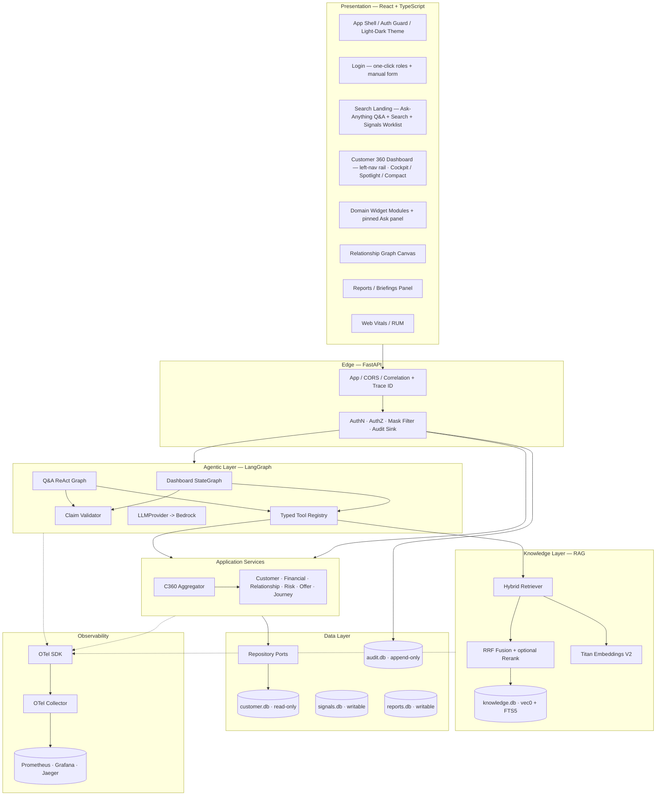
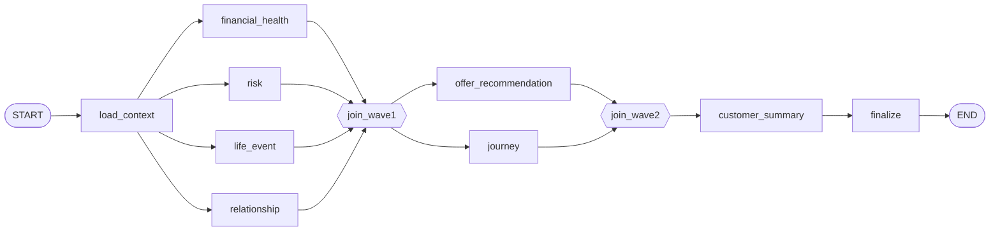
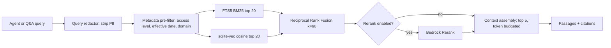
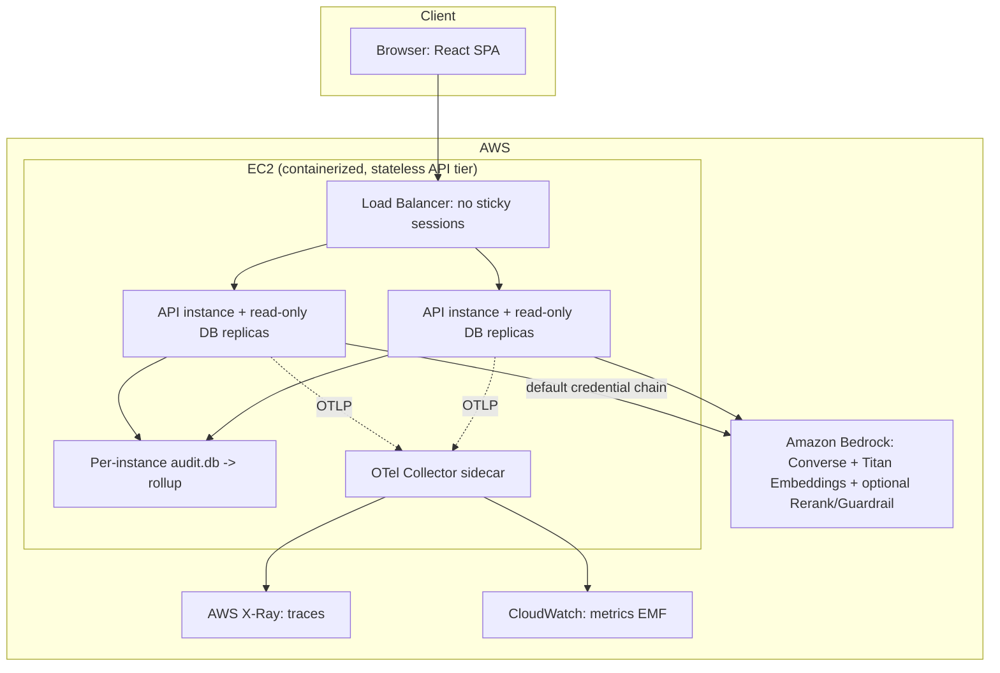

# Customer 360 Intelligence Platform — Hackathon Documentation

> AI-augmented, single-pane-of-glass view of a banking customer. Deterministic facts, cited AI narratives,
> enforced entitlements, and full observability.

**Stack:** React 18 + TypeScript (Vite) · FastAPI + Python 3.12 · SQLite 3 (WAL, JSON1, FTS5, `sqlite-vec`) ·
Amazon Bedrock (Converse API + Titan Embeddings V2) · LangGraph · Hybrid RAG · OpenTelemetry (GenAI semantic
conventions) · Prometheus / Grafana / Jaeger · AWS EC2.

**Source of truth:** This document is generated only from the project artifacts —
`requirements.md`, `design.md`, `tasks.md`, the `docker/` deployment configs, `config/bedrock_prices.json`,
and the `docs/` portability notes. Every claim below traces back to those artifacts.

---

## Table of contents

1. [Executive Summary](#1-executive-summary)
2. [Problem Statement](#2-problem-statement)
3. [Solution Overview](#3-solution-overview)
4. [Key Features and Business Value](#4-key-features-and-business-value)
5. [High-Level Architecture](#5-high-level-architecture)
6. [End-to-End Data Flow](#6-end-to-end-data-flow)
7. [AI / Agent Architecture](#7-ai--agent-architecture)
8. [RAG Architecture](#8-rag-architecture)
9. [Customer Knowledge Graph Overview](#9-customer-knowledge-graph-overview)
10. [Proactive Signals & Reporting](#10-proactive-signals--reporting)
11. [Security & Governance](#11-security--governance)
12. [Observability](#12-observability)
13. [AWS Deployment Architecture](#13-aws-deployment-architecture)
14. [Innovation & Differentiators](#14-innovation--differentiators)
15. [Scalability & Future Enhancements](#15-scalability--future-enhancements)
16. [Hackathon Business Impact](#16-hackathon-business-impact)
17. [Complete Demo Script](#17-complete-demo-script)
18. [Slide-by-Slide PPT Structure with Speaker Notes](#18-slide-by-slide-ppt-structure-with-speaker-notes)
19. [One-Page Executive Summary for Judges](#19-one-page-executive-summary-for-judges)

---

## 1. Executive Summary

**Purpose.** Give every customer-facing banking role — relationship managers, wealth advisors, contact-center
and branch staff, risk analysts and marketing — one unified, AI-augmented view of a customer, replacing the
swivel-chair across many systems.

**What it is.** The Customer 360 Intelligence Platform consolidates profile, contact, financial, credit, risk,
behavioral, engagement, relationship, asset and life-event data into a single dashboard. On top of the
deterministic data sit seven grounded AI agents (Summary, Financial Health, Risk, Life Event, Offer,
Relationship, Journey), a natural-language Q&A capability, and a hybrid RAG layer that answers policy, product
and procedure questions from an institutional knowledge corpus. Beyond the pull experience, the platform also
pushes: a **proactive signals worklist** ranks the events already computed (rising churn risk, a large deposit,
a detected life event, an AML flag) into a prioritized daily queue, and a **scheduled / branded report** layer
produces PDF packs, digests and "prepare-for-meeting" briefings.

The experience is a polished enterprise SPA: one-click role login, a search landing that leads with Ask-Anything
Q&A and the signals worklist, and a 360 dashboard with a left navigation rail, three view modes (360° Cockpit,
Spotlight and a compact at-a-glance view), a pinned customer-scoped Ask panel, and a light/dark theme — all held
to WCAG 2.1 AA in both palettes.

**Business value.**
- **Faster, more confident service.** A single call returns the deterministic 360 view within a 3-second p95
  budget; AI narratives stream in under a 5-second p95 budget without blocking the page.
- **Trustworthy AI.** Every AI figure is validated against a source record before it is shown. The platform
  cannot narrate a number it cannot cite — a post-generation claim validator rejects any figure that does not
  resolve to a source fact within tolerance, including any figure sourced only from a retrieved document.
- **Provable governance.** Field-level masking is applied at the serialization boundary, entitlements are
  enforced inside queries, and every read, agent run and retrieval is written to an append-only audit log.
- **Operable by design.** OpenTelemetry traces every request end to end — API, authorization, services,
  database, graph traversal, retrieval and model calls — with token usage, estimated cost and latency per
  agent, and zero customer content in telemetry.

**Technical implementation.** React + TypeScript frontend; FastAPI + Python backend; SQLite as a zero-ops,
read-only-at-runtime datastore (with `sqlite-vec` for vectors and FTS5 for lexical search); LangGraph for
agent orchestration; Amazon Bedrock for generation and embeddings; OpenTelemetry exporting over OTLP to a
collector that fans out to Prometheus, Grafana and Jaeger locally, or CloudWatch and X-Ray on AWS.

**Demo talking points.**
- One screen, six roles, one governed data path.
- "The AI never does math and never invents a number — it narrates numbers the system already proved."
- "Swapping the whole observability backend from local to AWS is a collector-config change, not a code change."

---

## 2. Problem Statement

**Purpose.** Frame the operational pain the platform removes.

**The problem.** A banker serving a customer today pieces together the picture from many systems: core
banking, CRM, credit, risk, marketing, and document repositories. This is slow, error-prone, and inconsistent
across roles. Worse, when banks bolt generative AI onto customer data, they inherit two new risks:
hallucinated figures presented as fact, and uncontrolled exposure of sensitive data to models and telemetry.

The platform serves six personas, each with different needs and data-sensitivity:

| Persona | Primary need | Data sensitivity |
|---|---|---|
| Relationship Manager (RM) | Full 360 view, next best actions | High — full access to assigned book |
| Wealth Advisor | Investments, net worth, household | High |
| Contact Center Agent | Identity verification, recent activity, service history | Medium — masked financial detail |
| Branch Employee | Profile, holdings, basic servicing | Medium — masked |
| Risk Analyst | Risk, fraud, delinquency, exposure | High on risk, restricted on marketing |
| Marketing Analyst | Segments, offers, propensity | Low on PII — aggregate / pseudonymized |

**Business value of solving it.** Reduced handling time, fewer errors, consistent role-appropriate views, and
an AI layer a regulated bank can actually put in front of a customer because every claim is grounded, cited,
masked and audited.

**Technical framing.** The release is explicitly **read-only over source data** (no write-back to core
systems), batch/on-demand refresh only, single tenant, USD, responsive web. That read-only assumption is what
makes a single-file datastore and per-instance read replicas viable — it is the architectural pivot for the
whole design.

**Demo talking points.**
- "Six roles, one screen, but each sees only what their role and entitlement allow."
- "The read-only constraint isn't a limitation — it's what lets us scale horizontally with a zero-ops
  datastore."

---

## 3. Solution Overview

**Purpose.** Describe the shape of the solution and its non-negotiable rules.

**What it delivers.**
- Customer search by any identifier (name, ID, email, phone, mobile, account number, card last-4, loan
  number) with sub-500 ms results.
- A Customer 360 dashboard with profile, financial overview, expense analytics, risk, offers, journey
  timeline, relationship network and next-best-actions modules, presented through three view modes (360°
  Cockpit, Spotlight, Compact), a left navigation rail, a light/dark theme, and client-side export (Excel,
  CSV, JSON, PDF).
- Seven grounded AI agents plus natural-language Q&A, both scoped-to-one-customer (a pinned Ask panel on the
  dashboard) and cross-customer from the search landing page.
- A hybrid RAG layer over institutional knowledge (product catalog, policy, procedure, offer terms, playbooks,
  compliance).
- A **proactive signals worklist** — the platform's push side — that ranks already-computed signals into a
  prioritized, entitlement-scoped daily queue.
- **Scheduled and branded report exports** — PDF packs, digests and "prepare-for-meeting" briefings composed
  from the 360 summary, open signals and cited talking points.
- Security (OAuth 2.0, RBAC, field masking, audit), observability, and an agent evaluation framework with CI
  quality gates.

**Eight non-negotiable architectural rules** (the spine of the design):
1. **Agents never touch the database.** Every agent reads through the same typed tool registry the REST API
   uses, so entitlement and masking can't be bypassed and citations come for free.
2. **Masking happens at the serialization boundary**, not in the UI. Unmasked values never enter a payload the
   caller isn't entitled to.
3. **Deterministic before generative.** Net worth, utilization and aggregates are computed in SQL / integer
   arithmetic. The LLM narrates; it never calculates.
4. **Retrieval is for knowledge, never for customer facts.** A retrieved passage can never satisfy a numeric
   claim.
5. **Per-module failure isolation.** One failing module degrades one card, not the page.
6. **Graph is derived, never authoritative** — rebuildable from relational tables.
7. **Telemetry carries no customer content** — no PII, money, prompts or completions; customer IDs are never
   metric labels.
8. **Every AI change is gated by evaluation** — entitlement leakage and adversarial failures are hard zeros in
   CI.

**Business value.** These rules turn "an AI feature" into "an AI feature a bank can defend to a regulator."

**Demo talking points.**
- "Deterministic first, generative second — the number is proven before the AI ever describes it."
- "There is exactly one governed path to data, and both the UI and the AI use it."

---

## 4. Key Features and Business Value

**Purpose.** Map each capability to who benefits and how it's built.

| Feature | Business value | Technical implementation |
|---|---|---|
| Universal customer search | Start serving without knowing a customer ID | FTS5 virtual table with prefix indexes; identifiers denormalized so one query covers all eight keys; entitlement applied inside the query, not as a post-filter |
| Unified 360 dashboard | One pane of glass; no system-hopping | `C360Aggregator` fans out concurrently over read-only connections; deterministic payload has its own 3 s p95 budget, decoupled from AI |
| Per-module resilience | A failure degrades one card, never the page | Every widget runs a five-state machine: loading → ready \| partial \| restricted \| error |
| Financial health intelligence | Net worth, cash flow, trends, health score with named drivers | Integer-cents arithmetic; derived tables; labelled heuristic `fhs-v1` score with provenance and drivers |
| Risk intelligence | Explainable risk posture, non-dismissible AML/PEP flags | Banding, severity-ordered alerts, server-driven compliance indicator |
| Offer intelligence | Ranked offers by expected value with rationale; duplicate suppression | Expected-value ranking; suppressed offers shown greyed with reason; cooling-off window on declines |
| Relationship / household graph | Total relationship value, referral opportunities | Property-graph tables, recursive-CTE traversal, redaction for restricted nodes |
| Journey timeline | Chronological milestone narrative for conversation | Merged timeline of life events, acquisitions, major transactions, applications |
| Grounded AI agents | Trustworthy narratives and recommendations | LangGraph waves, per-node timeouts, claim validation, citations, streaming |
| Natural-language Q&A | Ask in plain language, from the search screen or a pinned per-customer Ask panel | ReAct loop over the typed tool registry; deterministic aggregation; refusal / clarification behavior |
| Hybrid RAG | Policy, product and procedure answers alongside customer facts | FTS5 + `sqlite-vec` fused with Reciprocal Rank Fusion; optional Bedrock rerank |
| Proactive signals worklist | Push, not pull — the day's highest-value signals surface without hunting | Detectors over the deterministic layer; ranked by severity × value-at-stake × recency; state in a new writable `signals.db`; `customer.db` untouched |
| Scheduled / branded reports & briefings | Branded PDF packs, digests and prepare-for-meeting briefings | Definitions/schedules/runs in a new writable `reports.db`; artifacts to the `data/` volume; entitlement-scoped, masked, audited |
| Enterprise SPA experience | Fast onboarding and low-friction navigation for six roles | One-click role login; three dashboard view modes (Cockpit / Spotlight / Compact); left-nav rail; light/dark theme (both WCAG AA); collapsible chrome; humanized machine values |
| Security & audit | Role-appropriate access, provable data handling | OAuth 2.0, entitlement scoping, serialization-layer masking, append-only audit |
| Observability | Prove latency and quality; diagnose fast | OpenTelemetry traces, metrics, RUM; per-agent cost and token metrics |
| Agent evaluation | A prompt or model change can't silently degrade quality | In-repo framework with generator-derived ground truth; hard CI gates |

**Demo talking points.** Lead with search → 360 → AI cards → Q&A → citation inspection → a masked role
comparison. That sequence hits every headline feature in under five minutes.

---

## 5. High-Level Architecture

**Purpose.** Show the layered system and where each concern lives.

**Business value.** Clean layering means each guarantee (masking, grounding, entitlement, observability) lives
in exactly one place and can't be forgotten by a new endpoint or a new agent.

**Technical implementation (layered view, from `design.md` §2.1):**



Key layering facts:
- **Presentation:** React 18 + TypeScript behind an auth guard with three routes — a split-card **login**
  (one-click sign-in cards for all six seeded roles plus a manual form), a **search landing** that leads with
  the cross-customer Ask-Anything panel, then customer search, then the signals worklist, and the **360
  dashboard** with a left navigation rail and three view modes (360° Cockpit, Spotlight, Compact). A
  `ThemeContext` drives a light/dark theme via a single `data-theme` flip; both palettes are held to WCAG AA.
  TanStack Query for per-module caching, accessible SVG mini-charts, Cytoscape.js for the relationship graph,
  and design tokens for contrast. Machine values (enums, score bands, dotted field paths) are humanized at the
  display boundary so a raw token never reaches the eye.
- **Edge:** FastAPI generates correlation and trace IDs, runs authentication, authorization, the masking
  filter, and the audit sink.
- **Application services:** one service per aggregate, composed by the `C360Aggregator`. Because the SQLite
  driver is blocking, services run in a bounded thread pool with one read-only connection per thread.
- **Databases as namespaces:** SQLite has no schemas, so files are the boundaries — `customer.db` (domain,
  read-only), `knowledge.db` (RAG corpus, read-only), `audit.db` (append-only), `checkpoints.db` (LangGraph
  Q&A memory), `eval.db` (evaluation), and two feature stores added on top of the platform: `signals.db`
  (proactive worklist state) and `reports.db` (report definitions, schedules and run history). Both feature
  stores are writable and single-writer like `audit.db`; the read-only `customer.db` and its schema are never
  changed.

**Demo talking points.**
- "Notice the AI layer has no arrow to the database — it can only reach data through the tool registry, which
  is the same code path the REST API uses."

---

## 6. End-to-End Data Flow

**Purpose.** Trace a real dashboard request so judges see the deterministic/generative split.

**Business value.** The split is why the page is fast and the AI is trustworthy: the deterministic view is
never gated on model latency, and every AI card is grounded and streamed independently.

**Technical implementation (dashboard request flow, from `design.md` §2.3):**

```mermaid
sequenceDiagram
    participant UI
    participant API as FastAPI
    participant AZ as AuthZ + Mask
    participant AGG as C360 Aggregator
    participant SVC as Domain Services
    participant LG as LangGraph
    participant DB as SQLite (ro)

    UI->>API: GET /customers/{id}/360
    API->>AZ: validate token, resolve entitlement scope
    AZ-->>API: principal + field policy
    API->>AGG: build(customer_id, principal)
    par deterministic fan-out (thread pool, ro connections)
        AGG->>SVC: profile / financial / credit / risk
        SVC->>DB: queries
    and
        AGG->>SVC: holdings / offers / journey / household
        SVC->>DB: queries
    end
    AGG-->>API: C360 read model
    API->>AZ: apply field masking
    API-->>UI: 360 payload (deterministic, < 3s p95)
    Note over UI: dashboard renders; AI cards show skeletons
    UI->>API: GET /customers/{id}/insights (SSE)
    API->>LG: astream_events(dashboard graph)
    LG->>SVC: via typed tools only
    LG-->>UI: stream each agent node's output as it completes (< 5s p95)
```

The flow, step by step:
1. UI requests the deterministic 360 payload. The edge validates the OAuth token and resolves the principal
   (role, entitlement scope, field policy, knowledge levels).
2. The aggregator fans out concurrently across domain services over read-only connections.
3. The masking serializer filter applies field policy so unmasked values never enter the response.
4. The UI renders immediately; AI cards show skeletons.
5. A second SSE call streams agent narratives as each LangGraph node completes — the summary card is never
   gated on the slowest agent.

Every response carries a `meta` envelope with `correlation_id`, `trace_id`, `as_of`, `masked_fields`,
`computed_fields` and `errors[]`, so a support engineer can jump from a user report straight to a trace, and
an auditor can see exactly what a role received.

**Demo talking points.**
- "Two calls, two budgets: 3 seconds for facts, 5 seconds for AI. The page is usable before the AI even
  starts."

---

## 7. AI / Agent Architecture

**Purpose.** Explain how seven agents produce narratives that a bank can trust.

**Business value.** Grounded, cited, role-masked AI output that degrades gracefully to accurate,
non-generated summaries during a model outage rather than showing blank or wrong cards.

**Technical implementation.** LangGraph `StateGraph` orchestrates a three-wave dashboard graph:



- **`load_context`** fetches every fact any agent needs once, through the tool registry (300 ms budget), so
  seven agents don't re-query the same profile.
- **Budgets:** wave 1 = 2.5 s, wave 2 = 1.5 s, wave 3 = 1.0 s → 5 s p95 total. Each node has its own timeout;
  a node failure writes to `errors` and returns rather than raising, so a wave never blocks on a straggler.
- **Streaming** uses `graph.astream_events(...)` forwarded over SSE per node.

**The seven agents** and what they consume (from `design.md` §8.3):

| Agent | Facts consumed | Knowledge domains | Timeout |
|---|---|---|---|
| Financial Health | financial profile, credit, holdings, expense analytics | — | 2.5 s |
| Risk | risk profile, delinquency, exposure, fraud signals | procedure (fraud, AML) | 2.5 s |
| Life Event | life events, transactions, applications, profile deltas | playbook | 2.5 s |
| Relationship Intelligence | household, relationships, network, linked assets | — | 2.5 s |
| Offer Recommendation | offers, holdings, propensity, life events, financials | product catalog, offer terms | 1.5 s |
| Customer Journey | journey timeline, milestones, acquisitions | — | 1.5 s |
| Customer Summary | profile, holdings + wave 1–2 outputs | — | 1.0 s |

Only three agents retrieve knowledge; the rest stay purely customer-grounded so retrieval doesn't add latency
where it adds nothing.

**Grounding, the trust mechanism:**
1. Every tool return value is wrapped with provenance (`entity_type`, `entity_id`, `field`, `as_of`).
2. `load_context` builds a numbered fact table per agent; retrieved passages sit in a separate, clearly
   delimited block with their own citation IDs.
3. A **post-generation claim validator** parses output, resolves referenced IDs, and rejects any numeric claim
   that doesn't match a fact within tolerance — including any figure sourced only from a passage. On rejection
   it retries once naming the violation, then degrades to a template-rendered deterministic summary with
   `degraded = true`.

**Bedrock integration.** `BedrockProvider` wraps `langchain_aws.ChatBedrockConverse` for generation and the
runtime client for Titan embeddings. Credentials come from the default AWS credential chain — no keys in
source. Region and model IDs are env-driven. Throttling uses adaptive retry plus jittered backoff and never
surfaces as a 500. An optional Bedrock Guardrail applies when `BEDROCK_GUARDRAIL_ID` is set. A
`MockLLMProvider` renders deterministic narratives for CI and is what the circuit breaker opens onto.

**Output caching.** Keyed by agent, customer, role, as-of date, fact fingerprint, knowledge fingerprint,
formula version, prompt version and model ID (15-minute TTL). Role is in the key because two roles legitimately
see different inputs; prompt version and model ID are in the key so an improvement invalidates stale narratives.

**Demo talking points.**
- "Watch the cards stream in independently — that's the wave graph."
- "If I turn Bedrock off, the cards don't break — they show a 'degraded' badge and render an accurate,
  templated summary instead."

---

## 8. RAG Architecture

**Purpose.** Explain how the platform answers policy, product and procedure questions without ever letting a
document supply a customer number.

**Business value.** The AI can say "she is eligible for the HELOC promo under policy 3.2" and cite both the
customer's FICO (from a record) and the eligibility rule (from a document) — an answer a banker can act on,
not one they have to go look up.

**The boundary that matters most.** RAG is scoped to **institutional knowledge only**. Customer facts always
come from the typed tool layer. The rule enforced in code: a numeric or customer-specific claim must resolve to
the fact table; the claim validator rejects any figure that resolves only to a retrieved passage.

| Question | Path | Why |
|---|---|---|
| "What's her mortgage balance?" | Tool call | Exact, cited to a record, masked by role |
| "Who else is on that mortgage?" | Graph tool | Deterministic traversal with a path |
| "Is she eligible for the HELOC promo?" | Tool call (holdings, FICO) **+** retrieval (eligibility rules) | Facts from data, rules from policy |
| "What's our procedure when AML flags fire?" | Retrieval only | Procedural knowledge |

**Technical implementation (retrieval pipeline, from `design.md` §9.4):**



- **Query redaction:** the query carries only non-identifying qualifiers (held product types, segment, life
  stage). Customer identity never reaches the embedding model.
- **Metadata pre-filter in SQL before ranking:** `access_level IN principal.knowledge_levels`, effective-date
  window, optional domain/product narrowing — so a document a role can't see never enters the candidate set
  and can't be inferred from result counts.
- **Hybrid retrieval:** FTS5 BM25 (exact terms, product codes, clause numbers) + `sqlite-vec` cosine
  (paraphrase), fused with Reciprocal Rank Fusion (k=60), which needs no score calibration between two
  differently-scaled retrievers.
- **Optional Bedrock rerank** (Amazon Rerank 1.0 / Cohere Rerank 3.5) — region-limited, so it is a config flag
  applied to Q&A only, with graceful fallback to fusion order.
- **Injection containment:** passages are wrapped in a delimited reference block that cannot issue
  instructions.

**Storage.** `knowledge.db` holds `kb_document`, `kb_chunk`, `kb_chunk_fts` (FTS5) and `kb_chunk_vec` (`vec0`,
float[1024]). Chunk IDs are deterministic (`doc_id:version:section_path:ordinal`) so evaluation fixtures stay
stable across re-ingestion. Chunking is structure-aware (400–600 tokens, ~15% overlap) and never splits rate
schedules, fee tables or eligibility lists.

**Latency budget:** ≤ 500 ms p95 for dashboard-agent retrieval (rerank off), ≤ 1.5 s p95 for Q&A (rerank on).

**Corpus:** six domains — product catalog, policy, procedure, offer terms, playbooks, compliance — roughly 60
synthetic documents and 1,200–1,800 chunks, ingestible from real documents through the same pipeline.

**Demo talking points.**
- "Ask a policy question and watch it cite a document, section and version. Ask for a balance and it comes from
  a record — never from a document."

---

## 9. Customer Knowledge Graph Overview

**Purpose.** Explain relationship and multi-hop intelligence — households, joint holders, beneficiaries,
referral networks.

**Business value.** RMs see total relationship value and referral opportunities; restricted identities stay
hidden while the structure remains visible.

**Technical implementation.** The graph is a **projection** of relational data into `graph_node` and
`graph_edge` tables (16 node types, 15 edge types), fully rebuildable and never authoritative.

The key optimization is a **bidirectional adjacency table**. A predicate like `src_id = :n OR dst_id = :n`
can't use an index in SQLite, so each logical edge is materialized in both directions (`OUT`/`IN`) with an
`ix_adj_src (src_id, edge_type)` index. Traversal is a recursive CTE with a delimited-text path as the
visited-set guard:

```sql
WITH RECURSIVE walk(node_id, depth, path) AS (
  SELECT :root, 0, '|' || :root || '|'
  UNION ALL
  SELECT a.dst_id, w.depth + 1, w.path || a.dst_id || '|'
  FROM walk w
  JOIN graph_adjacency a ON a.src_id = w.node_id
  WHERE w.depth < :max_hops
    AND instr(w.path, '|' || a.dst_id || '|') = 0
)
SELECT node_id, MIN(depth) AS depth FROM walk GROUP BY node_id ORDER BY depth LIMIT :node_cap;
```

Caps: `max_hops` = 3, `node_cap` = 300, so a hub node can't blow the 2-second p95 budget. Household subgraphs
are precomputed since they're the most frequent traversal. Traversal is in-process with no network round-trip.

**Governance on the graph.** A **graph redaction filter** runs before serialization: any `Customer` node
outside the principal's entitlement is reduced to `{restricted: true}` while node and edge remain visible.
Structure is visible; identity is not. The redaction lives in the service layer so the Q&A agent gets the same
treatment as the UI. Inferred relationships (e.g. a spouse guessed from a shared address) carry `is_inferred`
and `confidence` and are shown visually distinct from system-of-record links.

**Demo talking points.**
- "3-hop traversal under 2 seconds, entirely in-process."
- "A restricted household member shows as a node with a relationship type and no identity — you can see the
  shape without seeing the person."

---

## 10. Proactive Signals & Reporting

**Purpose.** Show how the platform moves beyond pull (a banker opening a dashboard) to push (the platform
surfacing what matters) and to packaged output (branded reports and meeting briefings) — without ever writing
to the read-only source data.

**Business value.** An RM no longer has to hunt across dashboards to find the customer who needs attention
today; the highest-value signals come to them in a ranked queue. And the work product a banker needs before a
meeting — a branded pack or a talking-points briefing — is generated on demand or on a schedule, already
masked and entitlement-scoped.

### 10.1 Proactive signals worklist (the push side)

The worklist flips the platform from pull-only to push. Instead of an RM hunting through dashboards, a
prioritized daily queue surfaces signals the platform already computes — churn/risk-band movement, a large
deposit opening a cross-sell window, a detected life event, an AML/PEP flag.

**Technical implementation.**
- **Derived, never authoritative.** Detectors reuse the deterministic layer (risk profile and derived
  history, expense analytics, journey life-event detection, risk flags). Signals are *derived* from the
  read-only `customer.db` and existing derived tables — no customer-DB writes.
- **New writable store.** Signal instances and their per-user state (new / seen / dismissed / actioned) live
  in a **new writable `signals.db`** (`SQLITE_SIGNALS_DB_PATH`, own migration head, WAL, single-writer),
  created the same way as `audit.db` and `checkpoints.db`. Tables: `signal`, `signal_state`, `signal_run`
  (batch provenance). A unique `dedup_key` means re-running detection updates rather than duplicates a live
  signal. There is no foreign key into `customer.db`; customers are referenced by id only.
- **Ranking.** Signals are ordered by severity × value-at-stake × recency, with configurable weights and
  stable ordering, and are entitlement-scoped so an RM sees only their book. Dismissed and cooled-off signals
  are suppressed.
- **Batch job + API.** `c360 detect-signals` and `POST /admin/detect-signals` (admin) run detection
  idempotently via `dedup_key`, writing a `signal_run` provenance row. The worklist is served by
  `GET /signals` (cross-book ranked queue for the caller), `GET /customers/{id}/signals`,
  `POST /signals/{id}/dismiss` and `POST /signals/{id}/ack` — entitlement-scoped, masked, cursor-paginated and
  in the OpenAPI spec.
- **UI.** A prioritized daily queue on the search landing page beside Ask-AI: ranked cards with severity,
  customer and evidence chips; drill to the customer 360; dismiss/ack; filter by signal type and severity.
  It is keyboard-navigable, uses a live region on new signals, encodes severity without relying on color
  alone, and degrades quietly to an "unavailable" note if detection has not yet run.

### 10.2 Scheduled and branded reports & briefings (packaged output)

Server-generated branded PDF packs, digest deliveries, and a "prepare-for-meeting" briefing for a customer or
a whole book.

**Technical implementation.**
- **New writable store.** Report definitions, schedules and run history live in a **new writable
  `reports.db`** (`SQLITE_REPORTS_DB_PATH`, own migration head, WAL, single-writer). Tables:
  `report_definition` (type; scope customer/book/segment; config; branding), `report_schedule` (cron-like
  cadence, owner, entitlement snapshot) and `report_run` (status, artifact path, provenance). Generated
  artifacts are written to the `data/` volume, never into a database. `customer.db` stays read-only.
- **Prepare-for-meeting briefing.** A single briefing for a customer (or each customer in a book) composes the
  360 summary, open signals (from §10.1) and cited talking points. It runs on the mock provider offline and
  produces real narratives when `LLM_PROVIDER=bedrock`.
- **Endpoints & CLI.** `POST /reports` (define), `POST /reports/{id}/run`, `GET /reports/{id}/runs`,
  `GET /reports/runs/{run_id}` (download artifact), schedule CRUD, and `c360 run-reports` for the scheduled
  path. Everything is entitlement-scoped, audited and in the OpenAPI spec. Mail delivery uses a mock deliverer
  in the build (no outbound mail).

**Governance note.** Both feature stores add only *new writable databases* — the same pattern as the existing
`audit.db` and `checkpoints.db`. Neither touches the read-only `customer.db`, and both inherit role masking and
entitlement, proven by tests that open `customer.db` in `mode=ro` and assert a write attempt raises.

**Demo talking points.**
- "The signals worklist is the platform working *for* the banker — the day's highest-value customers surface
  in a ranked queue, each drilling to its evidence."
- "A prepare-for-meeting briefing is generated on demand, already masked to the role, composing the summary,
  open signals and cited talking points."
- "Both features are new writable databases — the customer database is still read-only, and we prove it."

---

## 11. Security & Governance

**Purpose.** Show that access is controlled, masked, and provable.

**Business value.** A regulated bank can demonstrate exactly who saw what, when, and which fields went to a
model — a prerequisite for putting AI in front of customer data.

**Technical implementation.**

**Authentication.** `IdentityProvider` port with a local OAuth 2.0 provider (RS256 JWTs, one seeded user per
role) and an OIDC adapter (JWKS validation). Both produce the same `Principal`:

```python
@dataclass(frozen=True)
class Principal:
    user_id: str
    role: Role                      # RM | WEALTH_ADVISOR | CONTACT_CENTER | BRANCH | RISK | MARKETING
    entitlement: EntitlementScope   # ALL | BOOK(customer_ids) | SEGMENT(segments)
    field_policy: FieldPolicy       # resolved masking rules
    knowledge_levels: set[str]      # PUBLIC | INTERNAL | RISK_ONLY | COMPLIANCE_ONLY
```

Access tokens live 15 minutes with refresh; idle sessions terminate at 30 minutes.

**Two independent gates.**
- **Row-level (entitlement):** applied *inside* repository queries — never as a post-filter — so a restricted
  book never silently loses search matches. 403 for non-entitled, 404 for non-existent.
- **Field-level (masking):** a Pydantic serializer filter on the response models, so no handler can skip it.
  Modes: `FULL` / `PARTIAL` (last-4, year-only, city-only) / `HIDDEN` (with a `masked_fields` entry) / `BAND`
  (coarse band instead of a value).

A representative slice of the role × field matrix (from `design.md` §7.2):

| Field group | RM | Wealth | Contact Center | Branch | Risk | Marketing |
|---|---|---|---|---|---|---|
| Balances, net worth | FULL | FULL | BAND | BAND | FULL | BAND |
| FICO / behavior | FULL | FULL | BAND | BAND | FULL | BAND |
| Risk / fraud / PID / SID | BAND | BAND | BAND | BAND | FULL | HIDDEN |
| AML / PEP flags | FULL | FULL | HIDDEN | HIDDEN | FULL | HIDDEN |
| Account / card number | PARTIAL | PARTIAL | PARTIAL | PARTIAL | PARTIAL | HIDDEN |
| Street address / DOB | FULL | FULL | PARTIAL | PARTIAL | FULL | HIDDEN |

Marketing is fully pseudonymized; Contact Center sees banded balances; full card numbers (PANs) are stored but
never selected by search or list queries — `card_last4` exists so hot paths never load a PAN.

**Data minimization to the model.** Before any Bedrock call, a `PromptRedactor` strips fields not on the
agent's allowlist, replaces identifiers with per-session pseudonyms (`CUST_A`, `ACCT_1`), and records the
surviving field list into `prompt_field_manifest`. Full account numbers, card numbers, VIN, DOB and street
address never leave the process.

**Audit.** A separate `audit.db` records every customer read, agent run, Q&A question, knowledge retrieval,
unmask attempt, denied access and export. Append-only is enforced by `BEFORE UPDATE` / `BEFORE DELETE` triggers
that `RAISE(ABORT)` (SQLite can't express an insert-only grant). Writes go to a bounded queue drained by a
single writer thread; if the queue saturates, the request **fails closed** rather than proceeding unaudited,
and that event is both a metric and a page. Each record carries `trace_id`, `prompt_field_manifest` and
`retrieved_doc_ids`, so an AI recommendation is reconstructible months later.

**Transport & rest.** TLS 1.2+; encryption at rest.

**Demo talking points.**
- "I'll log in as an RM, then as a contact-center agent — same customer, but the balance is now a band and the
  address is masked. The unmasked value isn't hidden by CSS; it's never in the payload."
- "Every screen I just opened wrote an immutable audit record with the trace ID."

---

## 12. Observability

**Purpose.** Prove latency and quality targets, and diagnose failures fast — including agent behavior, token
usage, cost and latency.

**Business value.** Operators can show, per endpoint and per agent, that the 3-second and 5-second budgets are
met; finance can see estimated model spend; and a user-reported problem maps directly to a trace and its audit
records.

**Technical implementation.** OpenTelemetry SDK for traces, metrics and logs, exported over OTLP to a
collector. Model, agent, tool and retrieval operations follow the OpenTelemetry **GenAI semantic conventions**
(`gen_ai.*`), so any conforming backend renders agent traces without custom mapping.

**Tracing & correlation IDs.** A single request produces a distributed trace spanning API → authz → aggregator
→ services → repositories → graph traversal → retrieval → LangGraph nodes → tool calls → model invocations.
The correlation ID is generated at the edge, carried as a span attribute, and returned in `meta.trace_id`, so
a log line, a metric spike and a trace share one identifier.

**Metric inventory (from `design.md` §13.3):**

| Group | Metrics |
|---|---|
| HTTP (RED) | request duration histogram by route/method/status; request/error counters; budget-breach counter |
| Agents | duration by agent; success/timeout/degraded/cache-hit counters; claim-validator rejections; citations per output |
| Model | `gen_ai.client.operation.duration`; `gen_ai.client.token.usage` (input/output) by model and agent; throttle counter; **estimated cost counter** from token counts × price table |
| Retrieval | latency by stage; candidate counts; zero-result counter; rerank-used counter; fusion overlap ratio |
| Q&A | tool calls per question; refusal counter by reason; clarification counter |
| Database | pool checkout wait; query duration by statement ID; `SQLITE_BUSY` retry counter |
| Graph | hops traversed; nodes visited; truncation counter |
| Signals | signals detected by type/severity; dismiss/ack rates; detection spans |
| Security | denied-access by role; masking-applied by field group; audit queue depth gauge; **audit fail-closed counter** |
| Frontend RUM | Web Vitals (LCP, INP, CLS); custom marks `dashboard.meaningful_render`, `insights.first_card` |

**Token usage & cost.** The cost counter is derived from token counts against `config/bedrock_prices.json`,
which stores integer micro-USD per 1,000 tokens (money is never a float; rounding to cents happens once, at the
boundary, after aggregation). Example configured prices: Claude 3.5 Sonnet 3,000 in / 15,000 out; Claude 3.5
Haiku 800 in / 4,000 out; Titan Embeddings V2 20 in; mock model 0.

**Latency.** Every SLO maps to a stated requirement, so an error-budget breach is a requirement breach:
dashboard render p95 < 3 s; agent response p95 < 5 s; graph query p95 < 2 s; retrieval p95 < 500 ms (agent);
API availability 99.5%; entitlement violations exactly 0. Alerting is on multi-window error-budget burn rate,
not single-sample thresholds. Immediate-page conditions: audit fail-closed, entitlement-denial spike, Bedrock
breaker open, any nonzero entitlement violation from the evaluation gate.

**Agent monitoring dashboards (four, provisioned as code):** platform health; agent performance and cost;
retrieval quality; data and security.

**Privacy in telemetry (enforced, not advisory):** `customer_id` is never a metric label; allowed labels are
low-cardinality (role, segment, route, agent, model, outcome, domain); prompt/completion content capture is
off; no monetary values in spans/metrics/logs; customer references in traces use a salted hash; a span
attribute allowlist runs before export. A dedicated CI test asserts no PII, money, prompt or completion content
and no `customer_id` label ever reaches exported telemetry.

**Demo talking points.**
- "Here's one request, traced end to end through the API, the tools, retrieval and the model call."
- "This panel shows tokens and estimated cost per agent — and there is deliberately no customer ID anywhere in
  the telemetry."

---

## 13. AWS Deployment Architecture

**Purpose.** Show how the platform runs locally and on AWS EC2, and why the move is low-risk.

**Business value.** A single-command local bring-up for the demo, and a production path to AWS where swapping
the entire observability backend is a config change, not a code change.

**Technical implementation.**

**Local / demo topology (Docker Compose).** Services: `api`, `web`, `otel-collector`, `prometheus`, `grafana`,
`jaeger`. There is **no database container** — SQLite is in-process; database files live on a mounted volume at
`data/`. The `init` step runs: migrations → seed → recompute → graph projection → adjacency → FTS → knowledge
ingest → chunk → embed → `ANALYZE` → ground-truth export. Grafana ships the four dashboards and its datasources
provisioned as code, so a fresh `docker compose up` brings dashboards up already wired to Prometheus and
Jaeger.

**AWS EC2 topology.**



- **Deployment target:** containerized on a single cloud provider (assumption A8); the API tier is stateless
  and scales horizontally behind a load balancer with no sticky-session dependency.
- **Read-only replicas:** each API instance mounts its own copy of the read-only customer and knowledge
  databases. This works precisely because the platform is read-only at runtime. Audit databases are
  per-instance and rolled up by a collector.
- **Bedrock credentials** come from the default AWS credential chain (IAM instance role) — the same credential
  model the collector uses for X-Ray/CloudWatch, so no new secret is introduced.
- **Observability backend swap:** the application only ever speaks OTLP to a collector. Moving from local
  (Jaeger + Prometheus) to AWS (X-Ray + CloudWatch) is a **collector-config swap** — replace
  `otel-collector.yaml` with `otel-collector.aws.yaml`, which exports traces to `awsxray` and metrics to
  `awsemf` (namespace `C360`). The application's single backend-coupling setting is
  `OTEL_EXPORTER_OTLP_ENDPOINT`; no rebuild, no redeploy, and the swap is reversible.

**Configuration** is entirely env-driven (`SQLITE_*` paths and pool size — including
`SQLITE_SIGNALS_DB_PATH` and `SQLITE_REPORTS_DB_PATH` for the two feature stores — `SEED_*`, `LLM_PROVIDER`,
`AWS_REGION`, `BEDROCK_*`, `RETRIEVAL_*`, `RERANK_*`, `AGENT_*`, `GRAPH_*`, `OTEL_*`, `AUTH_*`). No secrets in
source; `OTEL_CAPTURE_PROMPT_CONTENT` defaults to false and fires a startup warning if enabled outside local
development.

**Demo talking points.**
- "No database server to run — SQLite is in-process, which is why every API instance can carry its own
  read-only replica and scale out cleanly."
- "Going to AWS is one file: point the collector at the AWS config and traces land in X-Ray, metrics in
  CloudWatch, with no application change."

---

## 14. Innovation & Differentiators

**Purpose.** State what makes this build genuinely different from a typical "chatbot over a database."

**Business value.** These are the reasons the platform is defensible in a regulated environment — the
difference between a demo and something a bank could ship.

**Differentiators, each grounded in the design:**
1. **A claim validator that makes AI figures trustworthy.** No numeric claim ships unless it resolves to a
   source fact within tolerance; a figure sourced only from a document is rejected. This is "the difference
   between an AI summary and an AI summary a bank can put in front of a customer."
2. **One governed data path for UI and AI.** Agents reach data only through the same typed tool registry the
   REST API uses, so entitlement, masking, audit, tracing and citations are inherited, not re-implemented.
3. **Deterministic-first architecture.** Money is integer cents end to end; aggregates are computed in SQL;
   the LLM narrates but never calculates.
4. **RAG that refuses to supply customer numbers.** Retrieval answers "what is the policy," never "what is her
   balance" — enforced in code, gated in evaluation at 100%.
5. **Governance baked into telemetry.** A span-attribute allowlist and a CI leakage test guarantee no PII,
   money or prompt content ever reaches the observability backend, and no `customer_id` is ever a metric label.
6. **Evaluation with real ground truth.** Because the dataset comes from a deterministic seeded generator, the
   generator *knows* the true life events, propensities and risk compositions, so most quality dimensions are
   deterministic assertions rather than a model judging a model. Entitlement leakage and adversarial injection
   are hard zeros in CI.
7. **Zero-ops datastore that still scales.** SQLite (+ `sqlite-vec`, FTS5) with read-only per-instance
   replicas — no database server — with repository ports ready for PostgreSQL / Neo4j / OpenSearch swaps.
8. **Adversarial-injection resistance by construction.** The real threat is data-borne injection (a merchant
   or employer name containing instruction-like text). Untrusted data sits in delimited reference blocks and
   the adversarial suite enforces 100% resistance.

**Demo talking points.**
- "Ask it for a number that doesn't exist — it won't invent one; it tells you the data is unavailable."

---

## 15. Scalability & Future Enhancements

**Purpose.** Show the growth path without over-claiming.

**Business value.** The design meets the stated targets (100 customers, 100 concurrent users) with clear,
low-risk levers for scale and clean swap points for production components.

**Technical implementation — scalability today:**
- Dataset default is 100 customers (`SEED_CUSTOMER_COUNT`), configurable to 1,000+ **without code changes**;
  budgets were sized against 1,000 for headroom.
- Stateless API tier scales horizontally behind a load balancer; read-only WAL connections per worker thread;
  per-instance DB replicas; per-instance audit with rollup.
- Caching tiers: HTTP ETag/Cache-Control on reference data; in-process TTL cache (60 s read models, 15 min
  agent output); content-addressed embedding cache; derived tables for aggregates; a Redis-ready interface for
  multi-instance deployment.
- Circuit breakers per dependency (Bedrock generation → template renderer; embeddings → lexical-only
  retrieval; rerank → fusion order; graph; DB).

**Swap paths (repository ports keep these contained):**
- Graph → Neo4j (`GraphRepository` port).
- Primary datastore → PostgreSQL (`Repository` ports) — the production path if shared-write or live ingestion
  is ever required.
- Knowledge retrieval → OpenSearch or Bedrock Knowledge Bases (`KnowledgeRepository` port) past roughly
  10⁵–10⁶ chunks, where `sqlite-vec`'s brute-force scan would outgrow the corpus. The first lever before that
  is reducing embedding dimensions from 1024 to 512 (halves storage and scan cost, retains ~99% accuracy).
- Auth → enterprise OIDC (`IdentityProvider` port).
- Data → real extract loader (`SourceLoader` port) instead of the synthetic generator.
- Observability backend → CloudWatch / X-Ray / any vendor (collector config only).

**Future enhancements implied by scope boundaries (out of scope this release):** write-back to core systems,
real-time streaming ingestion, model-training pipelines for propensity/risk scores, mobile-native apps,
multi-currency, multi-tenant isolation, and regulatory report generation.

**Demo talking points.**
- "Every production-grade swap — Postgres, Neo4j, OpenSearch, OIDC, CloudWatch — is a port behind an
  interface, not a rewrite."

---

## 16. Hackathon Business Impact

**Purpose.** Translate the build into outcomes judges care about.

**Business value / impact narrative:**
- **Time-to-serve.** A single 360 call under 3 seconds p95 replaces multi-system navigation; AI narratives
  stream under 5 seconds p95 without blocking the page.
- **Trust and compliance.** Grounded, cited, role-masked AI with an append-only audit trail and a
  data-minimization manifest of exactly which fields went to the model — a story that survives a compliance
  review.
- **Cost visibility.** Per-agent token usage and estimated Bedrock spend are first-class metrics, so AI cost is
  observable and controllable (allowlisted fact tables, `max_tokens` caps, 15-minute output cache,
  content-hashed embedding cache).
- **Operational confidence.** SLOs map one-to-one to requirements; burn-rate alerting; four provisioned
  dashboards; readiness that fails closed if the audit writer is dead (the platform won't serve data it can't
  audit).
- **Quality that can't silently regress.** CI hard gates block any entitlement leakage, adversarial failure,
  schema non-conformance, or groundedness/coverage regression.

**Technical proof points to cite to judges:** integer-cents money with a no-float-drift test; masking asserted
absent from payloads (not just hidden in UI); telemetry-leakage test; claim validator rejecting fabricated and
passage-sourced figures; 3-hop graph traversal under 2 seconds.

**Demo talking points.**
- "This isn't a chatbot bolted onto a database — it's a governed platform where the AI is the last mile, not
  the source of truth."

---

## 17. Complete Demo Script

**Total time: ~8 minutes.** Format for each beat: **[Show]** → **[Say]** → **[Business value]**.

### Beat 0 — Setup (before you present)
- Have the app, Jaeger, Prometheus and Grafana running (`docker compose -f docker/docker-compose.yml up -d`,
  then the API and web). Seed 100 customers (`c360 seed --count 100 --seed 42`) and run signal detection
  (`c360 detect-signals`). Open the login screen.

### Beat 1 — One-click role login + landing page (30s)
- **[Show]** On the split-card login, click the RM role card to sign in. Land on the search page, where the
  Ask-Anything panel and the signals worklist sit above search. Flip the light/dark theme toggle.
- **[Say]** "Six seeded roles, one click each — no password to memorize. The landing page leads with
  Ask-Anything and a proactive worklist, and the whole app has a light/dark theme held to WCAG AA in both
  palettes."
- **[Business value]** "A banker can ask a question or work the queue before they even open a profile."

### Beat 2 — Universal search (45s)
- **[Show]** Type a partial name, then an account number, then a card last-4 into search; results appear
  instantly.
- **[Say]** "One search box matches name, ID, email, phone, mobile, account number, card last-4 and loan
  number, under 500 milliseconds — backed by an FTS5 index with entitlement applied inside the query."
- **[Business value]** "A banker starts serving without knowing a customer ID, and never sees a customer
  outside their book."

### Beat 3 — The 360 dashboard loads fast (45s)
- **[Show]** Click a result; the dashboard opens in Spotlight on Profile. Show the left-nav rail, switch to
  360° Cockpit and then the Compact at-a-glance view. Point out the profile and financial headline rendering
  immediately while AI cards show skeletons.
- **[Say]** "Three view modes off one section list — Cockpit for everything, Spotlight for focus, Compact for
  a one-screen glance. The deterministic 360 payload has its own 3-second budget and is never gated on the AI;
  one aggregate call fans out concurrently over read-only connections."
- **[Business value]** "The page is usable before the AI even starts, and the banker picks the density they
  want."

### Beat 4 — Grounded AI cards stream in (60s)
- **[Show]** Watch the Summary, Financial Health, Risk and Offer cards fill in independently.
- **[Say]** "These are seven LangGraph agents running in waves. Every figure they show was validated against a
  source record — a claim validator rejects any number it can't cite."
- **[Business value]** "AI a bank can put in front of a customer, because it can't invent a balance."

### Beat 5 — Inspect a citation (45s)
- **[Show]** Click a fact citation (jumps to the owning widget and highlights the field), then a knowledge
  citation (opens the passage with document, section, version, effective date).
- **[Say]** "Two citation types, kept visually distinct: facts resolve to a customer record; knowledge resolves
  to a policy passage."
- **[Business value]** "Every statement is inspectable and defensible after the fact."

### Beat 6 — Natural-language Q&A + RAG boundary (60s)
- **[Show]** Using the pinned customer-scoped Ask panel, ask "Is she eligible for the HELOC promo?" then
  "What's her mortgage balance?"
- **[Say]** "The eligibility answer cites a policy document *and* the customer's FICO from a record. The balance
  comes only from a record — retrieval never supplies a customer number."
- **[Business value]** "Rules from documents, numbers from data — never the other way around."

### Beat 7 — Relationship graph (30s)
- **[Show]** Open the relationship network; expand to a 3-hop household view.
- **[Say]** "In-process recursive-CTE traversal, under 2 seconds, capped at 3 hops and 300 nodes."
- **[Business value]** "Total relationship value and referral opportunities at a glance."

### Beat 8 — Role-based masking (45s)
- **[Show]** Log out, log in as a Contact Center agent, open the same customer.
- **[Say]** "Same customer — but the balance is now a band, the address is masked, AML flags are hidden. The
  unmasked value isn't hidden in CSS; it's never in the payload, because masking runs at the serialization
  boundary."
- **[Business value]** "Provable, role-appropriate access — and every screen wrote an immutable audit record."

### Beat 9 — Proactive worklist + prepare-for-meeting briefing (60s)
- **[Show]** Return to the landing page and open the signals worklist — a ranked queue with severity, customer
  and evidence chips. Drill into a delinquent or large-deposit signal, then generate a "prepare-for-meeting"
  briefing for that customer.
- **[Say]** "This is the platform working for the banker: signals it already computes, ranked by severity,
  value-at-stake and recency, scoped to their book. The briefing composes the summary, open signals and cited
  talking points — and it's written to a new `signals.db` and `reports.db`; the customer database stays
  read-only."
- **[Business value]** "The right customers surface without hunting, and the pre-meeting work product is one
  click — already masked to the role."

### Beat 10 — Observability (45s)
- **[Show]** In Jaeger, open the trace for the last request — API → authz → tools → retrieval → model. In
  Grafana, show the agent performance/cost dashboard.
- **[Say]** "One request, traced end to end, with token usage and estimated cost per agent — and deliberately
  no customer ID anywhere in the telemetry."
- **[Business value]** "We can prove the latency budgets, watch AI spend, and diagnose any request — without
  leaking data into the monitoring stack."

### Beat 11 — Graceful degradation (optional, 30s)
- **[Show]** Toggle `LLM_PROVIDER=mock` (or trip the breaker) and reload.
- **[Say]** "Bedrock is 'down.' The AI cards don't break — they show a degraded badge and render accurate,
  templated summaries from the same facts."
- **[Business value]** "A model outage degrades gracefully instead of failing the page."

**Closing line:** "Deterministic first, generative second, governed throughout — that's what makes this
shippable in a bank."

---

## 18. Slide-by-Slide PPT Structure with Speaker Notes

A 15-slide deck. Each slide: **title**, on-slide content, and speaker notes.

**Slide 1 — Title**
- *Content:* "Customer 360 Intelligence Platform — Grounded, Governed, Observable AI for Banking." Stack logos:
  React/TS, FastAPI, SQLite, Bedrock, LangGraph, OpenTelemetry, AWS.
- *Notes:* "One unified, AI-augmented customer view for six banking roles — built so a regulated bank can
  actually ship the AI."

**Slide 2 — The Problem**
- *Content:* Swivel-chair across many systems; two AI risks: hallucinated figures, uncontrolled data exposure.
  The six-persona table.
- *Notes:* "Bankers assemble the picture from many systems. Bolting AI on adds hallucination and exposure risk.
  We solve all three."

**Slide 3 — Solution Overview + 8 Rules**
- *Content:* The eight non-negotiable architectural rules.
- *Notes:* "These rules are the spine. The headline: deterministic before generative; agents never touch the
  database; retrieval never supplies a customer number."

**Slide 4 — High-Level Architecture**
- *Content:* The layered diagram (§5), including the enterprise SPA shell (one-click login, search landing with
  worklist, three dashboard view modes, light/dark theme) and the two new writable feature stores.
- *Notes:* "Every guarantee lives in exactly one layer. Note the AI layer has no arrow to the database. The
  frontend is a full enterprise SPA — role login, three view modes, a proactive worklist and a theme."

**Slide 5 — End-to-End Data Flow**
- *Content:* The dashboard sequence diagram (§6).
- *Notes:* "Two calls, two budgets — 3 seconds for facts, 5 for AI. Facts render before the AI starts."

**Slide 6 — AI / Agent Architecture**
- *Content:* The three-wave LangGraph diagram + the seven-agent table.
- *Notes:* "Seven agents in waves with per-node timeouts. The claim validator is what makes the output
  trustworthy."

**Slide 7 — Trust: the Claim Validator**
- *Content:* Fact table → generation → validate → retry → template fallback.
- *Notes:* "No figure ships unless it resolves to a source fact. A number from a document is rejected. On
  failure we degrade to an accurate template."

**Slide 8 — RAG Architecture**
- *Content:* The retrieval pipeline diagram + the "which path" table.
- *Notes:* "Hybrid FTS5 + sqlite-vec fused with RRF, optional Bedrock rerank. Rules from documents, numbers
  from data."

**Slide 9 — Customer Knowledge Graph**
- *Content:* Node/edge projection, bidirectional adjacency, redaction of restricted nodes.
- *Notes:* "Derived graph, 3-hop traversal under 2 seconds, in-process. Restricted identities show as
  structure-only."

**Slide 10 — Proactive Signals & Reporting**
- *Content:* The push side — a ranked signals worklist derived from the deterministic layer (severity ×
  value-at-stake × recency), plus scheduled/branded reports and prepare-for-meeting briefings. Both add only
  new writable stores (`signals.db`, `reports.db`); `customer.db` stays read-only.
- *Notes:* "The platform doesn't just answer questions — it surfaces the day's highest-value customers and
  packages the pre-meeting work product. Both features are new writable databases; the customer database is
  never touched, and we prove it in tests."

**Slide 11 — Security & Governance**
- *Content:* Two gates (entitlement inside queries; masking at serialization); the role × field matrix slice;
  append-only audit; prompt field manifest.
- *Notes:* "Masking is in the payload, not the UI. Every read and AI run is audited immutably, and we record
  exactly which fields went to the model."

**Slide 12 — Observability**
- *Content:* Trace topology; metric groups; cost/token per agent; privacy rules; four dashboards.
- *Notes:* "GenAI semantic conventions, end-to-end traces, per-agent cost — and a CI test proving no PII or
  customer ID reaches telemetry."

**Slide 13 — AWS Deployment**
- *Content:* Local Compose topology + AWS EC2 topology; the collector-config-swap point.
- *Notes:* "No database server; stateless API with read-only replicas. Moving telemetry to X-Ray + CloudWatch
  is one config file."

**Slide 14 — Innovation, Impact & Evaluation**
- *Content:* Differentiators; CI hard gates (entitlement leakage, adversarial, schema, groundedness) at zero
  tolerance; generator-derived ground truth.
- *Notes:* "Ground truth comes from the seeded generator, so most quality checks are deterministic assertions,
  not a model judging a model. Leakage and injection are hard zeros."

**Slide 15 — Scalability, Roadmap & Close**
- *Content:* 100→1,000+ without code changes; ports for Postgres/Neo4j/OpenSearch/OIDC; out-of-scope roadmap.
  Closing line.
- *Notes:* "Deterministic first, generative second, governed throughout — that's what makes it shippable."

---

## 19. One-Page Executive Summary for Judges

> **Customer 360 Intelligence Platform** — a unified, AI-augmented view of a banking customer, built so the AI
> is trustworthy, the data is governed, and the whole system is observable.

**The problem.** Bankers piece together a customer from many systems, and naive generative AI adds two risks:
hallucinated figures and uncontrolled data exposure. Six roles (RM, Wealth Advisor, Contact Center, Branch,
Risk, Marketing) each need a different, controlled view.

**The solution.** One dashboard consolidating profile, financial, credit, risk, relationship, journey and offer
intelligence, plus seven grounded AI agents, natural-language Q&A, and a hybrid RAG layer over institutional
knowledge — all behind a single governed data path. On top of the pull experience, a **proactive signals
worklist** pushes the day's highest-value events into a ranked queue, and a **scheduled / branded report** layer
produces PDF packs and prepare-for-meeting briefings — both as new writable stores that never touch the
read-only customer database. The whole thing is a polished enterprise SPA: one-click role login, three dashboard
view modes, a pinned per-customer Ask panel, and a light/dark theme held to WCAG 2.1 AA in both palettes.

**Why it's trustworthy (the differentiators):**
- **Deterministic before generative** — money is integer cents, aggregates computed in SQL; the LLM narrates,
  never calculates.
- **A claim validator** rejects any AI figure that doesn't resolve to a source record — including any figure
  sourced only from a document.
- **RAG never supplies a customer number** — rules come from policy documents, numbers come from data.
- **One governed path** — agents reach data only through the same typed tool registry the REST API uses, so
  entitlement, masking, audit, tracing and citations are inherited.
- **Masking at the serialization boundary** — unmasked values are never in the payload, not just hidden in the
  UI.
- **Governed telemetry** — no PII, money, prompts or completions in traces/metrics/logs; no `customer_id`
  label; enforced by a CI test.
- **Evaluation with real ground truth** from a deterministic seeded generator; entitlement leakage and
  adversarial injection are hard zeros in CI.

**Tech stack.** React 18 + TypeScript · FastAPI + Python 3.12 · SQLite (WAL, JSON1, FTS5, `sqlite-vec`) ·
Amazon Bedrock (Converse + Titan Embeddings V2, optional Rerank/Guardrail) · LangGraph · Hybrid RAG ·
OpenTelemetry with GenAI semantic conventions · Prometheus / Grafana / Jaeger locally, CloudWatch / X-Ray on
AWS · AWS EC2.

**Performance targets (SLO-mapped).** Dashboard render < 3 s p95 · agent response < 5 s p95 · graph traversal
(≤3 hops) < 2 s p95 · retrieval < 500 ms p95 (agent) / < 1.5 s (Q&A) · 100 customers and 100 concurrent users ·
API availability 99.5% · entitlement violations exactly 0.

**Operations & cost.** Per-agent token usage and estimated Bedrock spend as first-class metrics; four
provisioned dashboards; burn-rate alerting; readiness fails closed if the audit writer is dead. Local bring-up
is one Docker Compose command; the AWS observability swap is a single collector-config change with no
application code change.

**Bottom line for judges.** This isn't a chatbot on a database. It's a governed platform where the AI is the
last mile — grounded, cited, masked, audited and observable — the difference between a demo and something a
bank could ship.
