<div align="center">

# Customer 360 Intelligence Platform

**An AI-augmented, single-pane-of-glass view of a banking customer — with grounding, entitlements, field masking, citations and full observability enforced end to end.**

[](https://www.python.org/)
[](https://fastapi.tiangolo.com/)
[](https://react.dev/)
[](https://www.typescriptlang.org/)
[](https://aws.amazon.com/bedrock/)
[](https://langchain-ai.github.io/langgraph/)
[](https://opentelemetry.io/)
[](#quality-gates)
[](#quality-gates)
[](LICENSE)

</div>

---

Customer 360 unifies profile, financial, credit, risk, behavioural, relationship, asset and
life-event data into one governed dashboard, then layers grounded AI narratives, natural-language
Q&A and a hybrid RAG knowledge layer on top. It is built to the standard a regulated bank would
demand: **the model narrates, it never calculates; every AI figure is validated against a source
record before it is shown; data is masked per role at the serialization boundary; and every read,
agent run and retrieval is written to an append-only audit log.**

> [!NOTE]
> The dataset is **synthetic and generated locally** — it contains no real customer data. The whole
> stack runs with **no AWS account** using the built-in mock model provider (`LLM_PROVIDER=mock`),
> or against **Amazon Bedrock** for real natural-language generation.

## Table of contents

- [Key capabilities](#key-capabilities)
- [Feature showcase](#feature-showcase)
- [Why it matters](#why-it-matters)
- [Business value and ROI](#business-value-and-roi)
- [Tech stack](#tech-stack)
- [Architecture](#architecture)
- [Request flow](#request-flow)
- [Quick start](#quick-start)
- [Configuration](#configuration)
- [Using Amazon Bedrock](#using-amazon-bedrock)
- [Observability](#observability)
- [Quality gates](#quality-gates)
- [Project structure](#project-structure)
- [Security posture](#security-posture)
- [License](#license)

## Key capabilities

- **Role-based access** — six banking roles, each with its own field masking and entitlement scope.
- **Universal customer search** — FTS5 typeahead, entitlement enforced inside the query.
- **Deterministic 360 dashboard** — profile, financial, credit, risk, relationships, household,
  journey; three view densities (Spotlight / Compact / 360° Cockpit).
- **Revenue intelligence** — priced opportunity pipeline, money-in-motion, wallet share,
  fee-recovery and economic profit.
- **Seven grounded AI agents** — summary, financial health, risk, life event, offer, relationship,
  journey; every figure validated against a source record.
- **Ask AI** — grounded natural-language Q&A over one customer or a whole cohort, multi-turn, cited.
- **Reports & meeting briefings** — branded 360 PDF packs and pre-meeting briefings, with
  scheduling and data/PDF export.
- **Full observability** — OpenTelemetry traces plus per-agent token, cost and latency metrics.
- **Runs offline** — no AWS account needed via the deterministic mock provider; swap in Amazon
  Bedrock for real generation.

## Feature showcase

### Role-based sign-in
Sign in as one of six banking roles. Each role sees only what its role and entitlement allow —
field masking and entitlement scope are decided at login and enforced end to end.

| Persona | Sees |
|---|---|
| Relationship Manager | Full 360 view, next best actions |
| Wealth Advisor | Investments, net worth, household |
| Contact Center Agent | Identity verification, recent activity (masked financial detail) |
| Branch Employee | Profile, holdings, basic servicing (masked) |
| Risk Analyst | Risk, fraud, delinquency, exposure |
| Marketing Analyst | Segments, offers, propensity (aggregate / pseudonymized) |

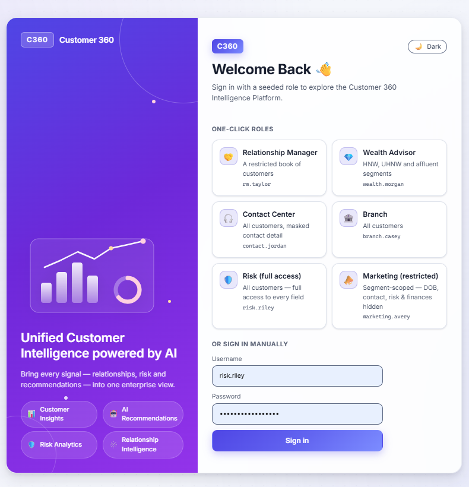

### Universal search
Search any customer you are entitled to with FTS5 typeahead — entitlement is applied *inside* the
query, so a restricted book never surfaces (or even counts) a customer outside it. The landing page
also hosts the universal "Ask anything" panel.

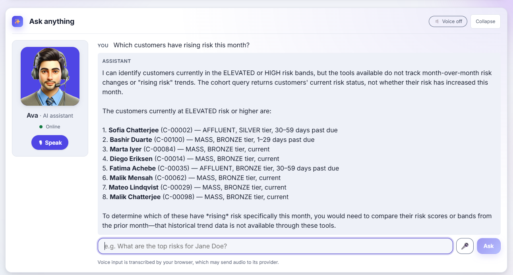

### Revenue intelligence — the opportunity pipeline
The landing page leads with a **priced opportunity pipeline**: identified vs. capturable vs.
realized revenue across the book, capturable opportunity broken down by revenue play, and a
**Money-in-Motion** feed of time-sensitive events. Per customer, dedicated widgets surface
**wallet share** (held-away vs. capturable), **fee-recovery** leakage, and **economic profit** — every
figure computed in integer cents and grounded.

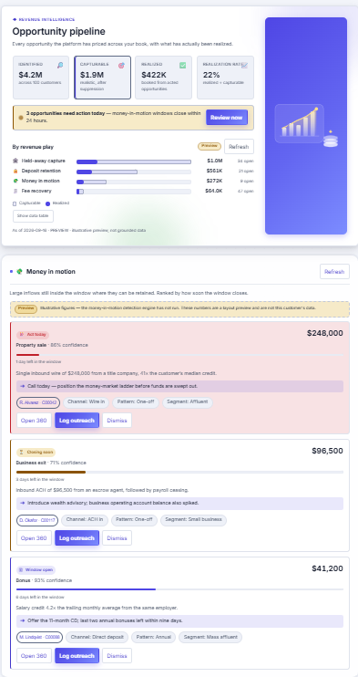

### The 360 dashboard — three views
A deterministic, single-pane view — profile, holdings, financial health, credit, risk,
relationships, household, journey — each widget with its own loading / ready / partial / restricted
/ error state, computed in SQL against a read-only database within a 3 s p95 budget. Switch density
to fit the task:

- **Spotlight** — one section at a time (the default; the profile opens first).
- **Compact** — every card shrunk to an at-a-glance, roughly one-screen overview.
- **360° Cockpit** — every card in full detail.

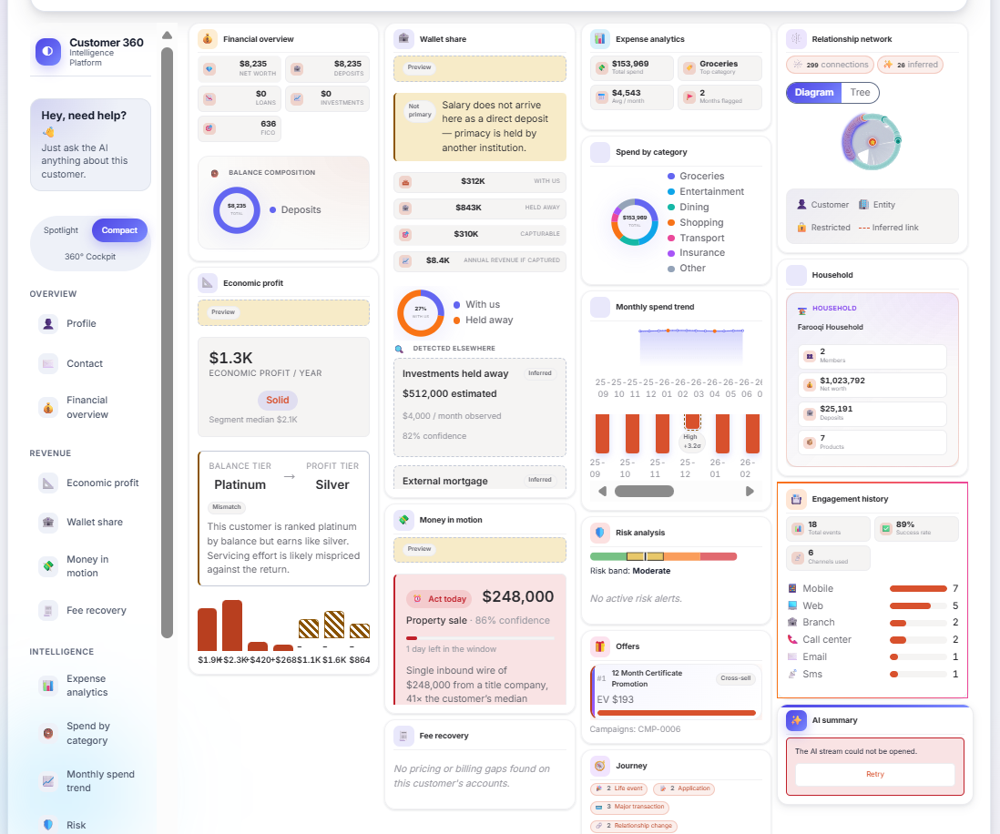

### Ask AI — grounded natural-language Q&A
Ask about **one customer** or a **whole cohort**, in plain language, on both the universal surface
and inside a customer's dashboard. Answers stream in, cite their sources by `[F]` id, and are
rejected if a figure can't be traced to a record.

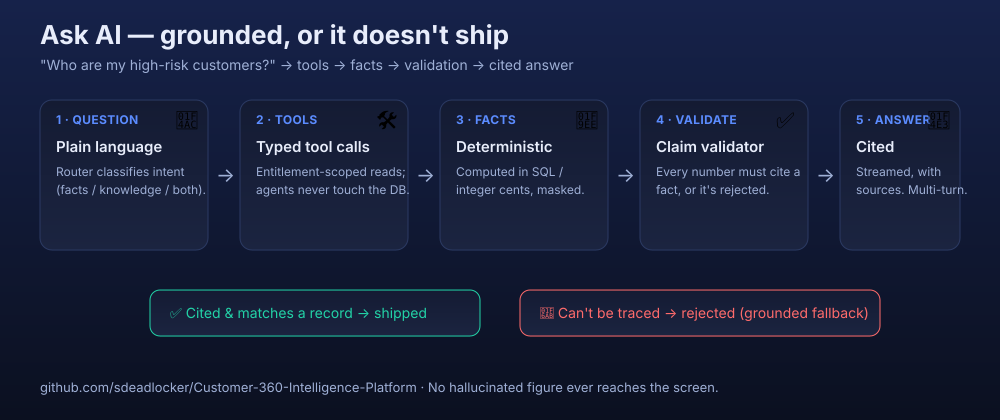

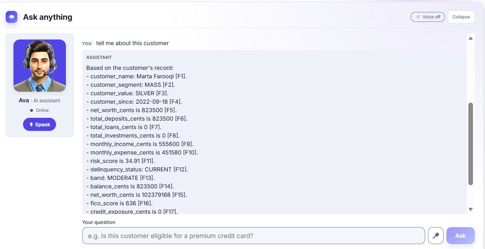

- **Cohort queries** — "who are my high-risk customers", "which clients are past due", "who is my
  most valuable customer" → a ranked, entitlement-scoped list, not a single-name lookup.
- **Pitch / next best action** — "prepare a pitch for this customer", "what should I tell them" → a
  grounded briefing of offers, financial position and risk flags.
- **Multi-turn memory** — follow-ups like "only high risk" continue the prior conversation.

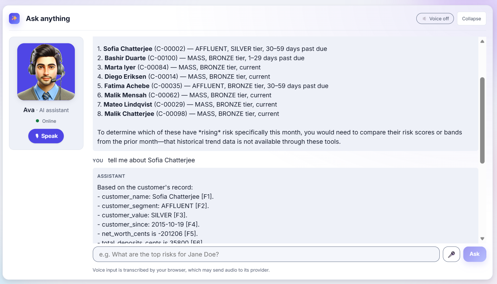

### Seven grounded AI agents
Summary, Financial Health, Risk, Life Event, Offer, Relationship and Journey — each narrates from
typed tool reads, never from a raw database query, and every claim is validated.

| Risk intelligence | Ranked offers | Relationship graph |
|---|---|---|
| 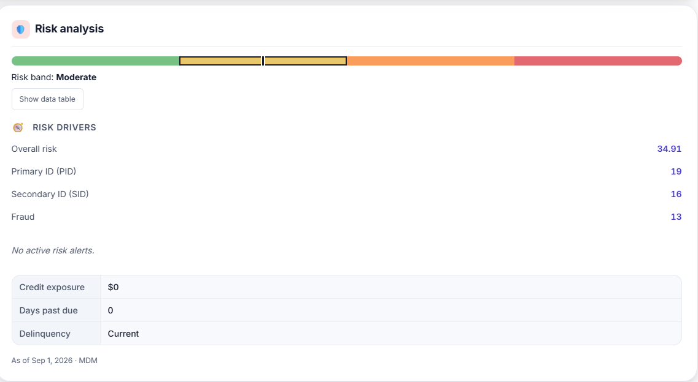 | 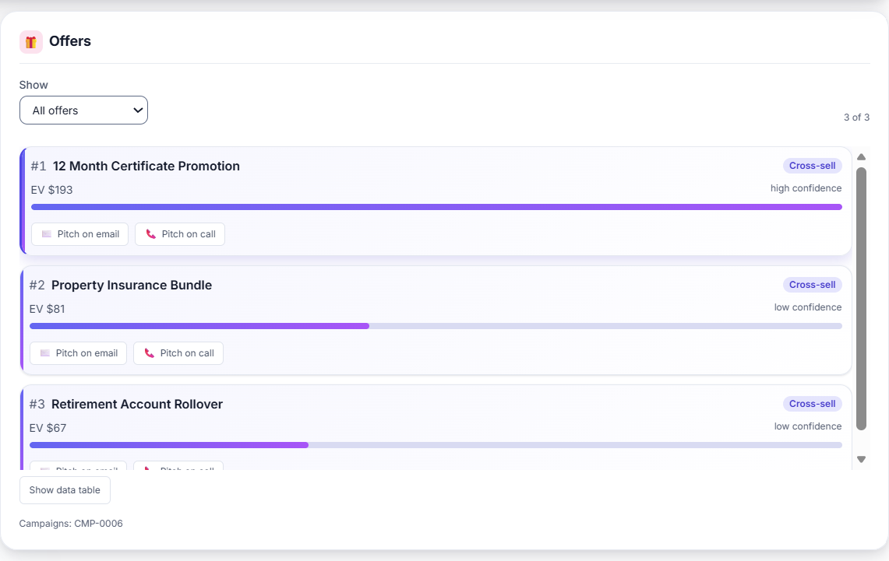 | 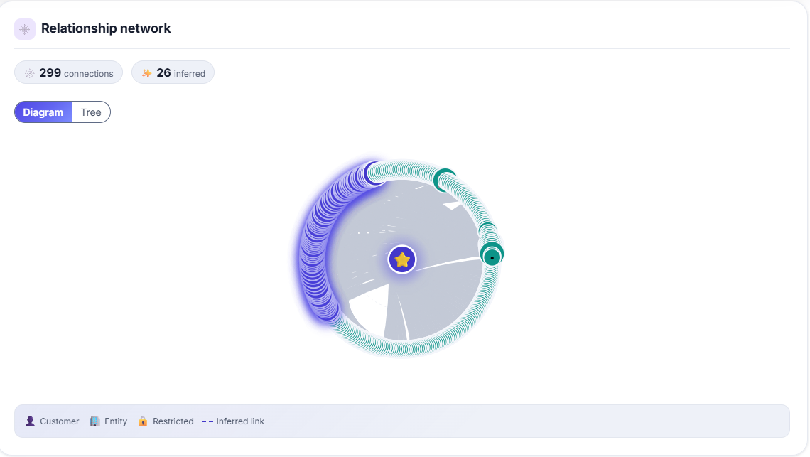 |

### Reports, meeting briefings and data export
For the customer in view, generate a **branded 360 PDF pack** or a **prepare-for-meeting briefing**
(a concise pre-meeting brief with talking points and open signals), with a live branding preview,
run history, download, and an optional schedule (daily / weekly / monthly). The dashboard also
supports **PDF and structured data export** — the exporter transparently mounts every section (as in
360° Cockpit) so the report captures all cards and charts even from Spotlight view.

| Reports & meeting briefing | Data / PDF export |
|---|---|
| 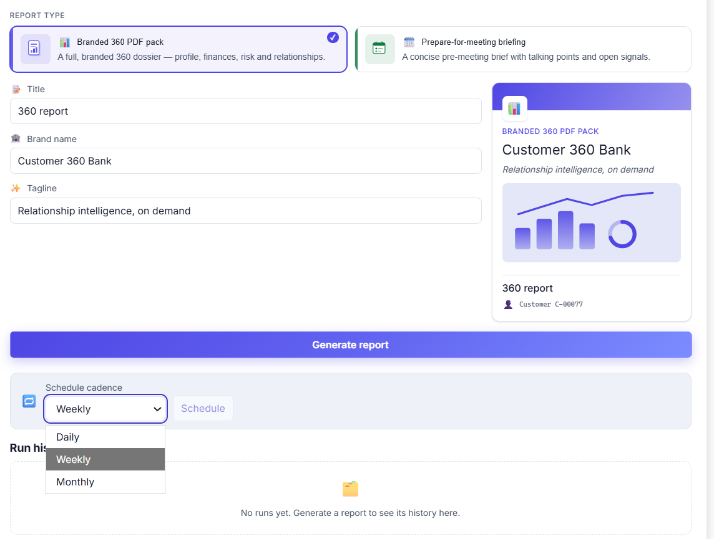 | 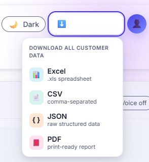 |

### Full observability
Structured JSON logs, OpenTelemetry traces (GenAI semantic conventions), and per-agent token, cost
and latency metrics — viewable in Jaeger and Grafana locally.

## Why it matters

A banker today stitches the customer picture together from many systems (core banking, CRM, credit,
risk, marketing, document stores). It is slow, error-prone and inconsistent across roles. Bolting
generative AI onto that adds two new risks: **hallucinated figures shown as fact**, and
**uncontrolled exposure of sensitive data to models and telemetry**.

This platform removes the swivel-chair and makes AI safe for a regulated setting:

- **Deterministic before generative** — net worth, utilization and aggregates are computed in SQL /
  integer cents. The LLM narrates; it never calculates.
- **Claim validation** — every AI figure is checked against a source record within tolerance before
  it is shown. A number that can't be cited is rejected and the answer degrades to a grounded,
  fact-listed fallback rather than shipping an unverifiable figure.
- **Masking at the serialization boundary** and **entitlements enforced inside queries**, with an
  append-only audit trail of who read what.

## Business value and ROI

The platform is designed to pay for itself on two fronts: **time recovered** for every front-line
banker, and **revenue surfaced** that would otherwise leak away. The point is not "AI for its own
sake" — it is turning data a bank already owns into priced, actionable opportunities a relationship
manager can act on today.

### Where the value comes from

| Lever | How the platform delivers it |
|---|---|
| **Advisor productivity** | Replaces the swivel-chair across core banking, CRM, credit, risk and document systems with one governed 360 view and natural-language Q&A. Less time assembling context, more time in front of customers. |
| **Revenue identified and captured** | A **priced opportunity pipeline** quantifies every open opportunity across the book in dollars — identified → capturable → realized — so effort follows the largest, most realistic wins. |
| **Fee-income recovery** | The fee-recovery play detects fee *leakage* (waived, unbilled, mispriced) per customer and sizes the **recoverable-per-year** figure — booked revenue the bank was already entitled to. |
| **Wallet-share expansion** | The wallet-share view quantifies **held-away** assets versus what is **capturable**, turning "we think they bank elsewhere" into a dollar target and an annual-revenue-if-captured estimate. |
| **Deposit retention & money-in-motion** | Time-sensitive events (large inflows, maturities) are surfaced with a closing action window, so the RM intervenes *before* funds move away. |
| **Prioritization by economic profit** | Customers are ranked by **risk-adjusted economic profit**, so scarce advisor time and offers go to the relationships that actually create value, not just the biggest balances. |
| **Risk & compliance efficiency** | Grounded risk cards, entitlement enforcement and an append-only audit trail reduce manual review and the cost of a mis-disclosure. |

### How it generates revenue

The revenue engine (the four **revenue plays** — fee recovery, money-in-motion, held-away capture,
deposit retention) converts existing data into a ranked, entitlement-scoped list of priced
opportunities. Each opportunity is measured end to end:

- **Identified** — the total dollar opportunity the data supports across the book.
- **Capturable** — the realistic portion after suppression and eligibility.
- **Realized** — what has actually been booked from acted-on opportunities, with a realization rate.

Because every figure is computed in integer cents and validated against a source record, these are
defensible numbers a bank can act on and report — not model guesses. The **Ask AI** layer then turns
each into a next best action ("prepare a pitch", "who should I call today") so the pipeline becomes
conversations, and conversations become bookings.

### ROI framing

The ROI is a function of three multipliers a bank can plug its own numbers into:

- **Hours saved per advisor per day** × advisor count × loaded hourly cost → **operating-cost savings**.
- **Capturable revenue identified** × **realization rate** → **incremental revenue** (fee recovery +
  wallet-share capture + retained deposits).
- **Reduced leakage and compliance rework** → **avoided losses**.

> The figures shown in the app are computed on a **synthetic** book for demonstration. On a real
> book the same engine sizes the opportunity in the bank's own dollars; the pipeline's
> identified / capturable / realized breakdown is exactly the input a business case needs.

## Tech stack

| Layer | Technology |
|---|---|
| **Frontend** | React 18 + TypeScript, Vite |
| **Backend** | FastAPI + Python 3.12 (ASGI factory), `uv` for dependency management |
| **Data** | SQLite 3 (WAL, JSON1, FTS5 lexical search, `sqlite-vec` vectors) — read-only at runtime |
| **AI** | Amazon Bedrock (Converse API + Titan Embeddings V2) with a deterministic mock provider; LangGraph orchestration; hybrid RAG with Reciprocal Rank Fusion and optional Bedrock rerank |
| **Observability** | OpenTelemetry (GenAI semantic conventions) → OTel collector → Prometheus, Grafana, Jaeger locally, or CloudWatch / X-Ray on AWS |
| **Deploy** | Docker, AWS (ECS/EC2), Terraform |

## Architecture

Layered so each guarantee (masking, grounding, entitlement, observability) lives in exactly one
place. A request flows top to bottom; the same guarantees are enforced at every hop.


> 🎬 An **animated** version (and the Ask AI grounding flow) lives in
> [`docs/animation/`](docs/animation/) — open the HTML to watch it play, and see the folder's README
> for turning it into a GIF/MP4 for slides or LinkedIn.

<details>
<summary>Plain-text layer view</summary>

```
Presentation (React + TS)
  App shell · Login · Search landing (Ask AI + Revenue pipeline) · 360 Dashboard · Reports
        │
Edge (FastAPI)
  CORS · correlation/trace ID · AuthN/AuthZ · mask filter · audit sink
        │
Application services
  Customer · Financial · Relationship · Risk · Offer · Journey  →  C360 Aggregator
        │
Agentic layer (LangGraph)
  Dashboard StateGraph · Q&A ReAct graph · typed Tool Registry · Claim Validator · LLMProvider→Bedrock
        │
Knowledge layer (RAG)                         Data layer
  Hybrid Retriever · RRF + rerank ·           Repository ports ·
  Titan embeddings · knowledge.db             customer.db (read-only) · audit.db (append-only) ·
  (vec0 + FTS5)                               signals.db / reports.db (writable)
```

</details>

**Non-negotiable rules:** agents never touch the database (they read through the same typed tool
registry the REST API uses); retrieval is for knowledge, never customer facts; the graph is derived
and rebuildable; telemetry carries no customer content; and every AI change is gated by an
evaluation suite in CI.

## Request flow

1. A user signs in with a role and searches for a customer (FTS5 typeahead, entitlement applied
   inside the query).
2. The `C360Aggregator` fans out concurrently over read-only connections and returns the
   deterministic 360 payload (3 s p95 budget); each widget runs a loading → ready / partial /
   restricted / error state machine.
3. AI cards and Ask AI stream in separately (5 s p95 budget) via LangGraph: agents call typed tools,
   deterministic aggregation runs in SQL, and the Claim Validator rejects any figure it can't cite.
4. Masking is applied at serialization; every read, agent run and retrieval is audited;
   OpenTelemetry traces the whole path with per-agent token, cost and latency metrics.

## Quick start

### Prerequisites

- **Python** 3.12.x
- [**uv**](https://docs.astral.sh/uv/) ≥ 0.5 (Python dependency manager)
- **Node** ≥ 20.19
- **Docker** ≥ 24 *(optional — only for the local observability stack)*

### 1. Clone and install

```sh
git clone https://github.com/sdeadlocker/Customer-360-Intelligence-Platform.git
cd Customer-360-Intelligence-Platform

# Backend deps (reproducible from uv.lock)
cd backend && uv sync --extra dev
cd ..

# Frontend deps (reproducible from package-lock.json)
cd frontend && npm ci
cd ..
```

### 2. Configure

```sh
cp backend/.env.example backend/.env
```

The defaults run the entire stack **offline with no AWS account** (`LLM_PROVIDER=mock`). To use
real generation, see [Using Amazon Bedrock](#using-amazon-bedrock).

### 3. Build the local databases

Databases are **generated, never committed**. Build them once (use `.venv/Scripts/python` on
Windows, `.venv/bin/python` on macOS/Linux):

```sh
cd backend
.venv/Scripts/python -m c360 seed              # synthetic customer database
.venv/Scripts/python -m c360 recompute         # derived values, search index, graph projection
.venv/Scripts/python -m c360 ingest-knowledge  # knowledge.db from the institutional corpus
.venv/Scripts/python -m c360 detect-signals    # proactive signals worklist
cd ..
```

### 4. Run it

Two terminals from the repo root:

```sh
npm run dev:api    # http://127.0.0.1:8000  — /health, /ready, /docs (OpenAPI)
npm run dev:web    # http://127.0.0.1:5173  — proxies API paths to the backend
```

Open **http://127.0.0.1:5173** and sign in. Local development users (seeded, not for production):

| Username | Password | Role |
|---|---|---|
| `rm.taylor` | `rm-dev-password` | Relationship Manager |
| `risk.riley` | `risk-dev-password` | Risk Analyst |
| `marketing.avery` | `marketing-dev-password` | Marketing Analyst |
| `contact.jordan` | `contact-dev-password` | Contact Center |

> The full list lives in the local auth provider. These credentials only exist in the local
> development auth mode and grant no access to any real system.

### API reference

With the backend running, the interactive OpenAPI docs are at **http://127.0.0.1:8000/docs**, the
raw schema at `/openapi.json`, and liveness/readiness at `/health` and `/ready`.

## Configuration

All configuration is environment-driven and typed — invalid values fail fast at startup. Copy
`backend/.env.example` to `backend/.env` and adjust. Selected keys:

| Variable | Default | Purpose |
|---|---|---|
| `LLM_PROVIDER` | `mock` | `mock` (offline, deterministic) or `bedrock` (real generation) |
| `AWS_REGION` | `us-east-1` | Bedrock region |
| `BEDROCK_MODEL_ID` | *(empty)* | **Required when `LLM_PROVIDER=bedrock`** — the Claude model / inference-profile id |
| `RETRIEVAL_ENABLED` | `true` | Enable hybrid RAG over the knowledge corpus |
| `OTEL_ENABLED` | `true` | Emit OpenTelemetry traces and metrics |
| `OTEL_EXPORTER_OTLP_ENDPOINT` | `http://otel-collector:4317` | OTLP target (use `http://localhost:4317` on the host) |
| `OTEL_TRACES_EXPORTER` | `otlp` | `otlp`, `console` (print to stdout), or `none` |
| `LOG_FORMAT` | `json` | `json` or `console` (human-readable) |

> [!IMPORTANT]
> `backend/.env`, `*.pem` and `*.key` are git-ignored and **must never be committed**. Do not put
> real credentials in any file that is tracked by git. AWS credentials are resolved from the
> standard AWS credential chain (see below), not from the repository.

## Using Amazon Bedrock

Bedrock is optional — everything works offline with the mock provider. To enable real generation:

1. **Provide AWS credentials via the standard AWS credential chain** — the app does *not* read AWS
   credentials from `.env`. Use whichever your organisation supports:
   - **AWS SSO / IAM Identity Center** (recommended): `aws configure sso` once, then `aws sso login`
     to refresh — credentials auto-refresh and never need pasting.
   - A profile / shared credentials file at `~/.aws/credentials`.
   - Environment variables in your shell (`AWS_ACCESS_KEY_ID`, etc.).

   Ensure the identity has `bedrock:InvokeModel` (and `bedrock:InvokeModelWithResponseStream`) for
   the model you choose.

2. **Point the app at a model you have access to.** List what your account can invoke:

   ```sh
   aws bedrock list-foundation-models --by-provider anthropic --region us-east-1
   ```

   Then set in `backend/.env`:

   ```env
   LLM_PROVIDER=bedrock
   BEDROCK_MODEL_ID=us.anthropic.claude-haiku-4-5-20251001-v1:0   # example; use one you can access
   ```

   > Many current Claude models on Bedrock must be invoked through a **cross-region inference
   > profile** (the `us.` prefix) rather than the bare model id. If you get a `ValidationException`
   > about the model id, use the inference-profile id.

3. **Restart the backend.** Estimated per-model cost is derived from token counts against
   `config/bedrock_prices.json` — add an entry there for your model to see cost attribution.

> [!NOTE]
> Temporary STS credentials (an access key starting with `ASIA` plus a session token) **expire** by
> design. When they do, refresh them (e.g. `aws sso login`) — no code change needed. If Bedrock is
> unavailable mid-session, the platform degrades gracefully to the deterministic provider rather
> than failing.

## Observability

Structured JSON logs go to stdout with correlation and trace IDs on every line. Traces and metrics
export over OTLP.

**Local stack** (Jaeger, OTel collector, Prometheus, Grafana with four pre-built dashboards):

```sh
npm run obs:up      # bring the stack up
# set OTEL_EXPORTER_OTLP_ENDPOINT=http://localhost:4317 in backend/.env, then restart the API
npm run obs:down    # tear it down
```

Then open:

| Tool | URL | Shows |
|---|---|---|
| **Grafana** | http://localhost:3000 | Platform health, agent performance & cost, retrieval quality, data security |
| **Jaeger** | http://localhost:16686 | Per-request traces (`qa_router` → `qa_agent` → `chat` spans with token usage) |
| **Prometheus** | http://localhost:9090 | Raw metrics and alert rules |

Key metrics include `gen_ai.client.token.usage` (input/output by model + agent),
`c360.model.estimated_cost.micro_usd`, `c360.agent.duration`, and
`c360.http.server.request.duration`.

### Viewing telemetry without Docker

The Grafana / Jaeger / Prometheus URLs above are served by the Docker stack. If you don't have
Docker, you can still see everything on the console:

1. In the root `.env`, set the exporters to console:

   ```env
   OTEL_TRACES_EXPORTER=console
   OTEL_METRICS_EXPORTER=console
   ```

   Restart the backend. Every request and model-call span (with `gen_ai.usage.*` tokens and
   durations) prints to the backend terminal, and metrics (token usage, estimated cost, latency)
   flush there periodically. Structured JSON logs with correlation and trace IDs are always on.

2. For a quick, readable per-request summary (model, latency, route, grounded answer), run the
   helper against the running API:

   ```sh
   cd backend && .venv/Scripts/python ../scripts/show_telemetry.py "which customers have rising risk this month"
   ```

## Quality gates

The whole project is gated on formatting, linting, typing and tests across both sides:

```sh
npm run check      # backend (black, ruff, mypy, pytest) + frontend (prettier, eslint, tsc, vitest)
```

Individual gates: `npm run lint`, `npm run types`, `npm run test`, `npm run fmt`.

- **Backend:** 1,200+ tests, ≥ 85% coverage enforced, warnings treated as errors.
- **Frontend:** unit + accessibility tests, strict TypeScript.
- **Evaluation gate** (deterministic, mock provider) — grounding, coverage, retrieval recall and
  no-regression checks:

  ```sh
  cd backend && .venv/Scripts/python -m c360 eval run --mode ci
  ```

## Project structure

```
Customer 360/
├── backend/                 # FastAPI + Python 3.12 service
│   └── src/c360/
│       ├── api/             # routes, envelope, masking, middleware, services container
│       ├── agents/          # LangGraph graphs, Bedrock/mock providers, Q&A, claim validator
│       ├── tools/           # typed tool registry the API and agents both read through
│       ├── services/        # Customer, Financial, Risk, Offer, Relationship, Journey
│       ├── data/            # SQLite repositories, migrations, engine
│       ├── knowledge/       # hybrid RAG retriever, embeddings, ingestion
│       ├── security/        # entitlement, field masking, audit log
│       ├── core/            # config, logging, telemetry (traces/metrics/cost)
│       └── generator/       # synthetic dataset generator
├── frontend/                # React 18 + TypeScript (Vite)
│   └── src/
│       ├── features/        # ai (Ask AI), dashboard cards, search, reports
│       ├── pages/           # login, search landing, dashboard
│       └── api/             # generated OpenAPI client, SSE
├── knowledge/               # institutional knowledge corpus (markdown + manifest)
├── prompts/                 # versioned agent prompts
├── config/                  # bedrock price table and other tuned config
├── docker/                  # observability stack (compose, collector, Grafana, Prometheus)
├── deploy/                  # Terraform + IAM policies for AWS
├── docs/                    # accessibility, deployment, performance, screenshots
└── scripts/                 # cross-platform tooling entry points
```

## Security posture

- **No secrets in the repository.** `.env`, `*.pem`, `*.key`, Terraform state and `tfvars` are
  git-ignored. AWS credentials come from the standard credential chain, never from tracked files.
- **Entitlement inside the query** — a restricted book cannot surface, or even count, a customer
  outside it.
- **Field masking at the serialization boundary** — a role that cannot see a balance never receives
  it, on the REST path *or* the AI path.
- **Append-only audit log** of every read, agent run and retrieval (who, what action, model, field
  manifest, outcome) — never the field values.
- **Telemetry carries no customer content** — an attribute allowlist and redaction filter run on
  every span and log line.

## License

Released under the [MIT License](LICENSE) — free to use, modify and distribute with attribution.
The dataset is synthetic and contains no real customer data.
